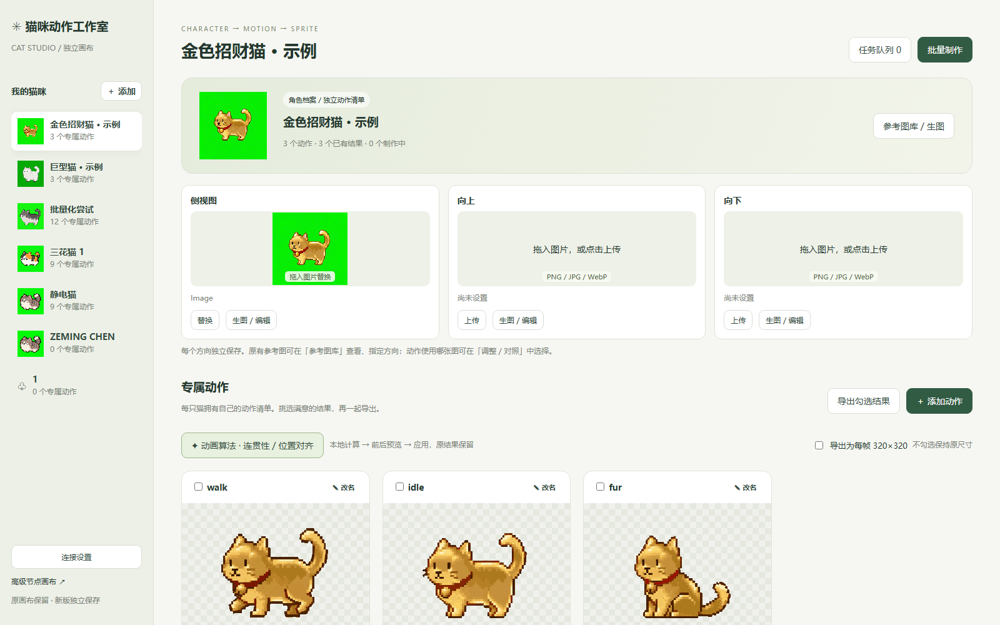

# 《毛球计划》技美日志

记录美术工具、视频处理和动画导出，之后按日期追加。FrameStudio 中未注明日期的迭代按本次指定归入 **9 月 24 日**。素材制作与入库见[美术日志](毛球计划_美术日志.md)。

## 2026年9月22日

FrameStudio 建立了“视频 → 抽帧 → 去绿幕 → 选帧 → 导出”的流程。处理整段动画时使用统一裁框，保留角色动作本来的跳跃和起伏，减少逐帧重新居中造成的抖动。

时间轴可对照原视频和透明帧，排除或恢复不合适的帧。导出 PNG、JSON、Godot `.tres` 和压缩包时，工具保留原始帧与选用帧，方便回溯；导出后仍须在游戏中检查。

## 2026年9月24日

FrameStudio 将参考图、视频、去背景和导出做成可保存的节点画布。按连线决定处理输入；一个视频也能分叉到不同处理节点，便于比较抠像和选帧效果。

*FrameStudio 本机界面截图，2026-10-08。图中的连线是参考图、动作处理和导出之间的数据流；截图日期是记录日期，不代表所有节点都在 9 月 24 日完成。*

工具保存项目、任务 ID 和处理版本。已有视频可直接重做本地处理；刷新后查询旧任务，不会重新提交付费生成。颜色、闪帧和像素稳定修正先给出预览候选，再决定是否应用。复杂绿边和原视频形变仍需人工检查。

这些迭代的原记录未逐项标明日期。代码快照已收入[工作流代码](../美术日志/工作流代码.md)，原项目数据仍在相邻 `Gaming` 工作区；详见[04 资产画布日志](../美术日志/04_资产画布制作日志.md)。

## 2026年9月29日

建立第二代“猫咪工作室”，按“猫 → 方向参考图 → 动作 → 视频 → 处理版本 → 导出”组织工作。制作时先核对侧面、向上、向下参考图，再查看每个动作的原视频、透明帧与导出结果；原节点画布仍可使用。

*猫咪工作室本机界面截图，2026-10-08。上方按方向管理参考图，下方按动作管理处理和导出；画面中的示例资产不等于游戏已接入资源。*

批量处理会跳过已有导出，已有视频优先走本地流程。连贯性和脚底位置修正先生成候选、对照预览，确认后才应用；旧候选不能覆盖更新的版本。动作改名会同步到 JSON 和 Godot 资源。

第二代从 FrameStudio 复制初始数据，此后独立保存。工具数据在相邻 `Gaming` 工作区；导出动画仍需手动导入游戏并检查方向、透明边、脚底和速度。详见[05 猫咪工作室日志](../美术日志/05_猫咪工作室制作日志.md)。

## 记录依据

依据[04 资产画布](../美术日志/04_资产画布制作日志.md)与[05 猫咪工作室](../美术日志/05_猫咪工作室制作日志.md)整理。工具导出不等于素材已接入游戏。
