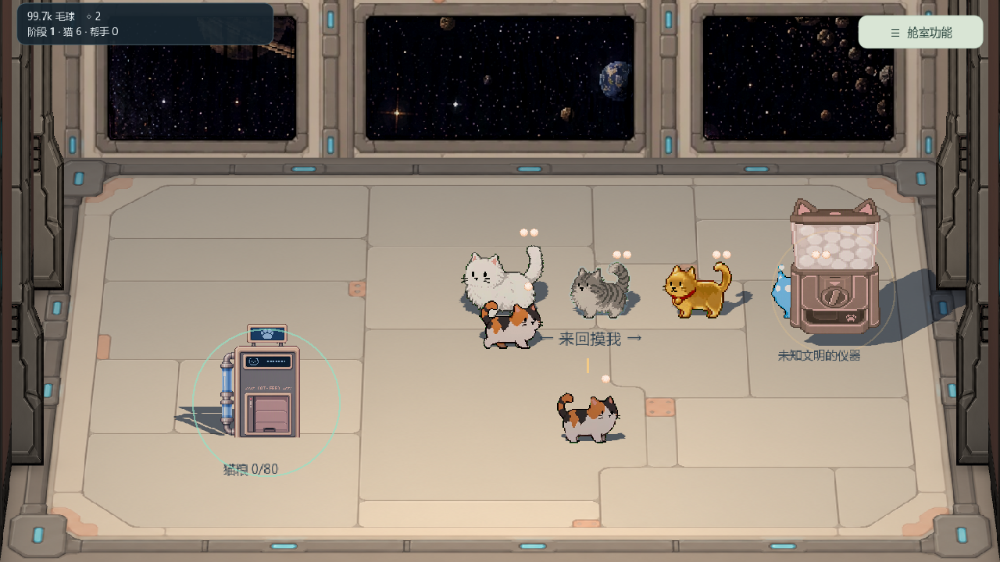
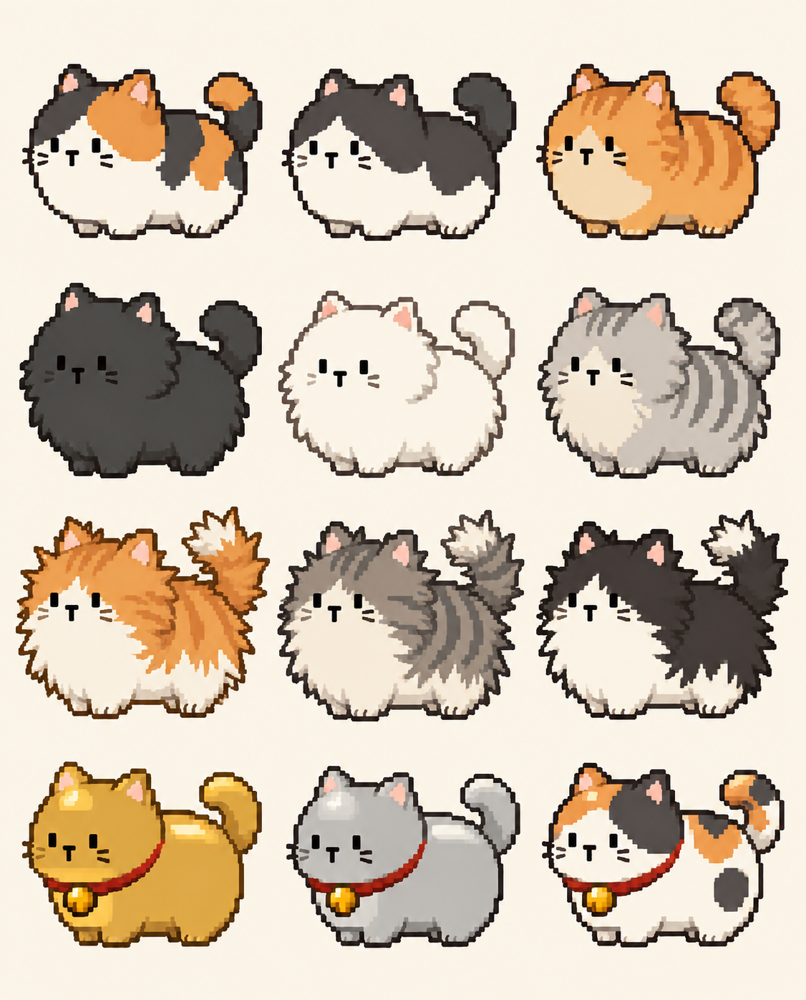
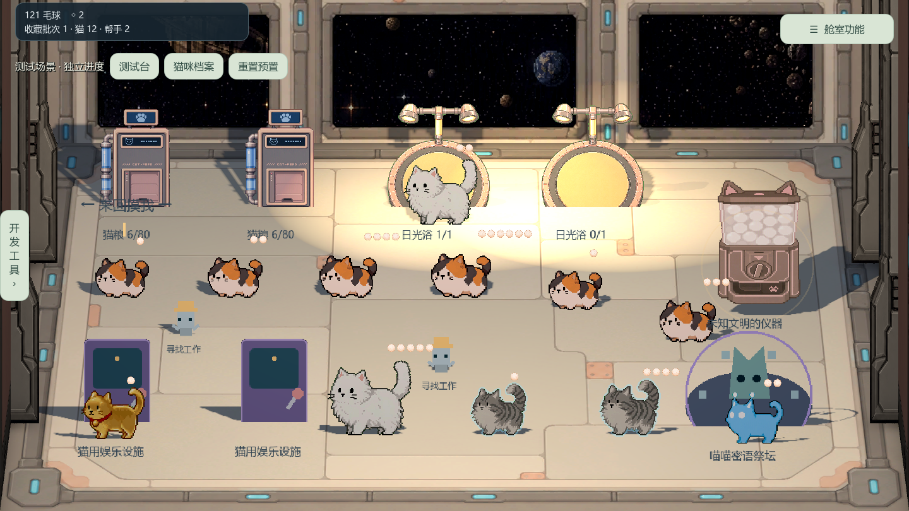

# 《毛球计划》美术日志

记录猫咪和空间站素材的制作与入库，之后按日期追加。概念图和绿幕图按本次指定归入 **9 月 28 日**；原文件没有具体制作日期。工具制作见[技美日志](毛球计划_技美日志.md)。

## 2026年9月21日

将短毛、巨型、静电、招财四种猫的待机、行走、产毛序列接入游戏，并配置动画。画面按猫的状态切换动作，脚底定位保持稳定。

加入空间站、标题、窗外宇宙、设施、资源和光标图像。窗洞遮罩让宇宙只显示在窗内；玩家可通过图标辨认设施与资源。

摸猫时会显示毛层和收获特效，获得代币时也有飞入界面的反馈。整合后核对了素材完整性、鼠标位置和实际显示，见[美术合并验证](../毛球满屋/reports/art_merge/README.md)。

## 2026年9月28日

1. **猫咪概念设计。**制作正常、长毛、最大毛量三种状态，重点用身体外轮廓表现毛量，并修正花纹、表情和像素边。这批概念图保存在本机 `Purr Orbit/output/imagegen/`，尚未接入游戏。
2. **绿幕单图。**把三花、白猫、灰刺毛、金猫各三个状态导出为独立绿底图，修正脸颊线条越界，方便后续抠像和制帧。纯绿背景、轮廓和跨状态一致性仍需逐张检查。
3. **3D 空间站。**布置地面、墙、窗、相机与灯光，填入墙地贴图和窗洞效果。猫与设施仍是平面素材，但能在 3D 场景中受光、投影；点击和拖动位置与画面对应。新增外星猫的行走、产毛动画。
4. **四向三花猫。**制作侧面、向上、向下的行走、待机，以及抚摸、舔爪、产毛图集。多次调整朝上尺寸、脚底和播放节奏；当前游戏使用 `cat1new2`。

*游戏内：9 月 28 日 3D 场景报告截图。可看地面、窗户、平面猫和设施在同一空间中的摆放。*

*游戏外：正常毛量概念图，供花纹和轮廓对照；没有作为运行图集接入。长毛对照见[修正版](../美术日志/图示/cat-growth-grown-v2.png)。*

概念与绿幕图是本机候选；3D 场景和四向图集的入库记录见[01 制作日志](../美术日志/01_制作与整合日志.md)和[3D 场景报告](../毛球满屋/reports/3d_scene/README.md)。

## 2026年9月29日

调整猫的勾边、静电亮边、补光、脚底对齐和休息动作，让猫在浅色地面和转向时更清楚、更稳定。补光只照猫，不改变墙面和设施亮度。

加入静电猫 `Cat2new` 图集，并修整空间站窗户的遮罩与浅灰内沿。游戏当前使用 `cat1new2` 和 `Cat2new`；`cat1new3`、`Cat1new4` 保留为候选。

*游戏内：9 月 29 日报告截图，用于核对多只猫、设施、补光与 UI 的整体观感；画面保留当时的测试界面。*

整合后完成动作、描边、移动和窗户检查；[报告](../毛球满屋/reports/merge_art_929/README.md)记录 7374 项自动检查通过。本次没有重导 Windows 执行文件。

## 记录依据

详见[01 制作与整合](../美术日志/01_制作与整合日志.md)、[02 当前素材](../美术日志/02_素材与场景索引.md)、[03 猫咪素材](../美术日志/03_猫咪素材制作日志.md)。本机实验图不等于已入库素材。
