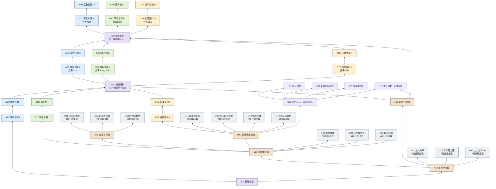
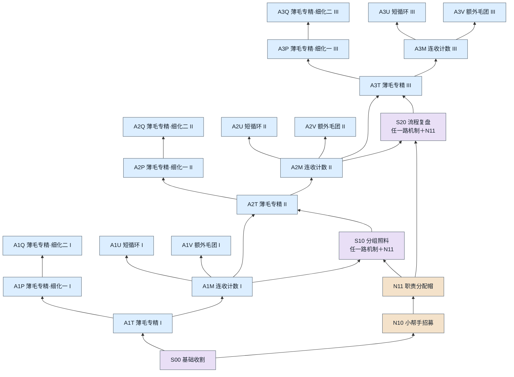
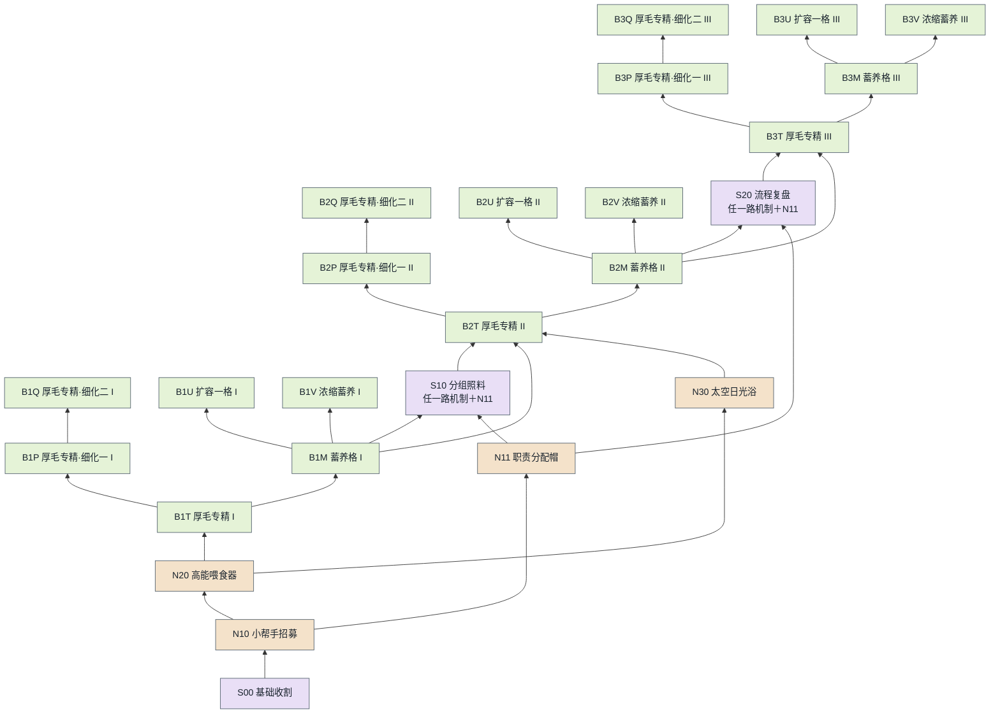
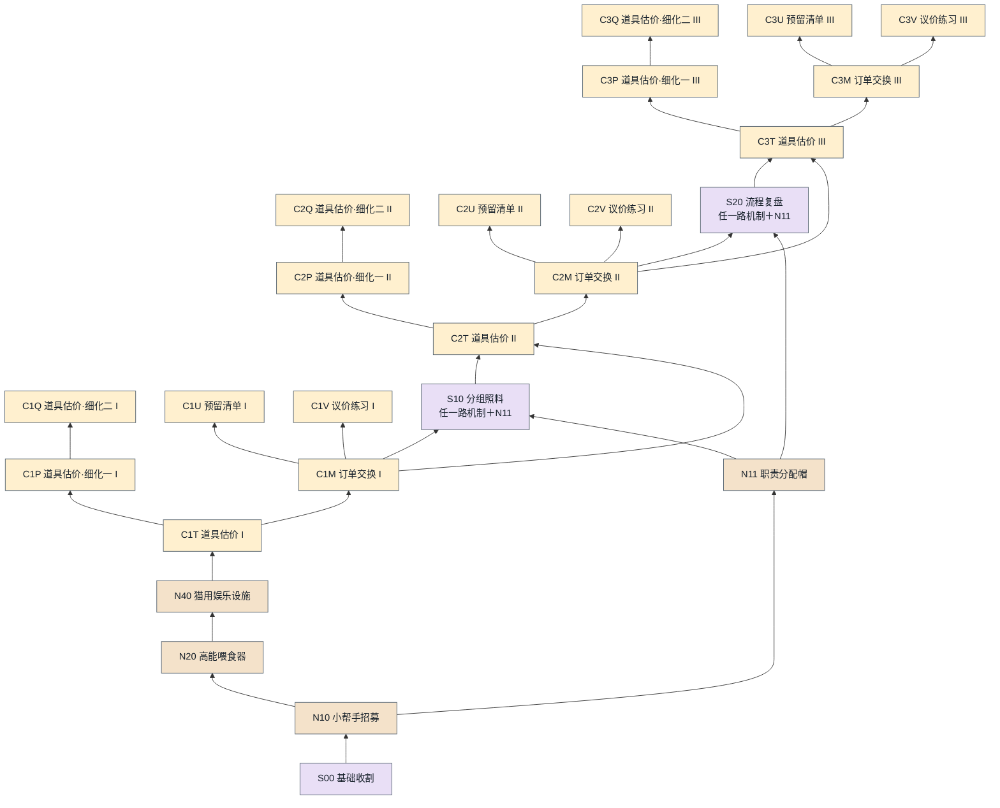
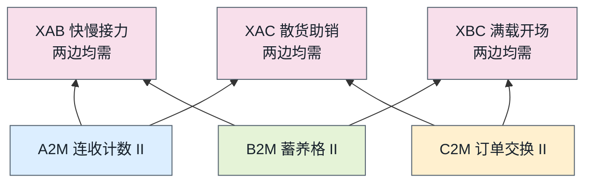
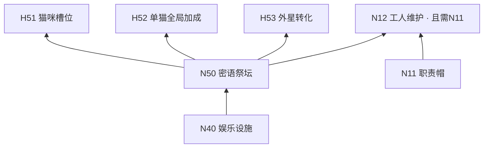

# 07｜升级树与解锁规划

> **2026-09-23当前范围（待实装）：**Demo取消周目及收藏批次对设施／机制的开放限制，纳入全部现有已采纳机制，包含祭坛、外星猫、信号干扰与工人维护；仍按统一升级树前置和毛球成本逐步发展，不等于开局全送。成长速度目标约为原计划2倍；12＋24收藏补货保留但不再锁设施。详见14、17第15节及18的IMP-20260923-001。下文旧阶段排期与一小时预算仅保留为改前基线；具体新数值尚未校准。

《Purr Orbit》／《毛球计划》｜2026-09-22碎片化修订。入口：[00](00_索引.md)，参数：[17第14.3—14.4节](17_Demo数值总表与调参清单.md)，待办：[18](18_实装变更日志.md)。

**最新确认：猫咪、设施、工人和流派机制都存在于同一张升级树；设施本身参与build构建。升级树永远只用毛球购买。**取消研究点、限额点数、发点里程碑及24／57预算。三条路线仍是单层快收、攒层爆发、道具换金；以同主题分段重复和小幅旁支推进build，而不是购买一个节点就拿满该主题数值。

**本页具体增幅、价格、解锁门槛及机制效果为详细设计提案，尚未实装、未校准。**改前33节点整包技能与研究点草案已移入[独立归档](../策划归档/2026-09-22_研究点与整包节点旧草案/README.md)，不再作为当前规则。

## 1. 先看变化

| 项目 | 新设计 |
| --- | --- |
| 货币 | 基础设施、性能、流派机制、共用节点和跨流派节点全部使用毛球；神秘代币仍只用于扭蛋 |
| 数值成长 | 同一主题有I／II／III三个段落，每段只给其中一部分，不能在第一个主题位置买完所有比例 |
| 机制成长 | 首段解锁可玩的基础机制，后续再次出现相同机制主题，逐步扩展功能与旁支 |
| 分支与合流 | 数值碎片是可选支路；机制入口可通向共用合流，再进入下一研发段，不要求旁支满级 |
| 统一树规模 | 60个流派／共用／交叉位置＋5个设施／工人主体＋13个强化主题（逐级展开共57次购买）；改前合计122个位置含免费起点；现追加N50/H51—H53/N12，等级展开总数待定，均为同一树。不是再开一张设施树 |
| 旧玩法保留 | 首层165像素、渐近3倍、10秒自然长毛、反应CD、悬停停步和工人独立CD保持；本次不直接改这些基础参数 |

### A01专精如何拆开

旧A01“一次买到单层产量＋25%”取消，改为下面9个实际节点，分散在三个研发段。界面显示本次增加和当前累计，不能把“最终可达25%”写成首购效果。

| 出现位置 | 主题入口 | 可选细化一 | 可选细化二 | 本段全买所得 | 三段累计 |
| --- | --- | --- | --- | --- | --- |
| 前段I | A1T：＋3个百分点 | A1P：再＋2 | A1Q：再＋2 | ＋7% | ＋7% |
| 中段II | A2T：再＋3 | A2P：再＋2 | A2Q：再＋2 | 再＋7% | ＋14% |
| 后段III | A3T：再＋5 | A3P：再＋3 | A3Q：再＋3 | 再＋11% | ＋25% |

加成按基础值相加，全部点满为×1.25，不是九个增幅连乘。只走三个入口而不买旁支，累计仅＋11%。B的高层专精、C的道具估价复用这一结构，但分别影响自己的收益对象，不叠成通用全局产量。

## 2. 三个研发段，不是新增三个周目

| 研发段 | 建议开放条件 | 这一段的作用 |
| --- | --- | --- |
| I 基础成型 | A从开局；B需喂食器；C需娱乐设施 | 买到第一片专精，开始连收／蓄养／订单的基础循环 |
| II 扩展机制 | 购买S10并满足对应路线前置；无收藏数量门槛 | 同主题再出现，补能力、增加机制分支；保留上一段全部投资 |
| III 深化build | 购买S20并满足对应路线前置；无收藏数量门槛 | 解锁同主题后段；能看到最终潜力，但不要求Demo结束前全满 |

研发段只表达同一树中的前后位置，不再检查收藏进度；不发新币、不按固定分钟锁门。C第一段需先研发娱乐设施，但不要求先投资A/B；C1M同样可独立通向S10。12件补货条件保持原样，绝不能反过来要求S10或树满级才能补货。

## 3. 统一升级树：猫咪、设施与build共用一套路径

下图为同一张树的折叠总览：包含所有设施解锁、猫种转化、工人及强化主题，并连入三种build。为便于阅读，T/P/Q与M/U/V细化见第4—6节的局部放大；13个重复强化主题的逐级位置见第8节。它们不是分开的树或单独页面。箭头从下向上；“或”表示任一，“且”表示同时需要。[打开总览图](图示/07_升级树总览.png)。

T节点分出两种投资：T→P→Q逐片补同一数值；T→M开放玩法，M→U／V分别扩展机制。**P/Q/U/V都是可选，不作为下一研发段的满级前置。**前段机制M通往共用S，再开启同路线下一段T；例如S10＋A1M→A2T，不能只走B线拿到S10就直接跳到A2。

## 4. A路线｜单层快收：专精＋连收计数

只奖励实际结算恰好1层的真实收割。人工与工人都可以推进连收，全场共用一个计数器；附加毛球、静电邻猫奖励不增加次数。收割计数进度显示在本路线小面板。

| ID／节点 | 研发段／毛球成本 | 直接前置与资格 | 本次购买效果（试算） |
| --- | --- | --- | --- |
| A1T 薄毛专精 I | 1／80 | S00 | 恰好1层真实收割的毛球加成增加3个百分点。只购买主题入口，不会自动获得本段两个细化节点。 |
| A1P 薄毛专精·细化一 I | 1／120 | A1T | 同一恰好1层真实收割的毛球加成再增加2个百分点；与其他同主题节点相加。 |
| A1Q 薄毛专精·细化二 I | 1／180 | A1P | 同一恰好1层真实收割的毛球加成再增加2个百分点；本段最后一片，不开放下一段的全部数值。 |
| A1M 连收计数 I | 1／240 | A1T | 开放连收计数：全场每完成12次真实1层收割，第12次额外给该次基础毛球的25%，清空计数。人工和工人均可计入。 |
| A1U 短循环 I | 1／320 | A1M | 连收次数需求再减1；只影响真实1层收割，衍生收益不计数。 |
| A1V 额外毛团 I | 1／450 | A1M | 连收额外奖励再增加5个百分点，以本次基础毛球为基数。 |
| A2T 薄毛专精 II | 2／900 | S10 且 A1M | 恰好1层真实收割的毛球加成增加3个百分点。只购买主题入口，不会自动获得本段两个细化节点。 |
| A2P 薄毛专精·细化一 II | 2／1,400 | A2T | 同一恰好1层真实收割的毛球加成再增加2个百分点；与其他同主题节点相加。 |
| A2Q 薄毛专精·细化二 II | 2／2,100 | A2P | 同一恰好1层真实收割的毛球加成再增加2个百分点；本段最后一片，不开放下一段的全部数值。 |
| A2M 连收计数 II | 2／3,000 | A2T | 在已解锁连收基础上，触发次数需求减1，奖励增加10个百分点；不重置并立刻结算旧进度。 |
| A2U 短循环 II | 2／4,200 | A2M | 连收次数需求再减1；只影响真实1层收割，衍生收益不计数。 |
| A2V 额外毛团 II | 2／6,000 | A2M | 连收额外奖励再增加5个百分点，以本次基础毛球为基数。 |
| A3T 薄毛专精 III | 3／9,000 | S20 且 A2M | 恰好1层真实收割的毛球加成增加5个百分点。只购买主题入口，不会自动获得本段两个细化节点。 |
| A3P 薄毛专精·细化一 III | 3／14,000 | A3T | 同一恰好1层真实收割的毛球加成再增加3个百分点；与其他同主题节点相加。 |
| A3Q 薄毛专精·细化二 III | 3／21,000 | A3P | 同一恰好1层真实收割的毛球加成再增加3个百分点；本段最后一片，不开放下一段的全部数值。 |
| A3M 连收计数 III | 3／30,000 | A3T | 再次把连收次数需求减1，奖励增加15个百分点；不赠送未买的连收旁支。 |
| A3U 短循环 III | 3／42,000 | A3M | 连收次数需求再减1；只影响真实1层收割，衍生收益不计数。 |
| A3V 额外毛团 III | 3／60,000 | A3M | 连收额外奖励再增加5个百分点，以本次基础毛球为基数。 |

满购三个段落后，单层专精＋25%；连收从每12次奖励25%基础毛球，逐步变成每7次奖励65%。后者是**第7次额外奖励65%**，不是每次都＋65%。升级次数门槛不立即发钱；已计进度保留，到下一次真实单层收割最多结算一次并清零。

## 5. B路线｜攒层爆发：专精＋蓄养格

初期猫在食物buff期间自然长出新层才充一格；B2M接入日光浴后，有粮时日光浴真实新增毛层也可逐层充格。首层常驻、反复进出或喂食动画不充格。4层以上真实收割时兑现；低于4层收割清除对应蓄养，不能保留给下一轮重复用。

| ID／节点 | 研发段／毛球成本 | 直接前置与资格 | 本次购买效果（试算） |
| --- | --- | --- | --- |
| B1T 厚毛专精 I | 1／80 | N20 | 4层及以上真实收割的毛球加成增加3个百分点。只购买主题入口，不会自动获得本段两个细化节点。 |
| B1P 厚毛专精·细化一 I | 1／120 | B1T | 同一4层及以上真实收割的毛球加成再增加2个百分点；与其他同主题节点相加。 |
| B1Q 厚毛专精·细化二 I | 1／180 | B1P | 同一4层及以上真实收割的毛球加成再增加2个百分点；本段最后一片，不开放下一段的全部数值。 |
| B1M 蓄养格 I | 1／240 | B1T；另需N20 | 开放蓄养格：猫在有食物buff时自然长出新层，存入1格，初始容量1；4层以上真实收割时，每格额外给本次基础毛球3%，随后清空。 |
| B1U 扩容一格 I | 1／320 | B1M | 蓄养容量再增加1格，不立即填充；原已有格数保留。 |
| B1V 浓缩蓄养 I | 1／450 | B1M | 每格结算比例增加1个百分点，全部格使用当前比例。 |
| B2T 厚毛专精 II | 2／900 | S10 且 B1M 且 N30 | 4层及以上真实收割的毛球加成增加3个百分点。只购买主题入口，不会自动获得本段两个细化节点。 |
| B2P 厚毛专精·细化一 II | 2／1,400 | B2T | 同一4层及以上真实收割的毛球加成再增加2个百分点；与其他同主题节点相加。 |
| B2Q 厚毛专精·细化二 II | 2／2,100 | B2P | 同一4层及以上真实收割的毛球加成再增加2个百分点；本段最后一片，不开放下一段的全部数值。 |
| B2M 蓄养格 II | 2／3,000 | B2T；另需N20 | 蓄养容量再增加1格；同时开放日光充能：有食物buff的猫在日光浴实际新增毛层时，每个新层也可充1格；同一层不重复充，单纯进出不充。 |
| B2U 扩容一格 II | 2／4,200 | B2M | 蓄养容量再增加1格，不立即填充；原已有格数保留。 |
| B2V 浓缩蓄养 II | 2／6,000 | B2M | 每格结算比例增加1个百分点，全部格使用当前比例。 |
| B3T 厚毛专精 III | 3／9,000 | S20 且 B2M；另需N20 | 4层及以上真实收割的毛球加成增加5个百分点。只购买主题入口，不会自动获得本段两个细化节点。 |
| B3P 厚毛专精·细化一 III | 3／14,000 | B3T | 同一4层及以上真实收割的毛球加成再增加3个百分点；与其他同主题节点相加。 |
| B3Q 厚毛专精·细化二 III | 3／21,000 | B3P | 同一4层及以上真实收割的毛球加成再增加3个百分点；本段最后一片，不开放下一段的全部数值。 |
| B3M 蓄养格 III | 3／30,000 | B3T；另需N20 | 蓄养容量再增加1格；保持真实进食期间自然长层的充能规则。 |
| B3U 扩容一格 III | 3／42,000 | B3M | 蓄养容量再增加1格，不立即填充；原已有格数保留。 |
| B3V 浓缩蓄养 III | 3／60,000 | B3M | 每格结算比例增加1个百分点，全部格使用当前比例。 |

只买第一机制入口：容量1格、每格3%；买完全部相关节点：容量6格、每格6%，满格最多另加36%基础毛球。买容量不会送充能，必须再靠实际长毛积累。喂食负责增产与充能资格，B2M把日光浴接入蓄养：需要实际补粮、搬猫和新增毛层，不会仅靠摆下设施就免费充满。U31速度和U32容量因此直接影响攒层build的处理能力。

## 6. C路线｜道具换金：估价＋订单交换

订单从最简单的同款两件开始，逐段开放三件不同款和五件不同款；预留清单和议价分支分开提升。所有订单消耗普通换金物，绝不消耗永久扭蛋收藏。预留不等于自动售卖，玩家仍选择兑换。

| ID／节点 | 研发段／毛球成本 | 直接前置与资格 | 本次购买效果（试算） |
| --- | --- | --- | --- |
| C1T 道具估价 I | 1／80 | N40 | 普通道具正常出售价格加成增加3个百分点。只购买主题入口，不会自动获得本段两个细化节点。 |
| C1P 道具估价·细化一 I | 1／120 | C1T | 同一普通道具正常出售价格加成再增加2个百分点；与其他同主题节点相加。 |
| C1Q 道具估价·细化二 I | 1／180 | C1P | 同一普通道具正常出售价格加成再增加2个百分点；本段最后一片，不开放下一段的全部数值。 |
| C1M 订单交换 I | 1／240 | C1T；另需N40 | 开放同款订单：消耗2件同名普通道具，获得其正常售价总和的1.05倍；开放1条库存预留清单。 |
| C1U 预留清单 I | 1／320 | C1M | 库存预留清单数量增加1条；不同清单不能占用同一件实物。 |
| C1V 议价练习 I | 1／450 | C1M | 所有已解锁订单的交易系数增加0.02；只选一种订单出口，不将系数连乘。 |
| C2T 道具估价 II | 2／900 | S10 且 C1M；另需N40 | 普通道具正常出售价格加成增加3个百分点。只购买主题入口，不会自动获得本段两个细化节点。 |
| C2P 道具估价·细化一 II | 2／1,400 | C2T | 同一普通道具正常出售价格加成再增加2个百分点；与其他同主题节点相加。 |
| C2Q 道具估价·细化二 II | 2／2,100 | C2P | 同一普通道具正常出售价格加成再增加2个百分点；本段最后一片，不开放下一段的全部数值。 |
| C2M 订单交换 II | 2／3,000 | C2T；另需N40 | 开放三件套订单：消耗3件不同名普通道具，获得正常售价总和的1.08倍；原同款订单仍可用。 |
| C2U 预留清单 II | 2／4,200 | C2M | 库存预留清单数量增加1条；不同清单不能占用同一件实物。 |
| C2V 议价练习 II | 2／6,000 | C2M | 所有已解锁订单的交易系数增加0.02；只选一种订单出口，不将系数连乘。 |
| C3T 道具估价 III | 3／9,000 | S20 且 C2M；另需N40 | 普通道具正常出售价格加成增加5个百分点。只购买主题入口，不会自动获得本段两个细化节点。 |
| C3P 道具估价·细化一 III | 3／14,000 | C3T | 同一普通道具正常出售价格加成再增加3个百分点；与其他同主题节点相加。 |
| C3Q 道具估价·细化二 III | 3／21,000 | C3P | 同一普通道具正常出售价格加成再增加3个百分点；本段最后一片，不开放下一段的全部数值。 |
| C3M 订单交换 III | 3／30,000 | C3T；另需N40 | 开放五件套订单：消耗5件不同名普通道具，获得正常售价总和的1.12倍；当前五种普通道具均可直接产出，不要求稀有转化。 |
| C3U 预留清单 III | 3／42,000 | C3M | 库存预留清单数量增加1条；不同清单不能占用同一件实物。 |
| C3V 议价练习 III | 3／60,000 | C3M | 所有已解锁订单的交易系数增加0.02；只选一种订单出口，不将系数连乘。 |

三个议价分支全买时，同款／三件／五件订单系数分别为1.11／1.14／1.18，先解锁哪种就只能使用哪种。四条预留清单来自初始1条和三次扩容，可用于不同物件组合；重叠需求按指定优先级占用实物。直接散卖始终可用，避免等不到组合时无法回款。

## 7. 共用与跨流派节点

| ID／节点 | 研发段／毛球成本 | 直接前置与资格 | 本次购买效果（试算） |
| --- | --- | --- | --- |
| S00 基础收割 | 开局／0 | 首次真实收割 | 首次真实收割后显示三路线；不发研究点或额外奖励。 |
| S10 分组照料 | 2／1,500 | （A1M 或 B1M 或 C1M）；另需N11 | 开放2个猫群标签，工人按组工作；目标层在已付费解锁的层数范围内设置。任一路机制入口买到即可继续，不要求数值碎片满。 |
| S20 流程复盘 | 3／22,000 | （A2M 或 B2M 或 C2M）；另需N11 | 增加第3个猫群标签，并允许给各组记录目标层／娱乐轮次预设；同时开放第三研发段。手动操作和工人仍执行实际任务。 |
| XAB 快慢接力 | 2／8,500 | A2M 且 B2M | 真实单层收割累计8次生成1枚标记（最多1）；下次4层以上真实收割消耗标记，增加该次基础毛球5%。 |
| XAC 散货助销 | 2／8,500 | A2M 且 C2M | 真实单层收割累计20次生成1张券（最多1）；下次出售一件普通道具，额外获得该件正常售价5%。 |
| XBC 满载开场 | 2／8,500 | B2M 且 C2M | 4层以上猫进入娱乐可选消耗超过首层的毛层，换min(消耗层数,3)轮基础奖品价值+5%；离场清除剩余轮次，消耗毛层及蓄养格不另兑毛球。 |

S10按组在已付费收割层上限内选目标，仍是为混搭提出的规则修订；未购买S10时沿用现版本全体统一门槛。S20只开放预设和更高研发段，不会瞬移猫或代替工人劳动。X节点需两条路线的第二段机制，不是买共用节点便免费获得全路线效果。本轮保留三种交叉基础效果，不再堆新的独立小游戏；后续扩展可沿同一主题再做小幅升级。

## 8. 同一升级树中的设施、猫种与工人节点

以下是统一树总图中N/U节点的说明，不是另一张“基础树”。猫咪属性在A/B等重复主题中升级，猫种转化在与设施相连的U22/U33/U44中升级；同一个升级只出现一份购买状态。解锁设施后仍需在商店购买实体并摆放，商店不承载另一个升级树。

| ID／节点 | 阶段／前置 | 具体内容、子级与边界 |
| --- | --- | --- |
| S00 基础饲养（原N00并入） | 开局 | 普通猫、手动收毛的共同起点；与前表S00同一节点，不重复收费 |
| N10 工人招募 | 1／S00 | 解锁招募，不等于免费给工人；工人接手重复操作 |
| N20 高能喂食器 | 1／N10 | 解锁喂食器和标准猫条供应；猫自主吃粮获得限时buff，补粮需人工／工人 |
| N30 太空日光浴 | 1／N20 | 解锁搬猫进日光浴加速就绪；不要求U21或U22满级 |
| N11 职责分配帽 | 不分周目／N10 | 固定工人岗位；基础分工花毛球，是S10/S20使用资格 |
| N40 娱乐设施 | 不分周目／N20 | 猫占用设施时停止长毛，按轮次得道具；资格不要求N30或任何U节点满级 |
| U11 工人效率 | N10／6级分段 | 现有每级＋15%行动效率，影响移动和互动，不重复减独立工作CD |
| U12 收割层数 | N10／7级分段 | 每级增加1层，从1至8；未买S10沿用全体门槛；买S10后改为可配置目标上限（新提案） |
| U13 工作CD缩减 | N10／6级分段 | 现有3×0.85^L秒并受0.6秒下限；不缩短猫produce反应 |
| U21 高级猫粮 | N20／2级分段 | 0级标准猫条；第1级解锁高能冻干；第2级解锁星尘鱼罐头，仍需商店付费购买 |
| U22 巨型猫转化 | N20／4级分段 | 提高实际进食后的转化概率，不直接给巨型猫，非B路线必备 |
| U23 料仓容量 | N20／4级分段 | 增加装粮上限，不自动补粮；缓解所有流派的补粮负担 |
| U31 日光浴速度 | N30／4级分段 | 缩短处理时间；不直接减少猫收割反应CD |
| U32 日光浴容量 | N30／4级分段 | 增加并行容纳量，仍需实际搬猫 |
| U33 静电猫转化 | N30／4级分段 | 增加日光浴转化概率，不成为B路线推进前置 |
| U41 获胜概率 | N40／4级分段 | 提高普通轮次中奖率；需与订单收益一起核算整体期望 |
| U42 轮次速度 | N40／4级分段 | 缩短娱乐轮次；不直接改变订单所需的道具数量 |
| U43 奖品价值 | N40／4级分段 | 提高产出道具的基础价值；同一件入库后的价值处理沿用现版本 |
| U44 招财猫转化 | N40／4级分段 | 提高娱乐转化概率；抛币正面额外给普通道具，不产出神秘代币 |

U节点ID用于本版文档定位，代码键仍为worker:efficiency／harvest_layers／cooldown等，不要求为改名迁移存档。U价格与精确数值沿用17已实装表，直到单独调参；新旧节点虽同用毛球，仍需各自独立定价。猫／工人／设施实体数量购买仍在商店，不把每一次买猫画成研究节点，也不凭空引入房间总猫数硬上限。

### 同一设施与猫种强化也分段出现

U卡片是折叠主题，展开后每一级是独立毛球购买位置，记作U11-L1等；不是一次购买满6级。具体单级价格和效果沿用当前配置，暂不加倍叠加；仅调整在统一树中何时开放这一建议。

| 强化主题 | I段可买 | II段继续出现（且需S10） | III段继续出现（且需S20） |
| --- | --- | --- | --- |
| U11工人效率、U13工作CD | L1—L2 | L3—L4 | L5—L6 |
| U12收割目标层 | L1—L3（目标到4层） | L4—L5（目标到6层） | L6—L7（目标到8层） |
| U21猫粮种类 | L1高能冻干 | L2星尘鱼罐头 | 本版不虚构第3种新粮 |
| U22巨型转化、U23料仓、U31/U32日光速度与容量、U33静电转化、U41/U42/U43娱乐性能、U44招财转化 | L1 | L2 | L3—L4 |

每一等级需要前一等级；**这些等级不构成S10/S20或下一T/M的满级门槛。**C和娱乐相关I段在N40解锁后可买，无收藏批次限制。三路共用U投资：无论从哪里看到巨型转化或工人效率，都是同一个节点、同一个等级，不重复付费。

### 设施如何真正参与build

| 同一树上的组合 | 改变的玩法 | 投资取舍 |
| --- | --- | --- |
| A单层专精／连收＋N10工人＋U11效率／U13CD | 工人连续收首层，填充连收计数；反应期间换猫，持续回款 | 钱用于多工人还是更高处理效率；仍不能跳过猫反应CD |
| A＋N20喂食／U22巨型转化 | 增加每次单层实际产出；频繁收割更密集地兑现食物buff | 增收同时承担供粮工作；不是只有B能用喂食器 |
| B蓄养＋N20喂食／U21高级粮／U23料仓 | 供粮产生蓄养充能资格，粮种提高收入，料仓减轻补粮压力 | 花钱补供应还是继续扩大猫群，防止断粮让蓄养失效 |
| B2M＋N30日光／U31速度／U32容量 | 将有粮的真实日光新增毛层接入蓄养，靠搬猫提高爆发准备速度 | 容量大但搬运不足不会凭空增产；工人仍要执行 |
| N30＋U33静电转化＋A或B | 静电附加产出可为不同收割策略增收 | 转化是可选加强，不能靠附加产出重复填A计数或B蓄养 |
| C订单＋N40娱乐／U41中奖／U42轮次／U43价值 | 决定可换物的数量、频率与单件价值，直接支撑订单 | 先稳供货，还是先提高交易系数；猫进入娱乐放弃毛球积累 |
| C＋U44招财转化 | 抛币额外道具进入同一库存，可参与订单 | 提升产物来源多样性；不要求转化成功才解锁C后续 |
| N11职责帽＋S10分组＋S20预设 | 在同一设施体系里让一组快收、一组攒层／娱乐 | 投入管理与工人才能实现混搭，不是额外一条“管理树” |

所有猫咪的实际能力仍按03号规则；本次不把巨型／静电／招财猫重新变为直接购买商品。普通猫的购买资格归S00，特殊猫的转化升级和设施强化在同一图上，不另开猫种研究页。

### 同一树新增Demo范围（已采纳机制，费用需重算）

| ID | 前置 | 内容与范围 |
| --- | --- | --- |
| N50 | N40 | 购买祭坛，指派猫带来全局加速并引入干扰；不要求招财转化成功 |
| H51 | N50 | 升级指派猫槽位，级数、费用后续定 |
| H52 | N50 | 升级单猫全局加速，级数、叠加上限后续定 |
| H53 | N50 | 提高外星猫转化率，级数、费用后续定 |
| N12 | N11且N50 | 解锁工人维修黑屏娱乐设施；仍需工人实际执行，不永久免疫干扰 |

原祭坛A01—A03以H51—H53表示，避免与单层路线编号混淆；旧F/S/E等分支在本版对应U21—U44。蟑螂和黑屏是设施联动事件，不是玩家付费购买的惩罚节点。扭蛋机仍由首枚代币接触解锁，不放到本树末端。

## 9. 毛球预算如何制造选择

必须诚实区分：毛球可以无限生产，**只靠有限固定价格，无法保证玩家无限等待后仍点不满。**本轮目标是“在加速后Demo、正式版前若干轮的实际收入与解锁窗口内，无法轻易全满”，不是永久禁止全点。正式版前几轮究竟几轮、重置与继承怎样处理仍待定；Demo不恢复重开。

- 先用同树前置控制同主题后续段的出现，再用逐段固定毛球成本和供粮／招猫／招工等支出形成机会成本。不得偷偷增加第二种树货币，也不根据玩家实时收入临时涨价。
- 单片数值小，价格也应允许阶段内频繁决策。优先买本段机制形成玩法，再决定补本段碎片、存钱等下一段还是开副路线，不能把全部旁支升满当作主线关卡。
- 流派片段小计633,970毛球只是统一树的一部分。合并5个主体解锁23,285和13主题57级性能270,229后，改前不含祭坛的统一树试算价为927,484毛球（现已不是新Demo全价）；现有价格基线来自008参数导出。该总价**尚未按新机制模拟验证**，不是已经证明一小时无法全点。
- 原66,720只统计T/M与S，不再当成完整路线成本。统一树必须计入该路依赖的设施解锁：A主体最低67,655，B为74,005，C为84,005毛球（未买可选性能、实体和粮）。树的完整预算还需计算必需的U12层数投入等实际运行选择；实体与粮食为树外经营支出。
- 每片和下一关键机制分别计算回本时间。如果末段小幅＋3%要等待远超剩余内容时间，应降价或放到更晚内容，不可把无收益的高价陷阱称为“流派选择”。

预算公式、逐段价格、实际收入取样及统一树预算见17第14.3—14.4节。此轮不再发放一次性研究点，也不保留“24点剩多少”的UI。

## 10. 节点结算、重复主题与防绕过

1. 同主题用统一family保存累计效果，节点各自记录是否购买。ID的I／II／III表示出现段落，不表示跳过旧旁支自动获得全等级。先后购买仍按已购片段求和，不能赋值覆盖，也不能重复叠同一个节点。
2. 毛球基础金额Y0沿用现有猫种、食物、虫害、收藏及层数收益；A/B专精与本轮机制奖金基于Y0相加，互不递归。A连收奖励基于触发那次Y0一次支付；B蓄养按本批锁定时可兑现的格数消费，互动期间新长层所充格留给后续，不能重用旧格。
3. 新版取消旧整包节点对人工行程、工人CD的一次性大幅减免；165像素／渐近3倍、反应CD、普通工人CD升级均保持。以后若加入“轻梳”主题，也须按相同分段方式另行设计。
4. 普通道具售价Q＝物件既有基础价×既有出售buff×(1＋已购C估价总比例)。订单一次只乘一个已解锁出口系数；三个议价碎片相加，不先同款打包再三件套。库存原件成交后移除，券最多作用一件，不发新神秘代币。
5. 真实生产贡献仍按已定义主产物核算一次，新增机制奖金／交易溢价不重复计入；这是本版试算口径。必须验证C不因收益主要在交易端而无法推进收藏；如需调整，修改生产贡献的明确公式，不靠重复售卖刷贡献。
6. 毛球重配不能照搬旧研究点全额退款。此次不新增洗点按钮：错误购买暂可继续经营赚毛球并补另一方向。若之后加入重配，应独立设计返还、节点状态和收入套利规则；不默认免费重置分支、清除反应CD或重领奖励。
7. 原有已实装的U节点等级和玩家财产保留；这批新节点未上线，无需给旧存档补任何研究点。追加节点拥有状态与机制计数兼容即可，具体迁移以开发验证为准。

## 11. 验证与版本状态

同主题9片求和为25%，首购仅3%；A连收满购7次／65%，B满购6格／每格6%，C订单最高系数1.11／1.14／1.18；这些是配置核算，不是已验证的平衡结果。应模拟三条纯路线和混搭，记录每次购买时刻、现金、剩余经营储备、combo形成时间、每分钟劳动与净收益、收藏币速以及50／60／70分钟能买到的节点集合。

检查路线主体可达、旁支不满级也能继续、后段不能提前购买、重复主题不自动补前段等级、无重复奖励。只有样本能支持“短期不能全满”时才宣称节奏达标。旧008报告不是新版构筑验证。

07是同一升级树的结构与玩法；17第14.3维护片段参数，第14.4合并设施／猫种依赖与完整预算；18的IMP-20260922-003继续记录实施。新树仍待实装，本次不改代码或构建。

## 2026-09-23范围与资格覆盖

S10/S20及II/III段保留路线前置，不再要求第12／24件收藏；N11、N40、N50、N12不再检查周目或收藏批次。设施实体仍需研发、付费与摆放。N50、H51—H53、N12现进入同一Demo树，新增级数／价格见17第15节的待校准范围；旧122位置和927,484仅为不含这些节点的旧小计，不是当前完整规模。旁支不用满级，不新增研究货币。

## 2026-09-23｜单猫设施对升级树的覆盖

每台设施同时只容纳、吸引一只猫。上文U32日光浴容量及H51祭坛猫咪槽位的“提高同时使用猫数”效果暂停采用；图中旧标签仅保留定位，替代升级待设计，不得照旧实现多猫共用。U23料仓容量保留。相关旧全树预算、吞吐量和B路线试算需重新校准；不在此直接指定替代数值。见17第16节及18的IMP-20260923-002。

## 2026-09-23本轮代码落地

已落地一张统一树：128个实际位置、性能主题显示下一等级，N/U/A/B/C/S/X共享毛球与购买状态。OR/AND前置、分段性能和重复主题均生效，无收藏门槛。U32/H51暂停，现行总价264,023，17第18节覆盖旧图价目。 当前代码与运行值见17第18节，验证记录见`毛球满屋/reports/september23/`；正式验收状态以18本批结果为准。此前“待实装”与旧资格／价目保留为历史来源。
