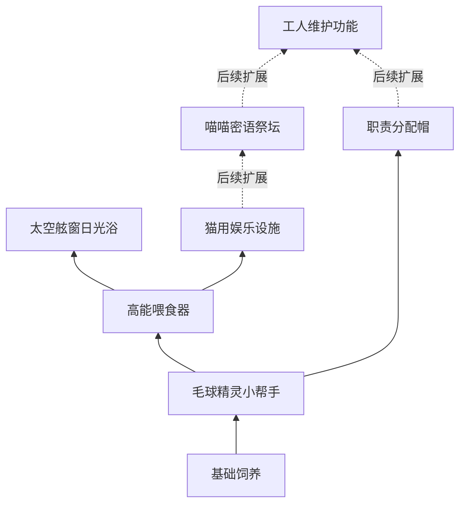

# 07｜升级树与解锁规划

v0.27｜2026-09-18。入口：[00_索引](00_索引.md)。

## 结构目标

沿用dc视觉方向：从下向上阅读，共同起点后逐步展开为2—3条主要路线，每个主体节点周围连接性能分支。分支强化不是下一主体的满级门槛。

本页为当前机制建立节点编号。**节点效果按确认机制收录；具体连线、位置、价格和局内前置为设计提案；阶段开放按v0.27：首段日光浴、次段娱乐，祭坛及维护留作后续。**旧dc的131节点及旧猫版节点不能直接当成当前树。用户指定的体验顺序见[10](10_游玩流程与引导.md)，它用于引导和定价，不要求做成一条贯穿所有项目的硬性单线。

## 主体节点与连接草案

| ID | 节点 | 获得的能力 | 阶段范围 | 建议直接前置 |
| --- | --- | --- | --- | --- |
| N00 | 基础饲养 | 基础猫、长毛与收割循环 | 第一阶段起 | 开局已有 |
| N10 | 毛球精灵小帮手 | 开放工人招募 | 第一阶段起 | N00 |
| N11 | 职责分配帽 | 为工人分配固定工作 | 建议第二阶段重点引入，具体门槛待定 | N10 |
| N12 | 工人维护功能 | 工人可维修黑屏娱乐设施 | Demo后续，配合祭坛干扰 | N11与N50，不要求性能满级 |
| N20 | 高能喂食器 | 开放购买、摆放与猫粮供应 | 第一阶段起 | N10 |
| N30 | 太空舷窗日光浴 | 开放日光浴区域 | 第一阶段的生产设施终点 | N20 |
| N40 | 次世代猫用娱乐设施 | 开放娱乐设备与换金轮次 | 第二阶段起 | N20 |
| N50 | 喵喵密语祭坛 | 开放祭坛与全局加速 | Demo后续 | N40 |

摆放草案：左路N20→N30承载饲养产量与毛层就绪；中路N10→N11→N12承载工人与分工；右路N40→N50承载换金与全局增益。N10连向N20，N20连向N40，N50跨接N12。分支各自向主体周围展开，跨线只表示明确依赖。

下面仅画主体连接提案；性能分支逐项列在下一表；图中虚线部分为Demo后续。

上述连线是设计提案，不越过阶段资格：第一阶段N40、N50、N12不可购买，第二阶段N40开放；N50与N12及其分支保留为后续内容。N11建议配合第二阶段的虫害引导，具体门槛待定。第二阶段保留旧节点及等级，不重新支付第一阶段研发费用；进入阶段不赠送新设施。

## 已确认效果的分支节点

A01—A03属于后续祭坛，不计当前Demo可购买节点；其余随所属主体开放。

| ID | 所属主体 | 分支 | 改变什么 |
| --- | --- | --- | --- |
| W01 | N10 小帮手 | 积攒层数收割 | 替换搬运升级，初始目标1层，每级＋1层；是否升级由玩家选择 |
| W02 | N10 小帮手 | CD缩减 | 缩短每次收割产出后的工作CD，独立于猫咪长毛与互动时间 |
| F01 | N20 喂食器 | 更高级猫粮种类 | 解锁新的猫粮购买资格；实际去商店买 |
| F02 | N20 喂食器 | 巨型猫转化几率 | 提高使用设施时转成巨型猫的机会 |
| S01 | N30 日光浴 | 单次时间 | 缩短一次处理时间；具体产毛语义待D02确定 |
| S02 | N30 日光浴 | 区域容纳量 | 同时容纳更多猫 |
| S03 | N30 日光浴 | 静电猫转化几率 | 提高静电猫转化机会 |
| E01 | N40 娱乐设施 | 获胜率 | 提高轮次获得换金道具的机会 |
| E02 | N40 娱乐设施 | 轮次速度 | 更快完成一轮 |
| E03 | N40 娱乐设施 | 奖品价值 | 赢取更贵的换金道具 |
| E04 | N40 娱乐设施 | 招财猫转化几率 | 提高招财猫转化机会 |
| A01 | N50 密语祭坛 | 猫咪槽位 | 指派更多猫参与祭坛 |
| A02 | N50 密语祭坛 | 单猫全局加成 | 每只祭坛猫提供更多速度加成 |
| A03 | N50 密语祭坛 | 外星猫转化几率 | 提高外星猫转化机会 |

F01是猫粮分支的入口，猫粮实际种类与子节点数量尚未确定。各转化分支是概率提升，不是直接赠猫，也不是必须先转出特殊猫才能继续。

## 不要混为一谈

| 项目 | 在树中的位置 |
| --- | --- |
| 第二阶段起，已有日光浴时开启虫害风险 | 设施联动规则，不是需要玩家购买的“蟑螂升级” |
| Demo后续，安装祭坛后出现黑屏干扰 | 设施联动规则，不另收一次故障解锁费用 |
| 招募工人、买猫、买猫粮 | 商店消费；主体节点负责资格，不等于已经买到实体 |
| 工人维护 | 功能解锁，解锁后还要安排有空闲能力的工人 |
| 旧短毛猫等多项性能分支、旧逗猫棒、暖炉 | 已移入历史，不为凑dc节点数恢复 |

## 节点呈现（设计提案）

区分阶段未开放、前置未满足、可买、已解锁和可继续强化。设计提案：阶段锁显示“第二阶段开放”等简短提示，不显示成单纯缺钱；未知内容可用轮廓预告。主体节点旁可预览下一个玩法变化；旁支描述只写自身效果及作用对象，避免让玩家误以为概率提升会增加所有来源的掉落。

试排位置、升级级数、工人效率分支、猫数及设施容量体系列入D08—D10。不要把本页效果目录误作最终可直接导入游戏的完整配置表。

## 收藏补货与升级树

神秘扭蛋机由首枚代币接触解锁，不依赖娱乐或祭坛。第一批12件收齐后补入第二批24件，同时进入第二阶段；不是树满级后补货，也不要求转化成功。既有研究和性能等级连续保留，新主体仍需前置和资金。

第一阶段的2套与第二阶段新增4套均为6件一套，总计36件。各分支阶段等级上限仍待定，不把第一阶段“止于日光浴”写成必须升满日光浴。

## 一小时Demo的节点预算

旧原型第一阶段可访问8个节点、最多21次升级，第二阶段累计14个、最多39次。连续经营只新增6个节点和18级购买空间，不能按21＋39计算重复研发。旧数值仅供识别内容缺口，不是新版价格表。

建议在已有节点下补有用的工人效率、容量与任务策略分支，或开放后段性能等级；不用重复图标凑数量。详细预算、dc参考和代币联动提案见[16](16_一小时Demo数值与阶段节奏分析.md)。

## v0.27-N2试玩树（以下为新规则改动前的实现记录）

当前实装两阶段主体worker→feeder→sun，以及第二阶段worker→hats、feeder→arcade，均不要求性能旁支满级。新增worker:efficiency、worker:carry、feeder:capacity三个试玩分支，费用/效果集中在17第12节。树和补给不展示祭坛、维护等当前不可玩的付费按钮；第二阶段入口明确显示首批收藏条件。连线仍为试玩实现，不宣称正式前置图已定。

## 2026-09-21工人分支替换

W01取代旧`worker:carry`的搬运提速效果；W02为新增CD缩减。候选代码键分别为`worker:harvest_layers`、`worker:cooldown`，本次未写入代码。两者同属N10旁支，建议彼此独立，互不要求满级；价格、级数和CD曲线待17第13节校准。保留搬运岗位与现有工效方向，但不自动把旧搬运价格和4级上限复制到新分支。

### IMP-20260921-001—005 实装回写

已完成代码及验证（未提交）。首层常驻，互动2＋0.35×(层数−1)秒，锁开始层/结算版本且保留新生层；全体工人初始1层、付费逐级＋1；独立产出后CD3秒，另有缩减分支，CD期间可做其他岗位。旧搬运费用全额返还，不直接转高门槛。上述精确值/策略均为试玩选择，正式待定不自动定稿。当前参数见[17第13.3节](17_Demo数值总表与调参清单.md)，逐项证据见[18](18_实装变更日志.md)。21组新策略完整经营40.92—47.45分钟，尚非一小时节奏达标；旧模拟只作历史。

## 2026-09-22｜有限研究资源与流派构筑（最新设计方向）

**已确认：**短期及少量周目内，可获得的升级资源不足以点满树；机制节点应形成“选什么、怎样搭配、何时投入”的取舍与combo。**三条主流派已确认：单层多次快速收割、积攒层数爆发性收割、换金道具交换。以下资源名称、具体节点、预算、连线、洗点及跨周目政策仍为设计提案，尚未实装。**既有已确认设施与交互不取消，旧表仍是功能目录／运行记录，不再代表最终人人买满的成长目标。

### 资源分工建议

毛球继续支付猫、工人、设施、猫粮及常规性能强化，保持可持续增量。新增暂名“研究点”的有限资源，专门购买改变玩法关系的机制节点。研究点由一次性进度里程碑发放，不能用毛球兑换、重复刷奖励或通过扭蛋buff增发。神秘代币仍专供扭蛋，不挪来支付树节点，避免把收藏主线与构筑互相卡住。

工人招募、补粮、日光浴、分工与娱乐的基础资格仍遵从原阶段规则；必要功能不消耗稀缺研究点。买了某条流派才变得特别擅长该玩法，而不是没买就不能经营。普通升级给规模和基础性能，有限节点改变操作、触发条件或资源去向，两者不要堆成同一项纯百分比加成。

### 三条主路线、每路两个可选旁支

树共同起点后向上分A／B／C三路。每路“入口→核心”，核心再各自连到两个独立旁支；点入口可解锁核心，点核心可买任一旁支，不要求另一个旁支买满。机制节点均一次购买，普通性能等级不作为其前置。第二阶段才开放C路线及各路线末端共鸣，具体建议如下。

| ID | 节点／研究点成本 | 机制提案 | 适合的搭配与代价 |
| --- | --- | --- | --- |
| A1 | 薄毛专精／1 | 完成恰好1层的真实收割时，获得专属毛球加成；人工与工人均适用 | 奖励频次，不把加成同时用于高层收割；附加产物不再触发一次收割 |
| A2 | 轻梳快收／2 | 只缩短1层收割的人工行程与工人互动时长，保留正下限 | 配合首层常驻持续回款；不能跳过produce反应CD |
| A3 | 薄毛优先／3 | 工人在已满足其付费收割门槛的候选中，优先选择恰好1层的猫 | 建议保留1层工人门槛；已升高门槛时本节点不自动降档，购前明确提示 |
| A4 | 熟练连收／4 | 累计完成一定次数真实的1层收割后，下一次1层收割追加一次有限奖励并清空计数 | 自动化也能积攒，不强制鼠标接力；高层不计数，静电与附加奖励不计次数 |
| B1 | 饱腹蓄毛／1 | 猫带食物buff自然长层时获得一份蓄养记录，收割时兑换附加毛球 | 需要持续供粮并等待自然长层；每层只记一次，不能喂食反复刷新刷奖励 |
| B2 | 日光熟成／2 | 日光浴完成后强化该猫下一次高层收割，结算一次后消耗 | 喂食＋搬猫＋高层收割形成combo；不能重复进出日光浴叠标记 |
| B3 | 成熟优先／3 | 收割岗位优先处理满足门槛且有熟成标记的猫，空闲时仍按原门槛工作 | 让工人把B2的标记转成产出；只改变排序，不免费提高／降低已购买的收割层数门槛 |
| B4 | 厚积爆发／4 | 一次收割达到高层门槛时，按本批合格毛层给予额外结算奖励，单次有上限 | 与B1/B2组合出大额爆发；只完整收割触发，不提前消费毛层或重复触发 |
| C1 | 安慰奖／1 | 娱乐失败时积累有上限的安慰进度，到阈值给一件低价道具并清进度 | 降低随机空转；基础期望价值需连同正常中奖一起校准 |
| C2 | 满载开场／2 | 猫带较高毛层进入娱乐时，用超过首层的毛层换有限轮次的奖品增值 | 把攒层转成娱乐收益；额外毛层消耗，不能同时按普通毛球价值再结算 |
| C3 | 轮班游玩／3 | 工人按既定轮次把猫从娱乐调出并换入候选猫 | 需要实际工人搬运、可用猫及分工；设施本身不凭空完成搬运 |
| C4 | 套组订单／4 | 使用指定的不同娱乐换金道具组成一份可重复但有交付冷却的订单，卖价高于散卖 | 取舍现在卖还是攒齐再卖；消耗实际库存，不使用永久扭蛋收藏，不追加代币贡献 |

A1→A2→{A3,A4}；B1→B2→{B3,B4}；C1→C2→{C3,C4}。A1/A2/A3、B1/B2/B3可在第一阶段按基础设施资格展开；A4、B4及C路线第二阶段开放。不能靠随机转化成功才允许进树。具体层数、轮次、倍率、接力窗口见17待定项，不在这里伪造已经平衡的参数。

### 点数预算与选择示例（提案）

12个机制节点，总成本30研究点；Demo最多发14点，不能买满，也不足以同时买满两路（20点）。每路全买10点，剩余4点可取另一条入口＋核心（3点）和第三条入口（1点），或放弃主路线末端来扩宽组合。详细发放计划见17第14节。

- 单层快收流：A路10＋B1/B2共3＋C1为1；多数猫反复收首层，少部分猫用喂食与日光浴培养高层。B旁支不强化同一笔单层收割，不要误认为所有节点同时生效。
- 攒层流：B路10＋A1/A2共3＋C1为1；大部分猫交给工人，玩家偶尔收割未纳入攒层安排的猫补现金。
- 换金流：C路10＋B1/B2共3＋A1为1；将部分猫毛层投向娱乐，而非全场同时收毛。

这些组合只是可比较的候选，不承诺三者强度相等。C2消耗毛层时不兑现B1/B2收割奖励，标记随消耗清理；工人或人工真正收毛才触发相应奖励。静电与额外道具不得递归增加真实收割计数或二次奖励。

### 何时点、如何试错

前期优先形成入口＋核心的小循环，后期选择补短板或加强主路线。可以存点等第二阶段，但不能让攒点成为唯一合理策略。建议提供一次可预览的全额重配机会：只退研究点，不退历史收益；撤销节点相关临时增益和未完成计量，保留防重复领奖记录，不允许靠重配重发入门奖励。进一步洗点次数／成本待定。

正式版建议“永久解锁可选方案、每轮重新分配有限预算”，收藏buff可以继承，但不自动增加研究点。若未来允许跨轮累积点数，必须按K轮累计总量仍小于当时树全开成本验算；否则两三轮后构筑会退化为全点。K的具体轮数、预算增长和重置继承尚未确认。本Demo继续两阶段、不重开，只展示一次完整的有限构筑体验。

### 上线前必须解决

新机制必须改变行为或组合关系，不能只有互相乘算的产量加成。只有某一路能完成36件收藏、某个节点所有路线都必点、没点工人功能就永久卡住，均视为设计失败。尤其当前代币主要看生产贡献：娱乐流若只增加售价而不能推进收藏，将成为假流派；需对毛球主产出、娱乐主产物的有效贡献采用明确且不重复的口径，再校准币速，不能靠反复出售／返粮／重配刷贡献。

## 2026-09-22｜三大build正式定位

本次用户确认的是三类主玩法，不是“手动／自动／娱乐”的控制方式分类。A、B均可以手动起步、由工人承接，C也需要玩家决策与工人安排。此前A路线的手动接力、高层最后一梳与全员热身不再作为主路线节点；上方A1—A4已重写，B4改为突出爆发结算的提案。

| 主流派（已确认） | 玩家追求什么 | 核心循环 | 主要瓶颈 | 建议升级方向 |
| --- | --- | --- | --- | --- |
| A 单层快收 | 钱来得快，频繁触发小额收益 | 首层就绪→迅速收掉→反应期间换猫→继续收首层 | 互动耗时、猫反应CD、工人处理速度 | 首层专属收益、首层互动减负、单层选猫策略、收割次数奖励 |
| B 攒层爆发 | 等待后一次拿到大笔收入 | 喂食／日光浴→积累多层→满足条件→集中兑现 | 等待期间缺现金、搬猫与补粮、工人提前收走 | 生长与蓄养、熟成标记、高层目标管理、单批爆发收益 |
| C 道具换金 | 从道具获取、保留和兑换中提高收益 | 猫参与娱乐／产出道具→选择散卖或保留→组合兑换→投入下一轮 | 道具供给不稳、猫被占用、等待套组占压资金 | 供给保障、有限轮次增值、工人轮班、套组交易 |

### 让三条路线都成立

1. A的特效以“实际结算恰好1层”为资格，不用泛化全局倍率，否则B同样获益而A失去定位。B的爆发以高层门槛和实际积累为资格，不把首层常驻也计作等待蓄养。C的交易对象是可卖道具，永久扭蛋收藏不消耗。
2. 反应动画CD仍是每只猫的限制。A靠缩短互动和多猫轮换增加频次，不能靠强制取消动画；工人互动时长与工人产出后CD仍独立。A是否再获专属工作CD缩减需另行定数，避免与普通分支重复相乘。
3. 单层首层不会耗尽、高层有三角增益，三路强度不能只比较单次数字；分别计算每分钟净收入、代币有效贡献、玩家劳动和现金回收时间。合理状态是A回款快、B后续爆发高、C交易选择与收益波动不同，而不是预设任一路永远收益最高。
4. 混搭优先靠不同猫／工人分组承担不同任务，不允许同一批毛既拿高层毛球又被C2消耗。当前工人门槛为全体统一值，无法完整支持自动化A/B并存；建议未来将付费等级作为已解锁目标上限、允许按工人／岗位在上限内设目标，属于需另行确认的规则变更，本次不覆盖既有“逐级提高门槛、无免费降档”。在此之前只能以人工收首层＋工人等高层等方式混搭。
5. C依赖第二阶段娱乐供给，不能宣称三路开局完全对等。保留既定设施阶段顺序；Demo先体验收毛，再选择是否转向换金。建议在第二阶段开放时提供一次重配机会，或提前显示路线并允许存点，具体重配方案仍待定。

只有三类身份已定，具体节点与数字继续按测试修订；不因用户认可流派就直接固定14点预算、30点总成本或全部节点提案。
