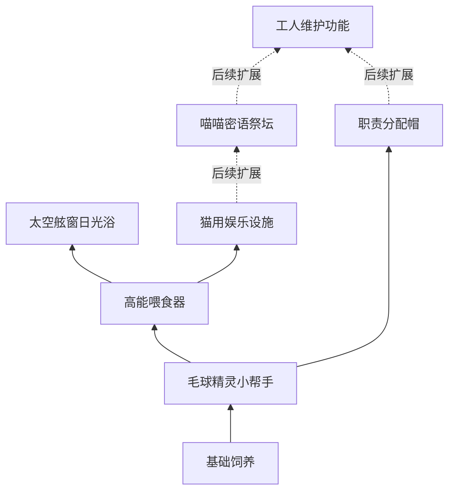

# 07｜升级树与解锁规划

v0.27｜2026-09-18。入口：[00_索引](00_索引.md)。

## 结构目标

沿用dc视觉方向：从下向上阅读，共同起点后逐步展开为2—3条主要路线，每个主体节点周围连接性能分支。分支强化不是下一主体的满级门槛。

本页为当前机制建立节点编号。**节点效果按确认机制收录；具体连线、位置、价格和局内前置为设计提案；阶段开放按v0.27：首段日光浴、次段娱乐，祭坛及维护留作后续。**旧dc的131节点及旧猫版节点不能直接当成当前树。用户指定的体验顺序见[10](10_游玩流程与引导.md)，它用于引导和定价，不要求做成一条贯穿所有项目的硬性单线。

## 主体节点与连接草案

| ID | 节点 | 获得的能力 | 阶段范围 | 建议直接前置 |
| --- | --- | --- | --- | --- |
| N00 | 基础饲养 | 基础猫、长毛与收割循环 | 第一阶段起 | 开局已有 |
| N10 | 毛球精灵小帮手 | 开放工人招募 | 第一阶段起 | N00 |
| N11 | 职责分配帽 | 为工人分配固定工作 | 建议第二阶段重点引入，具体门槛待定 | N10 |
| N12 | 工人维护功能 | 工人可维修黑屏娱乐设施 | Demo后续，配合祭坛干扰 | N11与N50，不要求性能满级 |
| N20 | 高能喂食器 | 开放购买、摆放与猫粮供应 | 第一阶段起 | N10 |
| N30 | 太空舷窗日光浴 | 开放日光浴区域 | 第一阶段的生产设施终点 | N20 |
| N40 | 次世代猫用娱乐设施 | 开放娱乐设备与换金轮次 | 第二阶段起 | N20 |
| N50 | 喵喵密语祭坛 | 开放祭坛与全局加速 | Demo后续 | N40 |

摆放草案：左路N20→N30承载饲养产量与毛层就绪；中路N10→N11→N12承载工人与分工；右路N40→N50承载换金与全局增益。N10连向N20，N20连向N40，N50跨接N12。分支各自向主体周围展开，跨线只表示明确依赖。

下面仅画主体连接提案；性能分支逐项列在下一表；图中虚线部分为Demo后续。

上述连线是设计提案，不越过阶段资格：第一阶段N40、N50、N12不可购买，第二阶段N40开放；N50与N12及其分支保留为后续内容。N11建议配合第二阶段的虫害引导，具体门槛待定。第二阶段保留旧节点及等级，不重新支付第一阶段研发费用；进入阶段不赠送新设施。

## 已确认效果的分支节点

A01—A03属于后续祭坛，不计当前Demo可购买节点；其余随所属主体开放。

| ID | 所属主体 | 分支 | 改变什么 |
| --- | --- | --- | --- |
| F01 | N20 喂食器 | 更高级猫粮种类 | 解锁新的猫粮购买资格；实际去商店买 |
| F02 | N20 喂食器 | 巨型猫转化几率 | 提高使用设施时转成巨型猫的机会 |
| S01 | N30 日光浴 | 单次时间 | 缩短一次处理时间；具体产毛语义待D02确定 |
| S02 | N30 日光浴 | 区域容纳量 | 同时容纳更多猫 |
| S03 | N30 日光浴 | 静电猫转化几率 | 提高静电猫转化机会 |
| E01 | N40 娱乐设施 | 获胜率 | 提高轮次获得换金道具的机会 |
| E02 | N40 娱乐设施 | 轮次速度 | 更快完成一轮 |
| E03 | N40 娱乐设施 | 奖品价值 | 赢取更贵的换金道具 |
| E04 | N40 娱乐设施 | 招财猫转化几率 | 提高招财猫转化机会 |
| A01 | N50 密语祭坛 | 猫咪槽位 | 指派更多猫参与祭坛 |
| A02 | N50 密语祭坛 | 单猫全局加成 | 每只祭坛猫提供更多速度加成 |
| A03 | N50 密语祭坛 | 外星猫转化几率 | 提高外星猫转化机会 |

F01是猫粮分支的入口，猫粮实际种类与子节点数量尚未确定。各转化分支是概率提升，不是直接赠猫，也不是必须先转出特殊猫才能继续。

## 不要混为一谈

| 项目 | 在树中的位置 |
| --- | --- |
| 第二阶段起，已有日光浴时开启虫害风险 | 设施联动规则，不是需要玩家购买的“蟑螂升级” |
| Demo后续，安装祭坛后出现黑屏干扰 | 设施联动规则，不另收一次故障解锁费用 |
| 招募工人、买猫、买猫粮 | 商店消费；主体节点负责资格，不等于已经买到实体 |
| 工人维护 | 功能解锁，解锁后还要安排有空闲能力的工人 |
| 旧短毛猫等多项性能分支、旧逗猫棒、暖炉 | 已移入历史，不为凑dc节点数恢复 |

## 节点呈现（设计提案）

区分阶段未开放、前置未满足、可买、已解锁和可继续强化。设计提案：阶段锁显示“第二阶段开放”等简短提示，不显示成单纯缺钱；未知内容可用轮廓预告。主体节点旁可预览下一个玩法变化；旁支描述只写自身效果及作用对象，避免让玩家误以为概率提升会增加所有来源的掉落。

试排位置、升级级数、工人效率分支、猫数及设施容量体系列入D08—D10。不要把本页效果目录误作最终可直接导入游戏的完整配置表。

## 收藏补货与升级树

神秘扭蛋机由首枚代币接触解锁，不依赖娱乐或祭坛。第一批12件收齐后补入第二批24件，同时进入第二阶段；不是树满级后补货，也不要求转化成功。既有研究和性能等级连续保留，新主体仍需前置和资金。

第一阶段的2套与第二阶段新增4套均为6件一套，总计36件。各分支阶段等级上限仍待定，不把第一阶段“止于日光浴”写成必须升满日光浴。

## 一小时Demo的节点预算

旧原型第一阶段可访问8个节点、最多21次升级，第二阶段累计14个、最多39次。连续经营只新增6个节点和18级购买空间，不能按21＋39计算重复研发。旧数值仅供识别内容缺口，不是新版价格表。

建议在已有节点下补有用的工人效率、容量与任务策略分支，或开放后段性能等级；不用重复图标凑数量。详细预算、dc参考和代币联动提案见[16](16_一小时Demo数值与阶段节奏分析.md)。

## v0.27-N2试玩树

当前实装两阶段主体worker→feeder→sun，以及第二阶段worker→hats、feeder→arcade，均不要求性能旁支满级。新增worker:efficiency、worker:carry、feeder:capacity三个试玩分支，费用/效果集中在17第12节。树和补给不展示祭坛、维护等当前不可玩的付费按钮；第二阶段入口明确显示首批收藏条件。连线仍为试玩实现，不宣称正式前置图已定。
