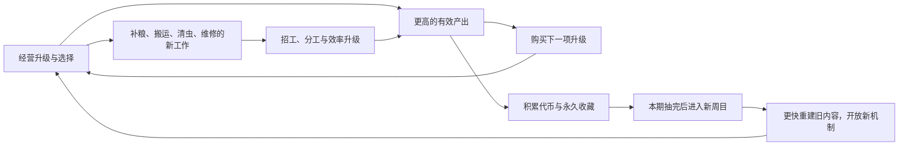

# 16｜两小时 Demo：数值与周目节奏分析

2026-09-18｜基于 v0.26 当前代码、本地 dc Demo 解包记录及公开一手资料。**用户目标：Demo约2小时。本文按首次主动游玩、前三周目合计约120分钟设计；不是每周目2小时，也不把离线等待计入时长。**具体时点、节点扩充、代币改造和价格区间均为分析建议，尚未应用到游戏。

## 1. 结论：先让正确经营影响通关，再拉长成本曲线

“节点成本＋节点数量控制时间”的方向成立，但只覆盖了一部分。当前结束周目的条件是扭蛋抽空，而代币主要来自毛层数量；喂食增产、叠层额外收益、巨型猫、娱乐换金、售价升级，并没有同等地推进代币目标。于是玩家可以绕过设施，只堆普通猫完成周目。提高设施价格甚至会让这种绕行更划算。

建议同时校准三条曲线：**经营升级曲线决定多久遇到新玩法；工人处理能力决定新劳动持续多久；代币与收藏曲线决定何时完成本周目。**继承则负责压缩下一轮已经体验过的部分。三条曲线需要在本轮末段会合，但不新增“必须点满树／集齐特殊猫”之类的重开硬门槛。

## 2. 当前 Demo 的可复现问题

新增诊断直接调用 Godot 4.7.1 下的现有模型，每种策略使用3个固定随机种子；最多每秒手动收割1只猫。购买、指派、出售、抽取按脚本策略完成，**没有计入读界面、鼠标行程、思考和切换菜单的时间，所以下表是模拟生产时间，不是真人通关时长，也不是全局最优路线。**不读写玩家存档。

| 策略 | 三周目合计中位数 | 发现 |
| --- | ---: | --- |
| 按当前引导买工人和全部阶段设施 | 7.42分钟 | 是快速机制演示规模，距离120分钟很远 |
| 每轮只把猫买到12只，不买工人或设施 | 4.42分钟 | 比完整经营路线还快，直接绕过主要设计 |
| 全程不购买，只有初始2只猫 | 16.23分钟 | 节点数量和成本都没参与这条通关路径 |
| 全部需要花毛球的费用乘16，其他机制不变 | 10.90分钟 | 不能把7分钟变成约112分钟，反而导致设施被跳过 |
| 完整经营，但等8层再收 | 8.88分钟 | 毛球更富裕，却未必更快完成收藏；攒毛与长期目标不够一致 |

当前旧流程测试额外要求“已安装本轮关键设施”才结束；真实游戏没有这一条件。本次同时测试两种结束口径，完整经营策略的结果相同，但只买猫和不购买策略暴露了原测试没覆盖的路线。不能通过给测试增加设施门槛来掩盖游戏中的绕行。

数据：[完整18组诊断](../毛球满屋/reports/pacing_2h/current_audit.json) · [汇总与预算](../毛球满屋/reports/pacing_2h/analysis_summary.json) · [诊断脚本](../毛球满屋/tests/analyze_pacing.gd)。

### 当前收益关系中更具体的风险

| 风险 | 按当前参数计算 | 对节奏的影响 |
| --- | --- | --- |
| 叠层使后期固定等上限占优 | 普通猫不加成：1层3/6＝0.5毛球/秒；3层18/18＝1；8层108/48＝2.25 | 现金压力消失后，收割策略趋于单一；可以分阶段提升毛层上限，但要保留多攒多得 |
| 娱乐设施可能是收益倒退 | 基础娱乐期望为0.55×12/5＝1.32毛球/秒；普通猫等8层为2.25 | 占用一只猫却少赚毛球，且不推进现行代币；售价和轮次分支都需要重新算机会成本 |
| 巨型猫压过娱乐路径 | 标准粮、持续饱食、8层巨型猫约2.25×3×1.65−0.6/8＝11.06毛球/秒 | 对比中尚未计故障、走动、设备成本和永久buff；已说明不能只看娱乐“会出新物品”就认为值得投 |
| 转化过快且互相争抢猫源 | 10%每次，平均10次；按完整喂食周期折算约80秒，升到42%约19秒；首轮即时触发还会缩短 | 长时间试玩时基础猫容易先全部变巨型猫；后续设施需要新猫。需要允许保留短毛猫／指定转化对象的策略 |
| 维护可能在危机前就完成 | 种子81926：第三轮37秒学会维修，63秒首次黑屏 | 自动化消除了尚未体验的新劳动，“先遇困难再解决”的过程可能缺席 |
| 补粮频率随数量急升 | 40粮仓、每猫8秒1粮：6猫约53秒用完，24猫约13秒 | 增加猫数还在同时增加操作压力；粮仓容量和工人补给能力必须进入节奏模型 |

这些是公式和策略诊断，不是玩家体验结论。娱乐最终升级或永久售价buff能改变回报，但应该让首台娱乐也有合理用途，而不是先忍受长时间倒退。

## 3. dc 真正值得借鉴的数值组织

依据用户提供并已解包的本地Demo，原件保持只读。这棵树有131个场景按钮，80个未被Demo锁直接或间接阻挡，静态合计543次可增购等级；其余配置、被锁内容和未实例化记录不能混算。**80不是必须购买数，543不是必须点击数，任何一个数字都不能直接推导其实际游玩时间。**

基础费用公式已由解包脚本核对：当前等级L的下一次升级费用为`roundi(基价×增长系数^L)`。原配置中的`ALL_COST`不能直接当逐级总费用。

| dc 本地记录 | 基础费用安排 | 借鉴到我们的游戏 |
| --- | --- | --- |
| 勺子初段产量，4级 | 50 → 80 → 128 → 205；每级产量+1 | 前几次升级立即可见，后续逐渐需要积攒 |
| 勺子初段动画倍率，5级 | 35、44、55、68、85；增长1.25，每级+0.03 | 小额旁支提供频繁选择；动画倍率不能未经进一步验证就当作等比例最终收入 |
| 蘑菇等待第一段，10级 | 基价200，增长1.15；3秒基础，每级减0.1秒 | 自动化可逐步改善，而不是只买一次工人后不再变化 |
| 蘑菇产量倍率，4级 | 5,000 → 20,000 → 80,000 → 320,000；倍率值每级+1 | 大跨越分支与便宜补强分支并存，不统一一个增长系数 |
| 新主体阶段 | 蘑菇200、铲子1,500、青蛙10,000、三叉戟25,000、镐子250,000 | 新玩法门槛按阶段跳跃，但必须结合该阶段收入；这些是不同分叉上的节点，不是一条串行路线 |
| 同一属性分段 | 旧勺子、旧帮手在后面的节点簇再次得到强化 | 新阶段重新激活旧系统；我们可在原分支追加阶段等级，不必复制一堆相同图标 |

来源：[本地配置](../策划归档/2026-09-18_旧方案与文档集归档/摸猫增量策划案/参考研究/DirtClicker/sheets.source.json)、[逐节点拓扑](../策划归档/2026-09-18_旧方案与文档集归档/摸猫增量策划案/参考研究/DirtClicker/节点研究/逐节点拓扑.json)、[费用生成脚本令牌](../策划归档/2026-09-18_旧方案与文档集归档/摸猫增量策划案/参考研究/DirtClicker/节点研究/data_controller.tokens.gd.txt)。

**dc可借鉴的是交错的投资节奏，不是它的绝对价格或131个图标。**此外，本地解析有14条前置字段最终按满级解释；这是参考包的事实，不覆盖我们“性能旁支不必满级才能推进下一主体”的既定要求。

## 4. 《刮个爽》与其他增量游戏：借鉴什么、不混淆什么

这里的《刮个爽》是 **Scritchy Scratchy，Steam app 3948120**。公开官方资料可以确认：局内升级改变刮奖效率、赔率和收益；Prestige重开获得Jack Points用于永久升级。2026-01-30官方v0.7公告还说明，推进依据改为已赚取的钱，首次Prestige赠送永久升级来加快后续局。**未取得它的原始数值表，不能声称已经复刻其JP公式、节点价格或精确周目时长。**[官方商店说明](https://store.steampowered.com/app/3948120/?l=english)、[官方v0.7更新记录](https://steamcommunity.com/app/3948120/allnews/)。

| 参考逻辑 | 我们适合采用的部分 | 需要保留的区别 |
| --- | --- | --- |
| 《刮个爽》的局内成长＋永久成长 | 每次重开都更快越过旧内容，永久奖励不只是说明文字 | 我们按收藏完成推进阶段，不照搬它的重开条件或随机失败 |
| 首次重开保证得到有用成长 | 第一轮收藏必定增强基础产毛／早期操作，第二轮开局马上可感知 | 第一抽不应只加成尚未开放的娱乐设施 |
| 推进和有效经营成果相关 | 经营新设备、提升有效产出，也应推进长期收藏 | 不直接照搬“赚多少钱解锁某票种”；我们的主体仍有周目资格与研究前置 |
| Cookie Clicker、AdVenture Capitalist等的经营与重开 | 成本曲线逐步追上收益，重开提供跨越旧瓶颈的能力；可用次线性永久增长抑制过快膨胀 | 两小时Demo不适合搬入多年挂机的层级数量；不必另加第二套Prestige货币 |

后两类增量数学与重開分析可参考Kongregate的[开发者数学文章](https://blog.kongregate.com/the-math-of-idle-games-part-iii/)与[数值建模说明](https://blog.kongregate.com/quest-for-progress-the-math-of-idle-games/)。它们是设计参考，不是本游戏参数已验证的证据。

## 5. 两小时的内容预算：建议30＋40＋50分钟

将约120分钟定义为普通首次玩家的目标中位时长，先以110—130分钟为调参区间；熟练主动玩家可以更快，频繁离开和低效率玩家可以更慢，不用强制计时锁拉齐。下表都是目标，不是当前Demo已经达到的结果。

| 周目 | 本轮目标／累计 | 旧内容重建 | 新内容与关键时点（本轮内） | 本轮末段应在做什么 |
| --- | --- | --- | --- | --- |
| 1 | 30分钟／30分钟 | 无 | 0—3分钟收割与首次接触；2—4分钟第一工人；5—8分钟喂食；8—15分钟猫粮与转化；15—22分钟日光浴与搬运 | 22—30分钟用静电、攒层与工人效率优化生产，逐步完成首轮收藏 |
| 2 | 40分钟／70分钟 | 约5—8分钟恢复上轮核心能力 | 7—12分钟虫害、清虫与职责帽；12—20分钟首台娱乐及招财转化 | 20—40分钟在产毛与娱乐之间分配猫，改善换金和岗位能力，完成新系列；需要中段实质强化 |
| 3 | 50分钟／120分钟 | 约6—10分钟恢复旧设施与分工 | 10—18分钟祭坛；18—24分钟黑屏与维护；24—32分钟外星猫与范围协作 | 32—50分钟通过更大猫群、岗位策略、设施容量与阶段强化继续提升，完成Demo收藏 |

后面单轮更长，是因为增加了新内容和收藏，不是旧内容变慢。第二轮不能再花前30分钟重学第一轮；第三轮也不能重做前70分钟。

**当前内容密度不足以仅靠涨价健康地填满这张表。**尤其第二轮后20分钟、第三轮后18分钟，需要新增有作用的效率与策略选择；如果只能继续重复补粮和等币，应缩短Demo，而不是把120分钟当不可退让的硬指标。

## 6. 节点数量如何变成有效时长

当前按周目可访问范围计数：第一轮8个可视节点、最多21次树内购买；第二轮14个／39次；第三轮19个／53次。包括主体和旁支等级，不包括重复买猫、招工与设备。不能把后两轮的旧节点全部算新内容，也不能假设玩家每轮都会点满。

| 项目 | 第一周目建议 | 第二周目建议 | 第三周目建议 |
| --- | --- | --- | --- |
| 本轮可见且能参与选择的节点总量 | 12—16 | 20—26 | 28—36 |
| 一条正常路线的有效树内购买次数 | 18—25 | 25—35，含快速重建 | 30—40，含快速重建 |
| 早期小升级间隔 | 约20—45秒 | 旧区更快 | 旧区更快 |
| 中后期有用购买／配置调整间隔 | 约45—90秒 | 约45—90秒 | 约45—90秒 |
| 实质玩法或策略变化 | 每5—8分钟一次 | 每5—8分钟一次 | 每5—8分钟一次 |

这些是密度预算，不是“节点数×平均等待＝通关时长”。多个目标并行积攒、玩家会跳过部分节点，买下一次升级的收入也在增长。

建议优先补以下缺口，均是提案：

- **工人能力分支**：移动、单次操作、批量搬运。工人仍实际执行劳动，不创建自动补粮／自动维修机器。
- **规模配套分支**：喂食器粮仓、服务范围、设备容量。让猫数增加后的新压力有对应投资。
- **更细的职责策略**：按猫种／设施指定工作、保留未转化猫、有限的紧急支援。现有基础目标层数设置继续好用，不为了凑节点把已有便利拿走再售卖。
- **同一分支的阶段等级**：随周目开放更高的上限和收益段，留在原有节点内；少量真正带来新动作的批量操作单独作为能力节点。

新主干不要求旁支满级。转化也不能成为随机硬锁；没有特殊猫的玩家仍能完成经营，拥有合适组合则更高效。

## 7. 定价用“多久能买、多久回本”，再转换成毛球

阶段定价先从静态的参考玩家状态反推，生成固定表；不要在运行时偷偷按玩家实际收入涨价，那会抵消玩家的优化。

`预计积攒时间 ≈ max(0，整套投入 − 现有资金) / 当前净收入`

`经济回本时间 ≈ 整套投入 / 新增净收入`

整套投入包括研发、第一台设备、必要工人和初始耗材；新增净收入扣除猫粮、占用猫的原产量及故障损失。工人还有解放注意力的价值，不能只用“比手动多赚多少”评价。

| 升级角色 | 参考积攒时间 | 起始费用曲线建议 | 对应体验 |
| --- | --- | --- | --- |
| 开局第一批小升级 | 10—30秒 | 独立低价 | 快速验证“花钱以后更强” |
| 常规效率旁支 | 20—60秒，后段可到90秒 | 同段增长约1.18—1.35 | 高频、小步进展 |
| 新设施的研发＋首购套餐 | 60—150秒 | 按阶段收入独立定价 | 解锁后能实际用上，不在研究后再次空等数分钟 |
| 范围、批量、显著容量提升 | 90—180秒 | 少数等级，增长约1.8—2.5 | 一次购买明显改变操作与分工 |
| 新需求的自动化解决方案 | 理解问题后约1—3分钟可获得 | 结合故障下的真实净收入定价 | 短暂手忙脚乱后释放双手，避免停产后连维修都买不起 |
| 阶段后段的高收益强化 | 120—240秒 | 独立高段，期间有其他选择 | 支撑长期目标；不能让所有可见节点同时都买不起 |

示例：参考玩家有200毛球、净收入10/秒，希望约90秒凑齐新系统，整套价预算为1100；可分研发350、实体400、配套350。不是只把研发定成1100，再另收实体费。

若收入每步乘h、价格每步乘g，积攒时间大致按`(g/h)^步数`变化。关键不是“涨价了没有”，而是价格相对实际收入涨得多快；当收益为线性加法时，后段还需逐级重算。

对于猫与工人的重复购买，保留独立数量价格曲线，并比较“多买一只”与“升级现有群体”的回本。不要恢复整个房间的硬总猫数上限来代替平衡。

## 8. 代币必须与新系统的有效产出重新连接

**优先建议：保留首枚代币的早期保障；后续改按有效生产贡献推进，按固定递增阈值出币。**这是待采纳的新方案，不是现有代码规则。

有效贡献可以来自主收割的毛球产出，以及娱乐设施主奖励入库时的毛球等值。它反映合法的产量、叠层与设备升级，让喂食、巨型猫、娱乐、祭坛都能间接推动收藏。道具入库时固定计值，出售时不再累计；消费、退款、重复结算和静电派生奖励不能重复记贡献，招财附加奖励也先不额外记，避免递归与套利。收益buff是否计入要选定同一口径并在调参中保持一致，预算示例暂按计入。

收割更高毛层应推进更多贡献，不能退回“每次抚摸一枚抽奖判定”。静电仍保留毛球经济价值，今后如要计入贡献必须另做触发链审计。

每枚币的贡献需求从离线预算表生成，玩家优化后可以更快到达；不设固定在线分钟数，也不因领先目标就暗中提高门槛。换金奖励很随机，可增加独立保底累计进度，但不能把招财猫正面奖励改回代币。

### 收藏密度建议

| 周目 | 当前收藏数 | 两小时方案建议 | 参考抽取节奏 |
| --- | ---: | ---: | --- |
| 1 | 2系列×3件＝6 | 2系列×5件＝10 | 首抽约30—90秒，其后约3分钟一次；末段可略长 |
| 2 | 新3系列×3件＝9 | 新3系列×5件＝15 | 重建时较快，后续约2—3分钟一次 |
| 3 | 新4系列×3件＝12 | 新4系列×5件＝20 | 新机制提供更多贡献，约2—3分钟一次 |

总计从27件变为45件是建议，不能仅多加18张收藏图来“增加内容”。每系列总buff先定好，再分摊到5件；**不把当前每件加成原样复制，否则扩大池子也同时扩大永久倍率。**首件就有效，完成一套可给清晰反馈而不必另叠大倍率。

若保留当前27件，按30／40／50分钟计算，平均约5／4.4／4.2分钟才一抽；两次永久奖励之间必须有足够的经营反馈。这比45件方案对中段内容密度的要求更高。

### 可复算的初始预算，不能当平衡结果

随文提供了分段收入假设和累计贡献阈值。以第一轮为例，假定0—3、3—8、8—15、15—23、23—30分钟，平均有效产出分别为2、4、10、24、40单位/秒，则30分钟共34,080单位。计划在第1、4、7、10、13、16、19、22、26、30分钟抽取，对应累计贡献阈值：

`120，600，1320，2760，4560，7200，11520，15840，24480，34080`

这是将目标时间乘上**假定**收入后反推的配置初稿，不是固定定时发币，不是Godot已验证的两小时路线。完整三轮假设的累计预算为34,080／216,900／960,000，全部时点与单币增量在[预算JSON](../毛球满屋/reports/pacing_2h/analysis_summary.json)。实际收入曲线低于假设时要降门槛或提高系统收益，高于假设时先检查策略与倍率来源。

## 9. 重开要带来更快的旧阶段，以及真正的新阶段

当前首轮收齐后，永久产量为×2.05、毛层速度为×1.36，理想基础产能约×2.79；第二轮收齐后，分别为×2.95和×1.36，约×4.01（未计工人吞吐和新设施）。已有继承强度并不弱，主要问题是内容很快被买完，以及不少增长没有推进代币。

已有永久产量与速度效果都应开局生效。建议先以第二轮基础生产约为原开局的2—3倍、第三轮约3—5倍作为校准范围，而非每件收藏都乘一次独立大倍率。

建议重开保留教学记忆、已用过的操作规则和岗位预设；实体与局内等级按试玩清单重建。可以评估“曾招募过工人后，下一轮缩短首工人重建”，但不要凭空让未解锁的维修功能提前生效，也不要自动继承全部产线规模。上述便利继承仍需设计选择。

新需求要有一次可理解的体验：例如首台黑屏时给短提示，让玩家看到停产、学会捶打，再引导维护节点。可考虑首次事件经历作为维护研究资格，而不要求多次手动清完整批设备；它不改变“收藏完成即可重开”的规则。后续周目已经学过的事件不重复强制教学。

## 10. 接下来怎样验证两小时，而不是宣称已经两小时

优先顺序：①修复代币与经营脱节；②使新设备首购有回报；③补工人和规模分支；④给旧分支阶段等级；⑤定收藏总强度与池量；⑥再反推各轮价格；⑦真人试玩调整。

必须同时检查：

- 完整经营、只堆猫、不购买、先娱乐、先自动化等路线。不要求所有人同一路，但新设施路线不能系统性地比跳过设施更差。
- 每轮首工人、首币、主要设施、首次故障、自动化接手和池空时点；正常经营路线在新设施尚不可负担时就抽空，视为内容节奏缺陷；允许玩家主动放弃部分支路，不增加强制体验全部设施的通关条件。
- 升级带来的净收益、回本、岗位负荷，以及无新操作／无有用选择的持续时长。正常阶段不要连续数分钟只剩等待。
- 第一次危机人工处理约1—2分钟后应有现实可达的解决方案。自动化稳定阶段可把重复维护时间压到主动操作时间的30%以内，作为观察目标。
- 第一轮恢复成本不能在后续轮次原样重演；同时保留新内容的探索空间。
- 先做6—10名首次玩家的定性试玩，定位不理解和疲劳；再扩大样本估计中位时长与分布。记录主动游玩与离开窗口的时间，不把挂机凑进2小时。

熟练路线约80—100分钟、普通首次约110—130分钟可作为初步观察区间，尚无真人样本支撑，不能写成承诺。**目前已证明的是现有数值不足以支撑目标，以及单纯提价不能修复；新的两小时方案仍需进入下一轮实现与验证。**
