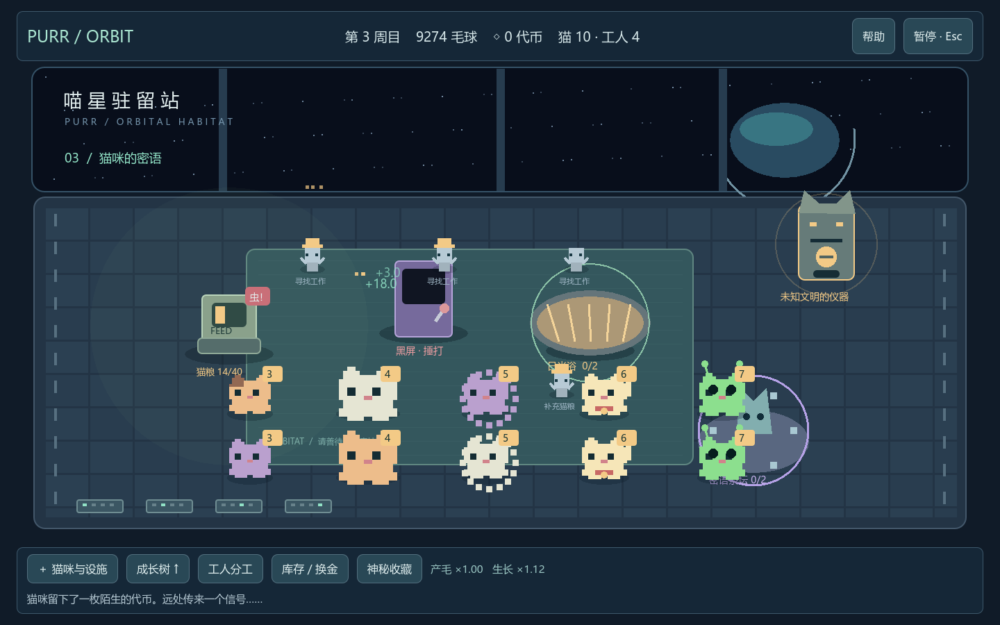

# 喵星驻留站 · 三周目可玩 Demo

2026-09-18｜依据空间站外星猫策划 v0.26 改版｜**Godot 4.7.1**。

在原 `毛球满屋` 工程内完成改版。正式规则入口仍是[策划索引](../摸猫增量策划案/00_索引.md)，本工程的试玩参数见 [DEMO_RULES](DEMO_RULES.md)。当前使用程序绘制的像素猫与空间站设施，是可玩机制原型，尚非最终美术和发行版本。

## 开始游戏

双击本目录的 **`启动Demo.cmd`**。启动器会验证引擎必须为 4.7.1，再进入游戏。当前机器使用工作空间 `.tools/godot-4.7.1/` 中的引擎；该目录不纳入 Git。

也可以用 Godot **4.7.1** 导入本目录 `project.godot`，按 F6 运行 `scenes/main.tscn`，或按 F5 运行项目。其他机器可运行 `launch.ps1 -Engine '自己的 Godot 4.7.1 可执行文件路径'`。

## 怎么玩

- **来回移动鼠标抚摸猫**：不按键，积累抚摸量后收割。猫头上的数字是毛层；等多层再收，赚得更多。
- **按住猫拖动**：搬到空地或送进日光浴、娱乐设施、祭坛。生产后的产物直接入库，不用拾取。
- **成长树 → 商店 → 场地**：先研发，再买实体，最后点击地板摆放；右键取消。树可拖动、缩放，上方按钮可定位各路线，主体周围显示性能旁支。
- **点击设施**：补入猫粮、连续点击清虫或捶打黑屏设备。商店采购猫粮、选择升级和出售道具仍由玩家决定。
- **招募毛球精灵**：真实行走、搬猫和执行操作。工人面板设置收割目标层数；第二周目解锁职责帽分配固定工作；第三周目研究维护后才可交给工人维修。
- **神秘代币**：首次获得时接触未知存在。扭蛋不会重复，收藏加成即时生效，并永久保留。抽完当期收藏后可回应下一段信号，也可暂留当前周目。
- **Esc**：暂停、保存、设置、重新开始；设置中可切换全屏、减少收益粒子。

## 三周目内容

| 周目 | 新增玩法 | 新扭蛋系列 |
| --- | --- | --- |
| 1 | 抚摸叠层、买猫、工人、喂食器、猫粮、巨型猫、日光浴、静电猫；不会生虫 | 2 系列，共 6 件 |
| 2 | 喂食器虫害、职责分工、娱乐设施、换金道具、招财猫 | 新增 3 系列，共 9 件 |
| 3 | 密语祭坛、外星猫、黑屏干扰、工人维修 | 新增 4 系列，共 12 件 |

合计 27 件不重复收藏。第三周目完成后保留场景继续经营，没有虚构第四周目内容。性能分支不要求满级才能研发下一主体，资金也不能越过周目门槛。

## 存档

每 10 秒及购买、研究、扭蛋等操作后保存；退出时保存。开始页支持继续与备份恢复。

位置：`%APPDATA%/PurrOrbitDemo/space_cats_v26.save`；上一份存档后缀 `.bak`。独立存档目录，不读取或覆盖旧原型存档。新游戏与新周目都先展示清零范围，点击确认才执行。没有离线收益。

## 验证

已使用 `4.7.1.stable.official.a13da4feb` 执行：

- `tests/test_demo.gd`：叠层、结算、周目门槛、设施联动、转化边界、工人、扭蛋、继承和存档检查。
- `tests/test_progression.gd`：从零资金通过正常购买、生产和抽取接口跑完三周目；报告在 [progression.json](reports/v026/progression.json)。这是固定策略模拟，不等于真人试玩时长。
- `tests/render_demo.gd`：向实际视口发送鼠标移动、拖放、按钮点击及 Esc；检查面板遮挡、暂停和分支树，截图覆盖 1440×900 与较小窗口。

在工作空间根目录执行：

```powershell
$engine = '.tools/godot-4.7.1/Godot_v4.7.1-stable_win64_console.exe'
& $engine --headless --path '毛球满屋' --script res://tests/test_demo.gd
& $engine --headless --path '毛球满屋' --script res://tests/test_progression.gd
& $engine --path '毛球满屋' --script res://tests/render_demo.gd
```

测试不读取或改写玩家正式存档。场景与界面截图位于 [reports/v026](reports/v026/)。改版前源码、场景、测试及启动配置副本保留在[归档批次](../策划归档/2026-09-18_旧摸猫Demo改版前/改版备份说明.md)。



## 两小时目标的数值诊断

本Demo当前仍是快速机制原型。后续120分钟目标、参考研究与诊断结果见[策划16](../摸猫增量策划案/16_两小时Demo数值与周目节奏分析.md)；提案尚未应用。

在工作空间根目录运行，只会更新分析报告：

```powershell
& '.tools/godot-4.7.1/Godot_v4.7.1-stable_win64_console.exe' --headless --path '毛球满屋' --script res://tests/analyze_pacing.gd
python '毛球满屋/tests/summarize_pacing.py'
```
