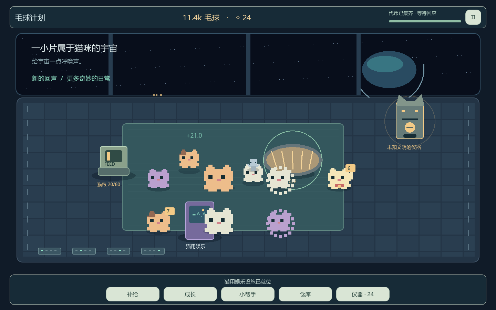

# Purr Orbit / 毛球计划 · v0.27连续经营Demo

Godot **4.7.1**，2026-09-23全机制试玩版。统一毛球升级树、单层／攒层／换金路线、分组照料、祭坛／外星猫／干扰维修已开放；12＋24收藏连续补货。保留队友导入美术。当前参数优先读17第18节，验证见[本批报告](reports/september23/README.md)，下方早期日期章节保留历史。

## 启动

双击[启动Demo.cmd](启动Demo.cmd)，或用Godot4.7.1导入[project.godot](project.godot)后按F5。本机引擎在工作空间`.tools/godot-4.7.1/`，不纳入Git；其他机器可使用`launch.ps1 -Engine 'Godot4.7.1可执行文件路径'`。

## 怎么玩

- 不按键，在猫身上来回移动鼠标收毛球，行走途中也能收割。随机走动后会停留播放idle，不锁收割；新增毛层短暂膨胀后恢复，毛层越多仍越蓬松。等多层再收更赚，也更快获得代币。
- 按住拖动搬猫，松在日光浴或娱乐设施上即可送入。点击设施补粮、清虫和移动设备。
- **成长**研究能力 → **补给**买实体 → 点击空地摆放，右键取消。升级显示当前与下级效果；不要求旁支满级。
- 招募小帮手接手劳动，默认等1层收割；树上解锁职责帽分工与付费层数，S10后按组选择已购范围内的目标。工人不替你买粮或出售。猫粮支持10/100份等价采购。
- 获得首枚代币时收到神秘仪器；每次投1币，得到一个不重复收藏。第12件后自动补入24件，经营进度不清零。36件后可继续经营。
- 娱乐奖品自动入**仓库**，出售后才得到毛球；C路线支持订单预留、取消及提交，普通出售不会吞掉预留商品。收藏不能卖。
- 抚摸进度显示在脚下短条，离开后保留3秒，返回同猫可接续；超时清空，静止不增进度。暂停冻结，读档／拖动取消。
- **Esc**暂停、保存、设置或查看帮助；开始菜单提供新游戏、继续、备份恢复和设置。

设施与机制由同一树的前置和毛球费用解锁，不再受收藏批次限制。祭坛、外星猫、干扰和维护均在当前Demo内；所有猫用设施同时只接待／吸引一只猫。

## 数值和代码入口

[策划索引](../摸猫增量策划案/00_索引.md)是规则入口；[17号文档第12节](../摸猫增量策划案/17_Demo数值总表与调参清单.md)维护当前运行参数、旧值、目的与验证。[DEMO_RULES](DEMO_RULES.md)区分试玩选择与正式待定。

| 文件 | 负责内容 |
| --- | --- |
| `scripts/balance.gd` | 生产、工人、设施、贡献阈值等常量 |
| `scripts/data.gd` | 阶段、研究树、价格、六个6件系列及升级说明 |
| `scripts/model.gd` | 生产/岗位/贡献结算、不重置补货、原子存档与校验 |
| `scripts/main.gd` | 休闲风菜单、紧凑HUD、成长/补给/仓库/收藏面板 |
| `scripts/room.gd` | 场景坐标映射、鼠标收割/拖放、贴图与膨胀反馈 |

## 存档

`%APPDATA%/PurrOrbitDemo/space_cats_v27.save`，备份`.bak`。每10秒、交易及退出时保存。旧`space_cats_v26.save`原件保留，界面提示可用旧工程读取；新版不静默覆盖或猜测迁移。不计算离线收益。

## 验证

```powershell
$engine = '.tools/godot-4.7.1/Godot_v4.7.1-stable_win64_console.exe'
& $engine --headless --path '毛球满屋' --script res://tests/test_demo.gd
& $engine --headless --path '毛球满屋' --script res://tests/test_progression.gd
& $engine --path '毛球满屋' --script res://tests/render_demo.gd
& $engine --headless --path '毛球满屋' --script res://tests/export_balance.gd
python '毛球满屋/tests/summarize_v027.py'
```

125项模型断言、真实输入与1440×900/1280×800界面检查通过。21组策略模拟完整经营57—66分钟，攒8层50—53分钟；不是真人通关时长。首阶段约19—24分钟仍早于25分钟建议。证据与限制见[报告](reports/pacing_v027/README.md)。测试只用隔离测试档，不覆盖玩家进度。

`reports/v026`、`reports/pacing_2h`保留历史，不是新版验收。`analyze_pacing.gd`现在只提示历史入口，当前分析用`pacing_v027.gd`。`--calibrate`只写离线参考，不修改游戏参数。



### 行走与长毛反馈专项验证

运行`--script res://tests/test_cat_feedback.gd`（使用图形模式）。17项检查覆盖移动中真实鼠标收割、抚摸不停止/改道、无行走冷却、旧档兼容，以及实际像素膨胀/脚底固定/保留毛层体型。截图在reports/cat_feedback。此前21组时长记录是这次移动改动前的基线。

### 2026-09-21 队友美术合并

已合并远端`04006a9d`；合并前本地快照为`771ad2f3`。全部371个`Art/`文件保持远端内容，当前数值配置与导出保持本地版本。`cat_visuals.gd`维护纯显示动画，`station_backdrop.gd`/`station_hud.gd`维护空间站与右侧控制台，`harvest_art.gd`/`token_effect.gd`维护收获特效。动画不会阻止移动或收割；数字键不会免费添加猫。

鼠标测试通过`room.screen_position()`把模拟坐标转为画面坐标；不可将显示用`ART_FLOOR`覆盖经济模型中的`D.FLOOR`。新增贴图时维持这种分离。标题原图含旧文字，通过运行时标题牌使用正式名称，原图完整保留。

[合并取舍、完整验证与截图](reports/art_merge/README.md)。历史节奏数据不作为本次新增节奏结论。

### 2026-09-21 自动觅食与随机活动

猫主动寻找有粮喂食器，到场吃1秒耗1份，获得11秒增产，到期再找粮；缺粮重选、无粮正常闲逛。自由活动随机走2—6秒/停1—3.5秒播放idle，长毛与收割不被停留锁住。扭蛋机右上贴右栏、机身在猫下层。旧v27存档兼容。

当前参数见17第12.8节。[交互验证](reports/feeding/README.md)；[新21组策略报告](reports/pacing_feeding/README.md)。完整经营模拟42—51分钟，已偏快；未擅自改价/代币门槛，不将旧57—66分钟当当前结论。

## 2026-09-21 收割系统实装日志完成

18号IMP-20260921-001—005已实装并验证：首层常驻、按层数延长真实互动、付费逐级收割门槛、单工人产出后CD及独立缩减。保留觅食与随机走停，旧搬运投入返款而不强升门槛。001—005当时的参数与报告保留历史；006当时参数更新为110像素首层、渐近3倍的操作量曲线、10秒自然长毛。详见策划17第13.4.2节。273项断言和真实鼠标UI回归通过，21组策略中完整经营52.92—59.13分钟；数值仍待真人校准，未提交或推送。

006证据：[机制与交互](reports/harvest_006/README.md)、[21组策略](reports/pacing_harvest_006/README.md)、[参数导出](reports/harvest_006/balance.json)。运行test_harvest_006.gd复测操作量、趋平和长毛边界；test_progression.gd、summarize_v027.py与export_balance.gd006时写入006报告目录，不覆盖旧报告。

## 007收割调整（2026-09-21）

首层165有效像素、单事件45，多层渐近495。每猫produce约1.1秒作为人工／工人共同禁收期，期间不缓存手势；cat_animation_data.gd统一动画资源时长，model计时，cat_visuals读取。暂停和读档保留剩余反应，旧v27缺字段默认0；自然长毛、工人首层2秒与自身CD保持。331项断言和真实UI／表现回归通过；完整经营模拟48.48—53.58分钟，仍待真人校准。未提交或推送。

当前测试入口test_reaction_007.gd覆盖新反应规则；test_harvest_006.gd维护当前基准的曲线回归，并非冻结旧参数。render_demo、export_balance、test_progression与summarize_v027当前写入007目录，旧报告保留。[实装验证](reports/harvest_007/README.md)、[21组策略](reports/pacing_harvest_007/README.md)、[参数](reports/harvest_007/balance.json)。数值入口17第13.5.1，状态见18的007。

## 当前008悬停停步（2026-09-21）

悬停猫立即停止自主行动、播放idle，移开后恢复原路线／活动计时；produce优先，长毛和冷却继续。临时输入不入档，UI遮挡／失焦／拖放／读档清理。进食活动随悬停暂挂属试玩实施选择。model管理hovered_cat_id，room刷新显示命中与UI遮挡，cat_visuals保持动画优先级；数值沿用007。

370项断言与双尺寸实际输入／动画回归通过。完整经营50.37—56.38分钟，补货23.25—27.73分钟；攒层47.15—52.12分钟，单层73.33—78.25分钟，模拟不等于真人一小时验收。当前输出为reports/hover_008及pacing_hover_008，旧报告保持历史。新增test_hover_008.gd验证悬停；策略脚本包含操作期间悬停、完成后移开。[验收](reports/hover_008/README.md)、[策略](reports/pacing_hover_008/README.md)、[参数](reports/hover_008/balance.json)。17第13.6.1与18的008已同步；未提交或推送。

009已修复idle滑动：model记录每个模拟步实际位移，cat_visuals在该步保持移动判定；没有位移才idle，produce仍优先。记录非持久，数值不变。256项断言及实际UI／动画回归通过，[证据](reports/idle_009/README.md)。交互截图当前写idle_009，008策略留作基线；未提交或推送。


## 2026-09-22｜16:9显示

默认窗口与视口改为1440×810，最小960×540；背景、遮罩与HUD共用16:9画布，消除原默认尺寸的上下留边。非16:9窗口继续等比居中；美术原件、模拟坐标、经济与存档格式保持兼容。`tests/render_demo.gd`已切换1440×810／1280×720验证，结果见`reports/display_16_9/README.md`。


## 2026-09-22｜开发者数字快捷键（IMP-20260922-005）

开始／读取游戏后直接使用，无需模式开关。主键盘数字与数字小键盘均可用，原F键和Ctrl组合键已移除。按9打开工具面板，暂停菜单也有入口；面板里可点击按钮。

| 数字键 | 操作 |
| --- | --- |
| 1 | +10,000毛球 |
| 2 | +100份标准猫粮，仍需补入喂食器 |
| 3 | 免费获得喂食器 |
| 4 | 免费获得日光浴 |
| 5 | 免费获得娱乐设施（第二阶段） |
| 6 | 免费获得小帮手 |
| 7 | 免费获得短毛猫 |
| 8 | 补齐首批12件收藏，沿正常补货流程进入第二阶段 |
| 9 | 打开开发者工具面板 |

设施自动寻找空位，免费解锁对应研究与前置，不增加升级等级。第二阶段仍需首批收藏完整；按8保留原进度，补齐后再次按不会重复发奖。开发操作沿用当前自动存档。长按重复、组合键和文字输入框中的数字不执行指令。

入口`scripts/developer_tools.gd`、`scripts/main.gd`；验证`tests/test_developer_004.gd`已更新为005规则，28项检查通过，双尺寸截图见`reports/developer_005`。旧004开关方案与报告仅为历史。正式经济参数和003新树状态不变。

## 2026-09-23新增代码入口

`tree_specs.gd`生成128节点，`tree_ui.gd`显示同一棵树；`build_rules.gd`负责A/B/C、订单及交叉收益；`cat_space.gd`负责空间避让与设施预约。model保存分组、订单、已购片段和scope_rules兼容标记。旧日光浴多猫容量按原价退款一次，不迁移正式存档文件。试玩Windows包位于工作空间builds/PurrOrbit_v0.27_20260923_Windows.zip。

## 2026-09-24最新软避让与自由拖放

IMP-20260924-002已完成：覆盖001的强制避让，允许短暂重叠，每对持续超过2秒后自由猫走离；拖动／放下不搜空位，读档不瞬移重排。手持／搬运优先，悬停猫停步，设施仍单猫。新判定17第20节，260项验证见reports/overlap_924；旧硬避让测试已冻结。保留固定动画锚点、3像素朝向过滤与经济值；未重跑长期节奏。当前执行文件builds/PurrOrbit_v0.27_20260924/PurrOrbit.exe更新为0.27.0.12，无新ZIP、未改正式档、未提交。

## 2026-09-28编辑器场景与原动画

IMP-20260928-001已完成。打开毛球满屋/scenes/main.tscn查看实际主场景，room.tscn为舱室，art_library.tscn为全部猫咪／设施素材预览；详细编辑方法见毛球满屋/scenes/README.md（工程内路径省略毛球满屋前缀）。HUD／菜单为保存节点，猫／设施／工人为同源场景实例；动态数量与列表在运行时远程树查看。

四套猫动画映射保持Cat1短毛、Cat5巨型、Cat8静电、Cat10招财，移除统一染色与临时项圈覆盖，原图不改。外星猫没有独立原始序列，仍为标注的Cat1绿色占位。42场景＋160既有UI／反馈断言，共202项及双尺寸render_demo通过；证据reports/editor_928。数值未改、正式存档未改、旧节奏不作本轮证据。测试实例化room.tscn，不再Room.new()。未提交。
