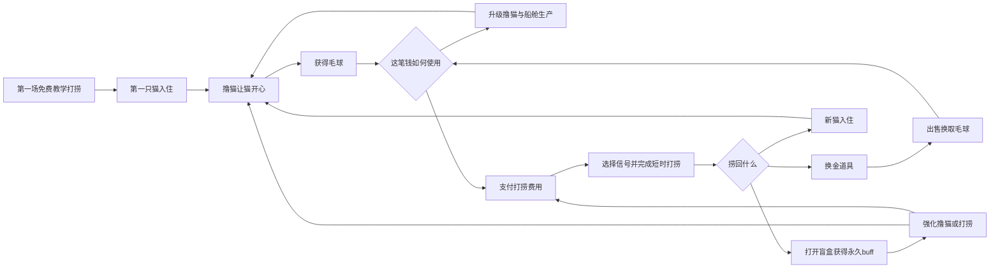
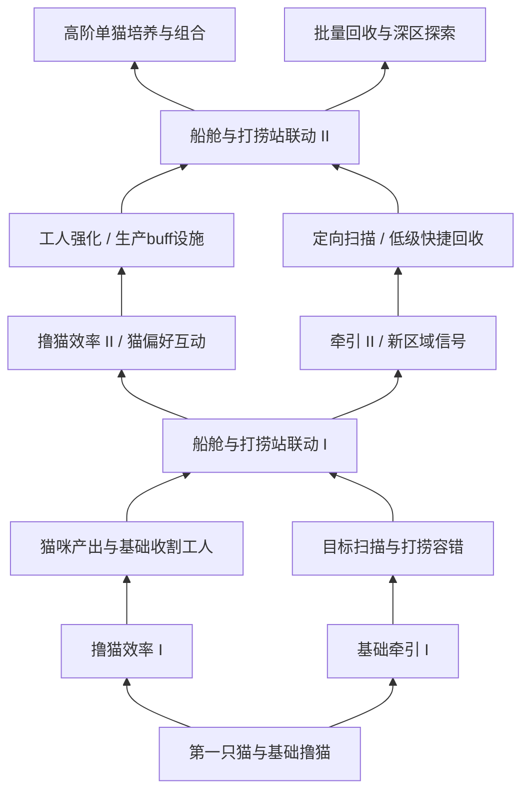

# 《Purr Orbit》／《毛球计划》：摸猫与太空打捞双循环方案

2026年10月10日｜完整玩法讨论稿

> 本文用于讨论新方案。用户提出的方向与本文补充建议分别标明；尚未替换正式策划、登记实装任务或修改游戏。文中的节奏、升级效果与规则示例均为设计建议，不能作为已确认的运行参数。

## 1. 游戏一句话介绍

玩家驾驶一艘星际打捞船，把漂流在宇宙中的奇怪猫咪带回船舱。通过撸猫获得毛球，再消耗毛球驱动打捞设备，捞回更多猫咪、能卖钱的太空杂物，以及提供永久加成的神秘盲盒收藏。

**摸猫是稳定挣钱和与猫相处的过程，打捞是花钱探索和发现惊喜的过程。** 玩家在两边交替投入注意力：想摸猫时回船舱，想看看下一次能捞到什么时去操作打捞设备。

游戏的长期变化是：船舱里的猫越来越有个性，撸猫和设备越来越有效，能够探索的打捞区域越来越奇怪；新猫和收藏又让船舱生产变得更强。

### 用户提出的方向

| 内容 | 本方案采用的方向 |
| --- | --- |
| 核心主题 | 保留普通撸猫，核心是让猫开心；猫毛是货币 |
| 新副玩法 | 增加太空“钓鱼打捞”，承接连打、蓄力和时机判断等力量感操作 |
| 开局 | 从星际打捞船开始，先打捞到第一只猫，再接入摸猫玩法 |
| 猫咪获得 | 通过持续打捞获得，带回船舱定居 |
| 打捞结果 | 只有三类：换金道具、猫、盲盒 |
| 换金道具 | 可出售的2D图标物品 |
| 盲盒 | 不可出售、提供永久buff的收藏 |
| 操作差异 | 打捞偏力量与短时紧张；摸猫偏频率、方位与温和互动 |
| 系统关系 | 摸猫产出资金，打捞消耗资金，两边需要形成投入取舍 |

后文的信号选择、区域推进、保底、费用规则和升级分支，是为补全循环提出的建议。

## 2. 两个循环如何相互推动

| 循环 | 玩家做什么 | 获得什么 | 如何帮助另一边 |
| --- | --- | --- | --- |
| 船舱摸猫 | 抚摸猫咪、掌握各自喜欢的节奏与位置，升级生产和收割能力 | 可持续的毛球收入、熟悉的猫咪与动作反馈 | 支付更远、更高价值的打捞，以及打捞装备升级 |
| 太空打捞 | 观察信号、选择目标，完成短时拉拽，再揭晓回收物 | 换金道具、新猫、永久buff收藏 | 短期补充资金，增加长期生产来源，强化已有生产配置 |

两个循环共用毛球资金。船舱升级和打捞投入会争夺同一笔钱，但打捞带来的长期收益又能够改善船舱。

## 3. 从开局到形成双循环

| 步骤 | 玩家看到与操作的内容 | 这一段要让玩家明白什么 |
| --- | --- | --- |
| 1. 捕获陌生信号 | 开场舷窗外有一只奇怪的漂流救生舱，牵引设备提示可以回收 | 飞船是用来打捞的，眼前有明确的可操作目标 |
| 2. 第一次拉回目标 | 免费完成一次带辅助的短时打捞；失败可立即重试，目标保持不变 | 打捞的基本手感，避免尚无猫、尚无收入就卡住 |
| 3. 第一只猫登船 | 救生舱打开，猫走进船舱，亮出名字与一句诙谐简介 | 猫是带回来的独特个体，玩家愿意看看它的反应 |
| 4. 第一次撸猫 | 猫主动靠近或摆出可摸姿势；鼠标移动时手、猫和声音同步反馈 | 摸猫让它开心，满足后能获得毛球 |
| 5. 第一次消费 | 先介绍一个便宜、效果清楚的撸猫升级，再亮起付费打捞入口 | 毛球既能提高收入，也能购买新的探索机会 |
| 6. 第一件换金道具 | 建议通过教学保障捞到一个离谱杂物，展示出售所得 | 普通打捞结果也有用途，出售是独立的玩家操作 |
| 7. 第一个盲盒收藏 | 建议在随后教学目标中保障一件收藏，明确显示永久buff及变化 | 收藏会让整个经营越来越强，值得继续探索 |
| 8. 第二只猫与稳定循环 | 在早期保障新猫到访，引入比较、培养和基础收割工人 | 摸猫支持打捞，打捞又带回新的生产伙伴 |

教学保障只用于首次介绍各类结果，之后进入正常随机规则。首次免费救援不能重复刷取或重复发放猫。

## 4. 船舱侧：把“撸猫”做回核心体验

建议恢复在船舱中直接摸猫的主要方式，保留猫身限定区域鼠标移动。猫的表情、姿态和声音随手势变化，满足后产出毛球并自动入库。

**不再把猫的身体放大为拔毛地图。** 毛王、毛头点击、猫身微型工人和偷毛贼等依赖该地图的设计，在这个讨论方案中不继续沿用；新方案若后续采用，需要另行处理旧原型，而不能默认它们已经删除。

摸猫的变化主要来自猫的偏好与玩家的成长，而不是给每只猫都安排一个复杂小游戏。

| 内容 | 建议交互 | 反馈与作用 |
| --- | --- | --- |
| 普通撸猫 | 在猫身上来回移动，方向明确，普通操作即可获得基础产出 | 猫眯眼、靠向手、抬头、瘫软，满足后毛球弹出 |
| 喜欢的方位 | 猫用侧头、翻肚皮或伸脖子提示当前舒服位置 | 找对位置提高满足速度或增加本次奖励；摸错仍能正常生产 |
| 喜欢的频率 | 有的猫喜欢慢慢揉，有的喜欢短促挠动；以猫的反应提示 | 匹配节奏获得额外表现和收益，不要求玩家一直精确跟拍 |
| 满足后的反应 | 正常满足与特别舒服有不同幅度的动作 | 少量投入也能看到反馈，熟练操作有更明显的奖励 |
| 收割工人 | 仅承担基础撸猫收割，保留招募、效率、收割目标与CD的成长方向 | 玩家可以去打捞，船舱仍有稳定生产；特殊偏好奖励优先留给玩家 |

建议短暂脱手保留互动进度，避免玩家切换目标就从头开始。打捞开启时未完成的抚摸按明确规则暂存，返回后给予重新接续的容错，不要求在打捞期间也操作猫。

各猫仍保留产出积累和收割冷却的成长空间；在积攒多层后，玩家可以选择一次集中收获。确切曲线与新频率奖励如何结合，后续再校准，不能直接拿旧原型数据替代。

## 5. 打捞侧：选择、拉回、揭晓

一次完整打捞包括三个环节：**选择我想尝试的信号 → 用操作把东西拉回来 → 看看里面是什么。** 游戏既要让拉回过程好玩，也要让结果值得期待。

### 5.1 选择目标

舷窗外提供少量可理解的目标信号。常规目标持续可用，特别信号可以暂存，避免玩家只能等机会，也避免错过提示就失去稀有内容。

| 信号线索示例 | 玩家能够作出的判断 | 保留的悬念 |
| --- | --- | --- |
| 金属回声较强 | 更偏向可出售的杂物，适合想回收部分资金时选择 | 可能是贵重货物，也可能是荒诞废品 |
| 检测到生命迹象 | 更偏向猫咪，适合想扩大船舱伙伴时选择 | 猫种、外观、名字和性格未知 |
| 不明文明信号 | 更偏向盲盒，适合想收集与获得永久成长时选择 | 收藏所属系列和具体物件未知 |

线索只改变三类结果的概率，普通目标不保证具体结果；教学和明确的保障信号除外。初期线索粗糙，升级后更容易辨认，让目标选择也能成长。

不建议第一次就引入瞄准、抛钩、搜索路线等多套操作。初期点击信号即可挂上牵引钩，集中验证拉回过程。

### 5.2 短时打捞动作

**每次只使用一种主要小游戏，目标为5—10秒以内。** 不将连打、蓄力、指针三个小游戏连续叠成一次长流程。推荐先验证“蓄力释放”，再补充另外两类。

| 形式 | 玩家如何完成 | 有力量感的画面与声音 | 升级带来的变化 |
| --- | --- | --- | --- |
| 蓄力牵引 | 按住鼠标积蓄牵引力，在有效区间松开；通常一两次拉动即可回收 | 缆绳拉紧、设备震动、目标突然向船靠近，成功时绞盘回弹 | 有效区间变宽、每次拉近更多、所需拉动次数减少 |
| 阻力突破 | 在短时间内连续点击，把卡住的目标从残骸中拉出来 | 每次点击对应绞盘转动和目标位移，临界时残骸脱落 | 单次牵引力提高、目标阻力降低；提供按住替代连续点击的输入选项 |
| 时机收钩 | 指针或目标随漂流摆动，在合适位置点击完成锁定 | 钩爪合拢、牵引束收紧、目标沿明确轨迹入舱 | 成功区间扩大、重试间隔缩短、完美操作奖励提高 |

小游戏类型由目标的物理状态决定，例如卡住、漂流或重型目标，而不是简单规定“猫一定连打、盲盒一定蓄力”。这样每类奖励都能经历不同的拉回方式，也不会在操作开始时就完全剧透结果。

### 5.3 失误、奖励与中断

建议一般目标采用“失误拖慢，熟练操作加分”的方式。操作失误后，牵引进度部分回落，设备可低速继续回收；玩家不会因为没点准一次就损失全部费用。熟练操作主要提高速度和换金物的出售溢价。

猫的稀有度与收藏内容在出发前由目标奖池决定，保障记录同时保留。小游戏失误不把稀有猫变成普通猫，不把收藏改成杂物。基础回收辅助也可以供不擅长小游戏的玩家使用，但不自动选择目标、支付费用或连续开始下一次。

启动前显示费用，只在确认后扣除一次；开始后免费返回船舱时，该次打捞暂停并保留目标与进度，返回继续，不再次收费。结果揭晓前不发奖励，完成后只结算一次。此中断方式是建议，后续若改为不可中断，必须重新评估对放松体验的影响。

### 5.4 结果揭晓

回收物落入船内隔离舱，开舱演出短促且可跳过：杂物显示图标和售价，猫走出救生舱并获得个体身份，盲盒开启后显示收藏与永久buff。

用于运输的救生舱或货箱只是表现载体，不增加第四类奖励。一次正常打捞获得一个主结果；批量打捞升级可同时完成多个独立结果，但每个结果仍只属于三类之一。

## 6. 三类结果分别承担什么价值

| 结果 | 玩家如何处理 | 短期价值 | 长期价值 | 建议边界 |
| --- | --- | --- | --- | --- |
| 换金道具 | 自动入库存，玩家点击出售；后续可解锁批量出售 | 回收部分成本、偶尔得到高价惊喜 | 支持下一次升级或打捞 | 常规情况下不能仅靠反复打捞出售就无限自供资金 |
| 猫 | 回收后入住船舱，展示名称、外观和简介 | 获得新的撸猫对象与动作反馈 | 增加生产来源，改变培养与配置选择 | 不默认出售、消耗或合并猫；同种猫保留个体差异 |
| 盲盒 | 开启得到不可出售的收藏，记入图鉴 | 开盒惊喜，立刻获得可理解的buff | 永久提升生产或打捞，同系列收集越多加成越强 | 建议沿用收藏不重复原则；永久继承的跨周目范围待正式规则确认 |

换金物可以非常有梗，例如“永远晚一分钟的原子钟”“失重专用压纸石”“声称自己不是猫粮的猫粮罐”。它们只作为图标和趣味文字存在，不额外形成使用、加工或维护系统。

猫的出现同样可以带有幽默感：睡在没有床的休眠舱里、穿着比自己大的宇航服、收到救援后先检查船上的纸箱。笑点围绕猫的性格和反应展开，形成“捞到它并带它回家”的记忆。

### 猫与收藏的保障建议

- 开局保障第一只猫，早期保障第二只猫和第一件收藏，确保两个循环真的能建立。
- 正常流程中分别记录“多久没有新猫”“多久没有收藏”；满足保障条件时给出明确的特殊信号。次数和条件待测试，不以一次好运代替节奏设计。
- 图鉴中提供可追求的猫种或收藏系列线索，减少完全盲抽的无目的重复。目标线索通过已探索内容逐步开放。
- 不重复收藏只在当前可获得收藏池内抽取剩余物件；当前池完成后，明确引导开放新区域。没有新收藏时，不继续以收藏概率抽到空奖励。
- 同种猫仍是新个体，但要通过区域选择、线索和培养价值控制增长。旧猫不会因新猫加入而被强制淘汰。

收藏池关闭或完成时，其结果权重如何转给另外两类，需要明确显示；不同区域可以没有某一类结果。全程仍只有三类奖励。

## 7. 资金取舍：升级生产，还是再捞一次

玩家每次获得毛球后，面前主要有三种投资：提高当前收入、提高打捞能力、直接开始下一次打捞。

| 当前情况 | 可作出的选择 | 为什么两边都值得考虑 |
| --- | --- | --- |
| 一只猫、收入较慢 | 先买一个便宜的撸猫升级，再打一两次捞 | 升级减少等待；打捞有机会带回新的长期生产来源 |
| 刚拿到高价杂物 | 出售后投资生产，或留出下一次打捞预算 | 偶发收入可以帮助跨过一个瓶颈，不必马上再花掉 |
| 猫多了但手忙不过来 | 买收割工人，提高单次互动效率 | 生产稳定后才有余裕参与打捞 |
| 已有稳定后台收入 | 追求特定猫种、收藏，或准备下一片区域 | 自动化将玩家从重复劳动中释放出来，探索接替主动操作 |
| 深区价格很高 | 改善生产配置，或在低区继续做较便宜的回收 | 进阶区域是阶段目标，低区保留可负担的活动 |

### 建议经济边界

**主货币保持一个：毛球。** “猫毛能源”“资金”和“打捞燃料”是这笔货币的不同用途，不另增一套需要兑换的油料。单根毛、毛团、毛线球的面额晋升暂不加入本方案的必要循环。

普通杂物的平均出售回款应低于对应打捞成本。若仅计算资金：

`每次预期资金净支出 = 打捞费用 − 换金道具出现概率 × 平均出售价格`

这项净支出应保持为正，猫与收藏提供额外的长期价值。每次全局buff、售价加成和费用折扣提高后都要重新核对，防止形成“打捞—出售—无限打捞”的独立印钞循环。

下一次打捞所需的主动挣钱时间可用下式观察：

`约需挣钱时间 = max(0, 下一次打捞费用 − 当前可用余额) ÷ 实际毛球收入速度`

实际收入要同时考虑玩家摸猫、工人收割与冷却，不能只看猫的理论产能。玩家打捞时，工人继续工作，未收割产物按既定积累规则保留；全局暂停、设置菜单和离线结算另按正式规则处理。

为避免自循环过强，还需计算：`打捞期间后台收入 + 预期出售回款`。长期若足以承担连续打捞，玩家可能常驻打捞界面；可以允许这种后期选择，但早中期不应过早出现，且主动摸猫应仍有明确的效率优势。

费用建议按区域和目标等级递增，同区域常规目标采用稳定价格。避免单纯随游玩时间涨价，导致回船舱撸猫越久，目标反而越买不起。价格在确认时锁定，切换视角不会改价。

资源耗尽后，已有猫的基础撸猫仍能产出，基础生产不依赖必须付费的猫粮。保证玩家总能靠已有猫恢复资金；早期随机结果和失误不会造成经济死局。

## 8. 成长与瓶颈如何逐步出现

| 阶段 | 新目标与瓶颈 | 玩家先做什么 | 随后如何突破 | 引出的下一步 |
| --- | --- | --- | --- | --- |
| 第一只猫 | 想再打捞，但钱不够 | 学会普通撸猫 | 升级满足效率或单次毛球奖励 | 更容易支付打捞，接触三类结果 |
| 新猫入住 | 要摸的猫变多，玩家照顾不过来 | 选择优先互动的猫 | 解锁基础收割工人、提高直接互动效率 | 能去打捞时保持一些生产 |
| 重型回收物 | 原设备拉得慢，有时机失误 | 尝试蓄力或指针操作 | 升级牵引力与容错，减少同目标操作次数 | 开始探索更高等级目标 |
| 高价区域 | 常规收入不足以支持新投入 | 培养已有猫、搭配生产buff | 单猫成长、船舱设施和系列收藏相互加强 | 高价值打捞变得可负担 |
| 目标收集 | 钱够了，却不容易碰到想要的猫或系列 | 根据线索选择区域与目标 | 升级扫描、开启定向信号，逐步触发保障 | 从纯随机探索转为有目的收集 |
| 成熟经营 | 重复拉回低级目标已经熟练 | 选择继续撸猫、收藏或推进探索 | 低级目标快捷回收，高级目标继续提供短互动 | 用新目标与新反馈延展内容 |

瓶颈来自追求更好的收益和发现，不通过持续惩罚猫或频繁打断玩家制造。已经克服的低级操作可以变方便，新区域提供新的可选挑战；不将旧小游戏每次都完整重复。

## 9. 升级树：一张树中的两类能力与共用节点

建议沿用**同一张升级树、同一种毛球货币**，形成生产与探索两个主要方向，中间穿插共用成长节点。节点分段出现，每段只提高一部分能力，避免单节点直接完成整个系统。

**图中合流使用任一条路线到达即可解锁的OR前置，旁支无需满级。** 合流表示两边共享能力，不要求玩家把两边都点满。进入某区域必须满足的基础打捞能力应单独、清楚地提示，不能被合流规则隐藏。

| 升级主题 | 可分段出现的分支 | 改变的体验 |
| --- | --- | --- |
| 普通撸猫 | 满足效率、单次毛球量、互动容错 | 更快感受到猫的反应与资源成长 |
| 猫偏好互动 | 舒服位置的容错、频率匹配奖励、满足后的额外产出 | 玩家对熟悉的猫越来越熟练 |
| 单猫培养 | 生长速度、积累收益、种类特性强化 | 多猫之外，同一只猫也值得持续投资 |
| 收割工人 | 招募上限、工效、收割目标与CD缩减 | 逐步缓解船舱重复操作；不恢复全能分工工人 |
| 牵引设备 | 每次拉拽推进量、目标阻力处理、有效时机区间 | 同样的目标越来越好拉，升级能直接看见 |
| 扫描设备 | 线索清晰度、定向信号能力、特殊信号暂存 | 逐渐接近自己想找的猫或收藏 |
| 回收便利 | 同等级费用小幅优化、低级快捷回收、批量处理 | 已掌握的内容变省事，保留选择目标的权利 |
| 船舱buff设施 | 撸猫产出、生长与特定猫偏好加成 | 猫与场景设备形成可理解的搭配 |
| 共用联动节点 | 例如高评价回收令下一次亲手撸猫加成；亲手让猫满足后下一次牵引获得小幅辅助 | 将两边的主动操作连接起来，鼓励往返 |

联动建议采用“成功一次，获得一份可暂存的小加成”，不要求限时赶去另一边；不无限叠加，也不让玩家为了每个小加成被迫频繁切换。

区域资格、扫描偏向与小游戏操作能力分别升级。深区不能只换成更窄的指针、更猛烈的连打；升级后相同难度应变容易，深区主要带来新内容与价值。

## 10. 设施与猫咪如何重新定位

### 船舱与打捞设备

| 设施方向 | 建议作用 | 与另一系统的联系 |
| --- | --- | --- |
| 猫咪休息与buff设施 | 改善生长、撸猫产量与偏好反馈，保持鲜明场景表现 | 提供打捞资金；新猫需要搭配合适的设施 |
| 打捞绞盘与牵引装置 | 承担力量感操作和可视化升级 | 更强设备可以把新的猫和收藏带回来 |
| 信号扫描台 | 提供目标线索、区域与收藏方向 | 让船舱缺什么、玩家想找什么能够影响打捞选择 |
| 回收隔离舱 | 负责展示结果、猫咪登船、开盒揭晓 | 将太空发现自然衔接到船舱生产与收藏 |
| 收藏展示与装饰 | 展示不可售卖的收藏和趣味物件 | 永久buff有可见来源，船舱随发现逐渐变化 |

既有喂食器、日光浴等设施可按其原用途评估保留，第一版不要同时加入大量补粮、虫害、维修劳动。首要验证两边交替本身是否有趣，再决定哪些旧需求确实能增强这个循环。

### 猫咪的身份与差异

每只猫保留稳定的名字、外观、性格和简短幽默故事，同时增加“在哪里捞到、当时发生了什么”的来历。它们既提供生产，也承载玩家探索的结果。

| 示例猫 | 撸猫表现 | 可以形成的生产特点 | 打捞出场笑点 |
| --- | --- | --- | --- |
| 普通猫 | 挠对位置便眯眼，满足后摊平 | 稳定、好操作，适合作为第一只猫 | 救生舱中的所有按钮都被它按过 |
| 液体猫 | 被揉成不同形状，停手后慢慢恢复 | 喜欢慢频率，长时间积累后集中产出 | 看起来是空瓶，开盖后流出一只猫 |
| 弹簧猫 | 尾巴与身体随挠动压缩、弹起 | 喜欢短促频率，表现为频繁小爆发 | 在救生舱里把自己弹成了报警器 |
| 严肃猫 | 脸始终严肃，尾巴却暴露它有多开心 | 容易形成独特偏好与熟练奖励 | 简介声称它是设备检查员，不承认被救援 |

这些是猫种候选，不与现有猫种直接一一替换。新猫可以更有特色，但不应一律数值碾压旧猫；不同配置让早期伙伴继续有用。

本方案建议打捞直接获得猫种，旧“特殊猫只能靠设施转化”的规则因此需要重做。设施是否还能改变猫的特性保留讨论，不同时要求玩家先抽到、再强制转化一次。

猫数量不因每次打捞必出猫而线性爆炸：只有部分结果是猫，其他结果也有价值。不新增全船猫数硬上限；后续可通过船舱分区与扩展房间改善展示，让各猫尽可能保持完整体态。扩房是否限制当区展示数量另行讨论，不以空间不足强制出售或丢弃猫。

## 11. 目的感：我为什么还想捞一次

打捞应持续给玩家可理解的期待，而不仅是把毛球换成一个随机图标。

| 时间尺度 | 可以追求的目标 | 玩家能看到的进展 |
| --- | --- | --- |
| 下一次 | 试一试生命信号，或回收刚发现的特殊箱子 | 信号线索、目标轮廓、费用与回收进度 |
| 当前阶段 | 找到一只想要的猫，完成某套收藏，攒钱升级设备 | 猫种线索、系列缺件、升级后的直接效果 |
| 长期 | 进入新的残骸区，建立自己的奇怪猫船，寻找神秘信号来源 | 区域解锁、船舱变化、发现记录与简短剧情 |

建议探索地点提供不同的内容主题：废弃货运带以荒诞商品为主，休眠船队更容易遇见猫，陌生文明遗迹偏向收藏。初期只显示一个区域，之后开放少量分支，让区域选择有意义。

一次次打捞也可以逐步揭示失落文明为何保存猫、为什么猫毛能够驱动设备。沿用神秘感，但开局用“救回第一只猫”建立关系；背景年代与具体故事后续与正式19号文档统一。

## 12. 两边并行、场景切换与反馈

建议采用全屏船舱与全屏打捞操作台两个主要页面，共用简洁的资金和入口提示。通过舷窗设备、控制台或常驻按钮往返，不必每次走角色路线，也不需要猫身缩放。

| 玩家所在位置 | 另一边继续发生什么 | 如何提示而不过度打断 |
| --- | --- | --- |
| 船舱 | 信号更新，特别目标暂存；已开始但中断的回收等待继续 | 一个信号灯与简短图标，不弹强制窗口 |
| 打捞台 | 猫继续积累产物，收割工人继续基础工作，船舱获得正常收入 | 资金变化与“船舱本次新增收入”，不要求同时处理撸猫手势 |
| 回收结果页 | 普通后台生产继续；已完成回收不重复结算 | 展示本次所得，以及它能帮助哪种成长 |

相邻两种手感要有明显差别：摸猫是手与身体细小、连续的回应；打捞是绷紧、阻力、突然释放和重物落舱。两边共享“动作有反馈、完成有奖励”的逻辑。

成长表现不能只依赖更大的数字。撸猫升级表现为更快速、丰富的舒服反应和毛球爆发；打捞升级表现为更粗的牵引束、更少的拉动、更大的目标和更夸张的入舱过程。常规演出可以很短，首次新猫、新系列和新区域才安排可跳过的小过场。

## 13. 与旧方案的关系

| 原内容 | 本讨论方案的处理方向 |
| --- | --- |
| 普通鼠标撸猫 | 保留并加强身体、声音与情绪反馈 |
| 放大猫身体作为拔毛地图 | 本方案不采用；切换对象改为船舱与打捞台 |
| 猫身小游戏 | 连打、蓄力和指针主要移到打捞；撸猫保留温和的节奏、方位变化 |
| 资金购买猫 | 改为打捞获得；首猫教学与后续保障需共同建立 |
| 专职收割工人 | 保留，支持玩家暂时离开船舱；不承担自动打捞和自动消费 |
| 设施转化特殊猫 | 不再作为获得特殊猫的唯一途径；是否保留特性改变待讨论 |
| 盲盒与永久收藏 | 并入打捞结果，保留不可售卖、系列buff与不重复方向 |
| 代币抽取 | 本方案不设置独立代币入口，使用毛球支付打捞 |
| 19号轨道回收舱 | 保留神秘回收载体、收藏主题与能源联系；随机接驳窗口和直接交换流程改为主动打捞讨论方向 |
| 9套×10件收藏目标 | 可作为内容规模参考；此文不重写90件清单，也不要求首版全部展示 |
| 换金道具 | 保留2D图标和出售功能；打捞成为重要来源，其他来源是否保留待评估 |
| 统一升级树 | 延续一张树、毛球购买，加入打捞节点与两边共用节点 |
| 周目与继承 | 不作为验证双循环的必要条件，正式版重开与继承后续另定 |

此表只说明方案采用时的改动方向，不宣称工程、正式19号方案或历史原型已完成迁移。

## 14. 优先检验的内容与风险

建议第一轮只验证：一只普通猫的完整撸猫反馈、一个蓄力打捞小游戏、三类结果、第二只猫、一个收割工人，以及少量能够明显改变效率的升级。先把一次往返做得有趣，再扩区域、猫种和小游戏。

| 风险 | 设计上的应对 | 试玩中需要观察什么 |
| --- | --- | --- |
| 打捞只是强制付费抽奖，过程依然无聊 | 让目标选择有线索，拉回有阻力与位移，结果有登船或开舱表现 | 玩家是否对操作本身感兴趣，还是只想跳过到结果 |
| 摸猫变成等待打捞的苦役 | 强化猫的偏好、情绪与培养反馈；新猫必须值得互动 | 得到新猫后，玩家是否主动回去摸它 |
| 几次坏运气造成停滞 | 首猫免费、早期教学保障、猫与收藏分别保障，低价目标始终存在 | 能否在一般运气下建立第二生产来源 |
| 出售杂物可以无限供给打捞 | 核对回款、费用折扣、永久buff与后台收入后的完整循环 | 不摸猫的纯打捞策略是否过早成为最优解 |
| 工人让玩家一直待在打捞台 | 基础自动化稳定，亲手撸猫保留合理额外收益和个性反馈 | 玩家是否愿意自行在两边切换，而非只被价格逼回船舱 |
| 后期每次小游戏都变成重复劳动 | 同难度升级后变方便，低级内容快捷回收，新区域增加内容变化 | 已熟练操作是否仍被要求重复完整5—10秒 |
| 猫过多，个体重新变成数字 | 单猫培养、稳定身份、分区展示与新猫节奏控制 | 玩家是否能认出并记住自己的几只猫 |
| 两套玩法维护量过大 | 先用一类打捞验证，首期少量设施；把复杂旧需求留到验证后决定 | 体验改善是否依赖堆入大量系统 |

试玩时尤其要区分两种往返：玩家因为“想看新猫反应、想找某个目标”主动切换，说明两个循环相互吸引；玩家只是“没钱了才回去摸几下”，说明船舱还缺吸引力。两种主题能提供注意力变化，但不能替代各自玩法的基本乐趣。

## 15. 下一轮讨论需要确定的边界

1. 打捞是否以蓄力释放作为第一套主要交互；连打与指针分别在什么阶段引入。
2. 猫与收藏的出现频率、保障条件、区域偏向，以及允许多大程度的定向寻找。
3. 亲手摸猫相对工人的奖励优势，以及频率、方位匹配是否足够直观。
4. 设施保留哪些旧机制；避免第一轮就同时承担摸猫、打捞、补粮、清虫和维修。
5. 同区域费用、杂物回款、升级价格和后台收入如何配合，保持投资选择。
6. 特殊猫获得与原转化体系的关系，收藏永久buff的作用范围与上限。
7. 新猫如何分区展示，确保数量成长不会再次遮挡个体与动画。
8. 打捞区域推进、剧情发现与收藏规模如何匹配；整体试玩时长另行实测，不套用旧Demo的约一小时或约30分钟结论。
