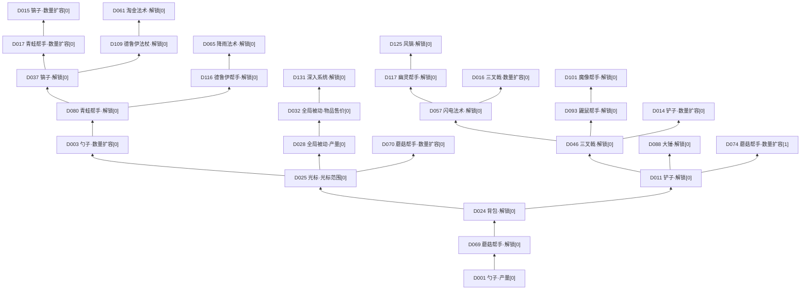

# dc升级树｜逐节点结构复刻

> 本篇是dc原版研究资料，不是当前单猫玩法的规则。当前饲养方案见[00](00_简明策划案.md)与[15](15_多猫饲养_荒诞需求与增量拓展.md)。

2026-09-15｜以用户提供的 **Dirt Clicker Demo 本地包**为准。这里复刻的是原版场景布局与连接，不是把猫咪内容强行串成一条线；不声称覆盖其他版本。中文名按内部键释义，方括号是从0开始的运行时分段索引，不是升级等级。

**阅读入口：**[原坐标总图（可缩放、点节点查看）](参考研究/DirtClicker/节点研究/dc-tree.html) · [完整原坐标SVG](参考研究/DirtClicker/节点研究/dc-tree.svg) · [机器可读节点与边](参考研究/DirtClicker/节点研究/逐节点拓扑.json)。下文D编号与总图一一对应，编号按场景按钮顺序稳定分配；实际推进方向从下往上，不按编号顺序购买。

## 1. 本次精确到什么程度

| 项目 | 核实结果 |
| --- | --- |
| 场景对象 / 真正升级按钮 | 147 / **131**；其余为容器、背景和辅助UI |
| 节点连线 | **130条**，唯一根节点D001；无环、无缺失前置，每个非根按钮有一个直接前置 |
| 原始属性记录 | 168条；其中37条没有实例化为这棵树的按钮，不能凑成168个技能 |
| Demo状态 | 直接锁5个；受祖先锁阻挡46个；无此类锁阻挡80个。后者仍需满足等级、费用等购买条件 |
| 满级连接 | 14条前置字段为0，脚本将其解析成前置满级，并非“零级即可” |
| 坐标与连线 | 直接读取场景偏移坐标；连接由按钮脚本按配置前置生成，未靠截图猜线 |
| 核验边界 | 已静态解析场景和脚本令牌；未运行dc，也未验证正式版内容或所有效果的最终收益算法 |

**对上一版的纠正：**M00→M07单线方案撤销。“2—3条主干”是对这张图的空间阅读方式，并非引擎里有三个独立树对象。实际是一棵有共同起点、随后多次分叉的树；支路还能继续分叉，并非所有小节点都只是终点。

## 2. 如何从下往上读

共同起步是 **勺子产量[0] → 蘑菇帮手解锁 → 背包解锁**。背包先分出铲子方向、光标方向和勺子掉落支路；光标方向再分出左侧勺子扩容／青蛙方向、中央被动方向和蘑菇强化方向。因此视觉上形成左右两条长路线，中间附带被动成长路线。

| 阅读区域 | 实际延伸内容 | 结构特点 |
| --- | --- | --- |
| 左侧长路线 | 光标[0] → 勺子扩容[0] → 青蛙 → 镐子；青蛙另分德鲁伊帮手／降雨，镐子另分德鲁伊法杖／淘金 | 新对象解锁与旧对象后段强化交错，既有长线也有侧线 |
| 中央路线 | 光标[0] → 被动产量[0] → 产量／品质／售价簇；售价[0] → 深入系统 | 由性能节点继续引出系统节点，不是全程“购买新品” |
| 右侧长路线 | 背包 → 铲子 → 三叉戟 → 闪电法术 → 幽灵 → 风镐；另分大锤、鼹鼠／魔像及工具后段强化 | 同一解锁节点可同时开放多个方向；Demo锁不等于没有这个节点 |

下面仅压缩显示分叉骨架，完整旁支见第3、4节。实线均为实际直接连接；为简洁省略边上的等级，等级以逐节点表为准。



## 3. 全树连接清单（131个节点，无省略）

缩进代表直接父子关系；括号是该连接要求的**父节点等级**，不是本节点价格或等级。按画布左右位置排列同父节点的孩子；阅读这份清单向右深入，对应画布沿连接推进。

```text
D001 勺子·产量[0]
├─ D007 勺子·暴击率[0] ←前置1级
├─ D069 蘑菇帮手·解锁[0] ←前置1级
│  ├─ D071 蘑菇帮手·等待时间[0] ←前置1级
│  ├─ D024 背包·解锁[0] ←前置1级
│  │  ├─ D009 勺子·物品掉率[0] ←前置1级
│  │  │  ├─ D004 勺子·数量扩容[1] ←前置1级
│  │  │  │  ├─ D002 勺子·产量[1] ←前置1级
│  │  │  │  ├─ D008 勺子·暴击率[1] ←前置1级
│  │  │  │  └─ D006 勺子·动作倍率[1] ←前置1级
│  │  │  └─ D010 勺子·物品品质[0] ←前置5级/满级
│  │  ├─ D025 光标·光标范围[0] ←前置1级
│  │  │  ├─ D003 勺子·数量扩容[0] ←前置1级
│  │  │  │  └─ D080 青蛙帮手·解锁[0] ←前置1级
│  │  │  │     ├─ D116 德鲁伊帮手·解锁[0] ←前置1级 【Demo锁】
│  │  │  │     │  ├─ D065 降雨法术·解锁[0] ←前置1级 【受Demo前置锁阻挡】
│  │  │  │     │  │  ├─ D067 降雨法术·法术挖掘量[0] ←前置1级 【受Demo前置锁阻挡】
│  │  │  │     │  │  ├─ D068 降雨法术·法术持续时间[0] ←前置1级 【受Demo前置锁阻挡】
│  │  │  │     │  │  └─ D066 降雨法术·法术储备[0] ←前置1级 【受Demo前置锁阻挡】
│  │  │  │     │  ├─ D122 德鲁伊帮手·动作倍率[0] ←前置1级 【受Demo前置锁阻挡】
│  │  │  │     │  ├─ D123 速度增益·增益持续时间[0] ←前置1级 【受Demo前置锁阻挡】
│  │  │  │     │  ├─ D124 速度增益·增益强度[0] ←前置1级 【受Demo前置锁阻挡】
│  │  │  │     │  ├─ D121 德鲁伊帮手·等待时间[0] ←前置1级 【受Demo前置锁阻挡】
│  │  │  │     │  └─ D120 德鲁伊帮手·作用范围[0] ←前置1级 【受Demo前置锁阻挡】
│  │  │  │     ├─ D086 青蛙帮手·物品掉率[0] ←前置1级
│  │  │  │     │  └─ D087 青蛙帮手·物品品质[0] ←前置10级/满级
│  │  │  │     ├─ D081 青蛙帮手·动作倍率[0] ←前置1级
│  │  │  │     ├─ D083 青蛙帮手·等待时间[0] ←前置1级
│  │  │  │     ├─ D037 镐子·解锁[0] ←前置1级
│  │  │  │     │  ├─ D109 德鲁伊法杖·解锁[0] ←前置1级 【Demo锁】
│  │  │  │     │  │  ├─ D061 淘金法术·解锁[0] ←前置1级 【受Demo前置锁阻挡】
│  │  │  │     │  │  │  ├─ D062 淘金法术·法术储备[0] ←前置1级 【受Demo前置锁阻挡】
│  │  │  │     │  │  │  ├─ D063 淘金法术·法术挖掘量[0] ←前置1级 【受Demo前置锁阻挡】
│  │  │  │     │  │  │  └─ D064 淘金法术·法术持续时间[0] ←前置1级 【受Demo前置锁阻挡】
│  │  │  │     │  │  ├─ D115 产量增益·增益强度[0] ←前置1级 【受Demo前置锁阻挡】
│  │  │  │     │  │  ├─ D112 德鲁伊法杖·暴击率[0] ←前置1级 【受Demo前置锁阻挡】
│  │  │  │     │  │  ├─ D114 产量增益·增益持续时间[0] ←前置1级 【受Demo前置锁阻挡】
│  │  │  │     │  │  ├─ D110 德鲁伊法杖·作用范围[0] ←前置1级 【受Demo前置锁阻挡】
│  │  │  │     │  │  ├─ D113 德鲁伊法杖·动作倍率[0] ←前置1级 【受Demo前置锁阻挡】
│  │  │  │     │  │  └─ D111 德鲁伊法杖·产量[0] ←前置1级 【受Demo前置锁阻挡】
│  │  │  │     │  ├─ D040 镐子·产量[0] ←前置1级
│  │  │  │     │  ├─ D017 青蛙帮手·数量扩容[0] ←前置1级
│  │  │  │     │  │  ├─ D079 青蛙帮手·产量倍率[0] ←前置1级
│  │  │  │     │  │  ├─ D015 镐子·数量扩容[0] ←前置1级
│  │  │  │     │  │  │  ├─ D043 镐子·动作倍率[1] ←前置1级
│  │  │  │     │  │  │  ├─ D041 镐子·产量[1] ←前置1级
│  │  │  │     │  │  │  └─ D045 镐子·暴击率[1] ←前置1级
│  │  │  │     │  │  └─ D084 青蛙帮手·等待时间[1] ←前置1级
│  │  │  │     │  │     └─ D082 青蛙帮手·动作倍率[1] ←前置1级
│  │  │  │     │  ├─ D044 镐子·暴击率[0] ←前置1级
│  │  │  │     │  ├─ D042 镐子·动作倍率[0] ←前置1级
│  │  │  │     │  └─ D038 镐子·物品掉率[0] ←前置1级
│  │  │  │     │     └─ D039 镐子·物品品质[0] ←前置1级
│  │  │  │     └─ D085 青蛙帮手·作用范围[0] ←前置1级
│  │  │  │        └─ D026 光标·光标范围[2] ←前置1级
│  │  │  ├─ D028 全局被动·产量[0] ←前置1级
│  │  │  │  ├─ D031 全局被动·暴击率[0] ←前置5级/满级
│  │  │  │  ├─ D029 全局被动·产量[1] ←前置5级/满级
│  │  │  │  │  └─ D030 全局被动·产量[2] ←前置3级/满级
│  │  │  │  ├─ D032 全局被动·物品售价[0] ←前置5级/满级
│  │  │  │  │  ├─ D131 深入系统·解锁[0] ←前置1级
│  │  │  │  │  └─ D033 全局被动·物品售价[1] ←前置10级/满级
│  │  │  │  └─ D034 全局被动·物品掉率[0] ←前置5级/满级
│  │  │  │     └─ D035 全局被动·物品品质[0] ←前置10级/满级
│  │  │  │        └─ D036 全局被动·物品品质[1] ←前置10级/满级
│  │  │  └─ D070 蘑菇帮手·数量扩容[0] ←前置1级
│  │  │     ├─ D078 蘑菇帮手·产量倍率[0] ←前置1级
│  │  │     └─ D076 蘑菇帮手·物品掉率[0] ←前置1级
│  │  │        └─ D077 蘑菇帮手·物品品质[0] ←前置10级/满级
│  │  └─ D011 铲子·解锁[0] ←前置1级
│  │     ├─ D022 铲子·物品掉率[0] ←前置1级
│  │     │  └─ D023 铲子·物品品质[0] ←前置5级/满级
│  │     ├─ D074 蘑菇帮手·数量扩容[1] ←前置1级/满级
│  │     │  ├─ D073 蘑菇帮手·等待时间[1] ←前置1级
│  │     │  └─ D075 蘑菇帮手·动作倍率[1] ←前置1级
│  │     ├─ D018 铲子·动作倍率[0] ←前置1级
│  │     ├─ D046 三叉戟·解锁[0] ←前置1级
│  │     │  ├─ D014 铲子·数量扩容[0] ←前置1级/满级
│  │     │  │  ├─ D019 铲子·动作倍率[1] ←前置1级
│  │     │  │  ├─ D013 铲子·产量[1] ←前置1级
│  │     │  │  ├─ D027 光标·光标范围[1] ←前置1级
│  │     │  │  └─ D021 铲子·暴击率[1] ←前置1级
│  │     │  ├─ D047 三叉戟·放电率[0] ←前置1级
│  │     │  │  └─ D049 三叉戟·放电暴击率[0] ←前置1级
│  │     │  ├─ D053 三叉戟·暴击率[0] ←前置1级
│  │     │  ├─ D057 闪电法术·解锁[0] ←前置1级
│  │     │  │  ├─ D016 三叉戟·数量扩容[0] ←前置1级
│  │     │  │  │  ├─ D052 三叉戟·产量[1] ←前置1级
│  │     │  │  │  ├─ D056 三叉戟·动作倍率[1] ←前置1级
│  │     │  │  │  ├─ D048 三叉戟·物品掉率[1] ←前置1级
│  │     │  │  │  │  └─ D050 三叉戟·物品品质[1] ←前置1级
│  │     │  │  │  └─ D054 三叉戟·暴击率[1] ←前置1级
│  │     │  │  ├─ D117 幽灵帮手·解锁[0] ←前置1级 【Demo锁】
│  │     │  │  │  ├─ D118 幽灵帮手·等待时间[0] ←前置1级 【受Demo前置锁阻挡】
│  │     │  │  │  ├─ D125 风镐·解锁[0] ←前置1级 【受Demo前置锁阻挡】
│  │     │  │  │  │  ├─ D129 风镐·物品掉率[0] ←前置1级 【受Demo前置锁阻挡】
│  │     │  │  │  │  │  └─ D130 风镐·物品品质[0] ←前置1级 【受Demo前置锁阻挡】
│  │     │  │  │  │  ├─ D126 风镐·产量[0] ←前置1级 【受Demo前置锁阻挡】
│  │     │  │  │  │  ├─ D128 风镐·暴击率[0] ←前置1级 【受Demo前置锁阻挡】
│  │     │  │  │  │  └─ D127 风镐·动作倍率[0] ←前置1级 【受Demo前置锁阻挡】
│  │     │  │  │  └─ D119 幽灵帮手·动作倍率[0] ←前置1级 【受Demo前置锁阻挡】
│  │     │  │  ├─ D060 闪电法术·法术持续时间[0] ←前置1级
│  │     │  │  ├─ D058 闪电法术·法术储备[0] ←前置1级
│  │     │  │  └─ D059 闪电法术·法术挖掘量[0] ←前置1级
│  │     │  ├─ D055 三叉戟·动作倍率[0] ←前置1级
│  │     │  ├─ D051 三叉戟·产量[0] ←前置1级
│  │     │  └─ D093 鼹鼠帮手·解锁[0] ←前置1级 【Demo锁】
│  │     │     ├─ D095 鼹鼠帮手·产量[0] ←前置1级 【受Demo前置锁阻挡】
│  │     │     ├─ D094 鼹鼠帮手·等待时间[0] ←前置1级 【受Demo前置锁阻挡】
│  │     │     ├─ D097 鼹鼠帮手·物品掉率[0] ←前置1级 【受Demo前置锁阻挡】
│  │     │     │  └─ D098 鼹鼠帮手·物品品质[0] ←前置1级 【受Demo前置锁阻挡】
│  │     │     ├─ D100 鼹鼠帮手·挖掘次数[0] ←前置1级 【受Demo前置锁阻挡】
│  │     │     ├─ D099 鼹鼠帮手·暴击率[0] ←前置1级 【受Demo前置锁阻挡】
│  │     │     ├─ D096 鼹鼠帮手·动作倍率[0] ←前置1级 【受Demo前置锁阻挡】
│  │     │     └─ D101 魔像帮手·解锁[0] ←前置1级 【受Demo前置锁阻挡】
│  │     │        ├─ D108 魔像帮手·挖掘次数[0] ←前置1级 【受Demo前置锁阻挡】
│  │     │        ├─ D107 魔像帮手·暴击率[0] ←前置1级 【受Demo前置锁阻挡】
│  │     │        ├─ D105 魔像帮手·物品掉率[0] ←前置1级 【受Demo前置锁阻挡】
│  │     │        │  └─ D106 魔像帮手·物品品质[0] ←前置1级 【受Demo前置锁阻挡】
│  │     │        ├─ D102 魔像帮手·等待时间[0] ←前置1级 【受Demo前置锁阻挡】
│  │     │        ├─ D104 魔像帮手·动作倍率[0] ←前置1级 【受Demo前置锁阻挡】
│  │     │        └─ D103 魔像帮手·产量[0] ←前置1级 【受Demo前置锁阻挡】
│  │     ├─ D020 铲子·暴击率[0] ←前置1级
│  │     ├─ D012 铲子·产量[0] ←前置1级
│  │     └─ D088 大锤·解锁[0] ←前置1级 【Demo锁】
│  │        ├─ D091 大锤·动作倍率[0] ←前置1级 【受Demo前置锁阻挡】
│  │        ├─ D089 大锤·产量[0] ←前置1级 【受Demo前置锁阻挡】
│  │        ├─ D092 大锤·作用范围[0] ←前置1级 【受Demo前置锁阻挡】
│  │        └─ D090 大锤·暴击率[0] ←前置1级 【受Demo前置锁阻挡】
│  └─ D072 蘑菇帮手·动作倍率[0] ←前置1级
└─ D005 勺子·动作倍率[0] ←前置1级
```

## 4. 每个节点的前置、等级和分支

坐标是按钮中心的原场景偏移坐标，Y越小越靠上。每行的“后续”列列出全部直接子节点，不等于都必须购买。属性[0]、[1]等段数按运行时数组索引列出；没有按钮的记录不列入此表。

### 勺子（SPOON，10个节点）

| 编号／节点 | 精确前置 | 初始→最高等级 | 直接后续节点 | 中心坐标X,Y | Demo状态 |
| --- | --- | --- | --- | --- | --- |
| <a id="d001"></a>**D001** 产量[0] | 起点，无树内前置 | 0→4 | [D005](#d005), [D007](#d007), [D069](#d069) | 3909,6783 | 无Demo锁阻挡 |
| <a id="d002"></a>**D002** 产量[1] | [D004](#d004) Lv.1 | 0→5 | — | 3525,6143 | 无Demo锁阻挡 |
| <a id="d003"></a>**D003** 数量扩容[0] | [D025](#d025) Lv.1 | 0→1 | [D080](#d080) | 3717,5439 | 无Demo锁阻挡 |
| <a id="d004"></a>**D004** 数量扩容[1] | [D009](#d009) Lv.1 | 0→1 | [D002](#d002), [D006](#d006), [D008](#d008) | 3653,6143 | 无Demo锁阻挡 |
| <a id="d005"></a>**D005** 动作倍率[0] | [D001](#d001) Lv.1 | 0→5 | — | 4037,6783 | 无Demo锁阻挡 |
| <a id="d006"></a>**D006** 动作倍率[1] | [D004](#d004) Lv.1 | 0→10 | — | 3589,6015 | 无Demo锁阻挡 |
| <a id="d007"></a>**D007** 暴击率[0] | [D001](#d001) Lv.1 | 0→5 | — | 3781,6783 | 无Demo锁阻挡 |
| <a id="d008"></a>**D008** 暴击率[1] | [D004](#d004) Lv.1 | 0→10 | — | 3589,6271 | 无Demo锁阻挡 |
| <a id="d009"></a>**D009** 物品掉率[0] | [D024](#d024) Lv.1 | 0→5 | [D004](#d004), [D010](#d010) | 3781,6143 | 无Demo锁阻挡 |
| <a id="d010"></a>**D010** 物品品质[0] | [D009](#d009) Lv.5（满级；原字段0） | 0→5 | — | 3781,6015 | 无Demo锁阻挡 |

### 铲子（SHOVEL，10个节点）

| 编号／节点 | 精确前置 | 初始→最高等级 | 直接后续节点 | 中心坐标X,Y | Demo状态 |
| --- | --- | --- | --- | --- | --- |
| <a id="d011"></a>**D011** 解锁[0] | [D024](#d024) Lv.1 | 0→1 | [D012](#d012), [D018](#d018), [D020](#d020), [D022](#d022), [D046](#d046), [D074](#d074), [D088](#d088) | 4613,5695 | 无Demo锁阻挡 |
| <a id="d012"></a>**D012** 产量[0] | [D011](#d011) Lv.1 | 0→10 | — | 4805,5695 | 无Demo锁阻挡 |
| <a id="d013"></a>**D013** 产量[1] | [D014](#d014) Lv.1 | 0→10 | — | 4229,4223 | 无Demo锁阻挡 |
| <a id="d014"></a>**D014** 数量扩容[0] | [D046](#d046) Lv.1（满级；原字段0） | 0→1 | [D013](#d013), [D019](#d019), [D021](#d021), [D027](#d027) | 4357,4351 | 无Demo锁阻挡 |
| <a id="d018"></a>**D018** 动作倍率[0] | [D011](#d011) Lv.1 | 0→10 | — | 4613,5887 | 无Demo锁阻挡 |
| <a id="d019"></a>**D019** 动作倍率[1] | [D014](#d014) Lv.1 | 0→10 | — | 4165,4351 | 无Demo锁阻挡 |
| <a id="d020"></a>**D020** 暴击率[0] | [D011](#d011) Lv.1 | 0→10 | — | 4741,5823 | 无Demo锁阻挡 |
| <a id="d021"></a>**D021** 暴击率[1] | [D014](#d014) Lv.1 | 0→10 | — | 4485,4223 | 无Demo锁阻挡 |
| <a id="d022"></a>**D022** 物品掉率[0] | [D011](#d011) Lv.1 | 0→5 | [D023](#d023) | 4421,5695 | 无Demo锁阻挡 |
| <a id="d023"></a>**D023** 物品品质[0] | [D022](#d022) Lv.5（满级；原字段0） | 0→5 | — | 4293,5567 | 无Demo锁阻挡 |

### 镐子（PICKAXE，10个节点）

| 编号／节点 | 精确前置 | 初始→最高等级 | 直接后续节点 | 中心坐标X,Y | Demo状态 |
| --- | --- | --- | --- | --- | --- |
| <a id="d015"></a>**D015** 数量扩容[0] | [D017](#d017) Lv.1 | 0→1 | [D041](#d041), [D043](#d043), [D045](#d045) | 3269,3519 | 无Demo锁阻挡 |
| <a id="d037"></a>**D037** 解锁[0] | [D080](#d080) Lv.1 | 0→1 | [D017](#d017), [D038](#d038), [D040](#d040), [D042](#d042), [D044](#d044), [D109](#d109) | 3269,4351 | 无Demo锁阻挡 |
| <a id="d038"></a>**D038** 物品掉率[0] | [D037](#d037) Lv.1 | 0→10 | [D039](#d039) | 3461,4351 | 无Demo锁阻挡 |
| <a id="d039"></a>**D039** 物品品质[0] | [D038](#d038) Lv.1 | 0→10 | — | 3589,4351 | 无Demo锁阻挡 |
| <a id="d040"></a>**D040** 产量[0] | [D037](#d037) Lv.1 | 0→10 | — | 3141,4351 | 无Demo锁阻挡 |
| <a id="d041"></a>**D041** 产量[1] | [D015](#d015) Lv.1 | 0→10 | — | 3269,3263 | 无Demo锁阻挡 |
| <a id="d042"></a>**D042** 动作倍率[0] | [D037](#d037) Lv.1 | 0→10 | — | 3397,4223 | 无Demo锁阻挡 |
| <a id="d043"></a>**D043** 动作倍率[1] | [D015](#d015) Lv.1 | 0→10 | — | 3141,3391 | 无Demo锁阻挡 |
| <a id="d044"></a>**D044** 暴击率[0] | [D037](#d037) Lv.1 | 0→10 | — | 3397,4479 | 无Demo锁阻挡 |
| <a id="d045"></a>**D045** 暴击率[1] | [D015](#d015) Lv.1 | 0→10 | — | 3397,3391 | 无Demo锁阻挡 |

### 三叉戟（TRIDENT，12个节点）

| 编号／节点 | 精确前置 | 初始→最高等级 | 直接后续节点 | 中心坐标X,Y | Demo状态 |
| --- | --- | --- | --- | --- | --- |
| <a id="d016"></a>**D016** 数量扩容[0] | [D057](#d057) Lv.1 | 0→1 | [D048](#d048), [D052](#d052), [D054](#d054), [D056](#d056) | 4357,3199 | 无Demo锁阻挡 |
| <a id="d046"></a>**D046** 解锁[0] | [D011](#d011) Lv.1 | 0→1 | [D014](#d014), [D047](#d047), [D051](#d051), [D053](#d053), [D055](#d055), [D057](#d057), [D093](#d093) | 4613,4735 | 无Demo锁阻挡 |
| <a id="d047"></a>**D047** 放电率[0] | [D046](#d046) Lv.1 | 0→10 | [D049](#d049) | 4421,4735 | 无Demo锁阻挡 |
| <a id="d048"></a>**D048** 物品掉率[1] | [D016](#d016) Lv.1 | 0→9 | [D050](#d050) | 4357,3007 | 无Demo锁阻挡 |
| <a id="d049"></a>**D049** 放电暴击率[0] | [D047](#d047) Lv.1 | 0→10 | — | 4293,4607 | 无Demo锁阻挡 |
| <a id="d050"></a>**D050** 物品品质[1] | [D048](#d048) Lv.1 | 0→9 | — | 4357,2815 | 无Demo锁阻挡 |
| <a id="d051"></a>**D051** 产量[0] | [D046](#d046) Lv.1 | 0→10 | — | 4805,4735 | 无Demo锁阻挡 |
| <a id="d052"></a>**D052** 产量[1] | [D016](#d016) Lv.1 | 0→10 | — | 4165,3199 | 无Demo锁阻挡 |
| <a id="d053"></a>**D053** 暴击率[0] | [D046](#d046) Lv.1 | 0→10 | — | 4485,4863 | 无Demo锁阻挡 |
| <a id="d054"></a>**D054** 暴击率[1] | [D016](#d016) Lv.1 | 0→10 | — | 4485,3071 | 无Demo锁阻挡 |
| <a id="d055"></a>**D055** 动作倍率[0] | [D046](#d046) Lv.1 | 0→10 | — | 4741,4863 | 无Demo锁阻挡 |
| <a id="d056"></a>**D056** 动作倍率[1] | [D016](#d016) Lv.1 | 0→10 | — | 4229,3071 | 无Demo锁阻挡 |

### 青蛙帮手（FROG_GUY，10个节点）

| 编号／节点 | 精确前置 | 初始→最高等级 | 直接后续节点 | 中心坐标X,Y | Demo状态 |
| --- | --- | --- | --- | --- | --- |
| <a id="d017"></a>**D017** 数量扩容[0] | [D037](#d037) Lv.1 | 0→1 | [D015](#d015), [D079](#d079), [D084](#d084) | 3269,3903 | 无Demo锁阻挡 |
| <a id="d079"></a>**D079** 产量倍率[0] | [D017](#d017) Lv.1 | 0→10 | — | 3141,3775 | 无Demo锁阻挡 |
| <a id="d080"></a>**D080** 解锁[0] | [D003](#d003) Lv.1 | 0→1 | [D037](#d037), [D081](#d081), [D083](#d083), [D085](#d085), [D086](#d086), [D116](#d116) | 3269,4991 | 无Demo锁阻挡 |
| <a id="d081"></a>**D081** 动作倍率[0] | [D080](#d080) Lv.1 | 0→10 | — | 3141,5119 | 无Demo锁阻挡 |
| <a id="d082"></a>**D082** 动作倍率[1] | [D084](#d084) Lv.1 | 0→5 | — | 3525,3647 | 无Demo锁阻挡 |
| <a id="d083"></a>**D083** 等待时间[0] | [D080](#d080) Lv.1 | 0→10 | — | 3269,5183 | 无Demo锁阻挡 |
| <a id="d084"></a>**D084** 等待时间[1] | [D017](#d017) Lv.1 | 0→10 | [D082](#d082) | 3397,3775 | 无Demo锁阻挡 |
| <a id="d085"></a>**D085** 作用范围[0] | [D080](#d080) Lv.1 | 0→12 | [D026](#d026) | 3397,4863 | 无Demo锁阻挡 |
| <a id="d086"></a>**D086** 物品掉率[0] | [D080](#d080) Lv.1 | 0→10 | [D087](#d087) | 3077,4991 | 无Demo锁阻挡 |
| <a id="d087"></a>**D087** 物品品质[0] | [D086](#d086) Lv.10（满级；原字段0） | 0→10 | — | 2949,4991 | 无Demo锁阻挡 |

### 背包（INVENTORY，1个节点）

| 编号／节点 | 精确前置 | 初始→最高等级 | 直接后续节点 | 中心坐标X,Y | Demo状态 |
| --- | --- | --- | --- | --- | --- |
| <a id="d024"></a>**D024** 解锁[0] | [D069](#d069) Lv.1 | 0→1 | [D009](#d009), [D011](#d011), [D025](#d025) | 3909,6271 | 无Demo锁阻挡 |

### 光标（CURSOR，3个节点）

| 编号／节点 | 精确前置 | 初始→最高等级 | 直接后续节点 | 中心坐标X,Y | Demo状态 |
| --- | --- | --- | --- | --- | --- |
| <a id="d025"></a>**D025** 光标范围[0] | [D024](#d024) Lv.1 | 0→8 | [D003](#d003), [D028](#d028), [D070](#d070) | 3909,5631 | 无Demo锁阻挡 |
| <a id="d026"></a>**D026** 光标范围[2] | [D085](#d085) Lv.1 | 0→8 | — | 3525,4735 | 无Demo锁阻挡 |
| <a id="d027"></a>**D027** 光标范围[1] | [D014](#d014) Lv.1 | 0→8 | — | 4357,3967 | 无Demo锁阻挡 |

### 全局被动（PASSIVE，9个节点）

| 编号／节点 | 精确前置 | 初始→最高等级 | 直接后续节点 | 中心坐标X,Y | Demo状态 |
| --- | --- | --- | --- | --- | --- |
| <a id="d028"></a>**D028** 产量[0] | [D025](#d025) Lv.1 | 0→5 | [D029](#d029), [D031](#d031), [D032](#d032), [D034](#d034) | 3909,5247 | 无Demo锁阻挡 |
| <a id="d029"></a>**D029** 产量[1] | [D028](#d028) Lv.5（满级；原字段0） | 0→3 | [D030](#d030) | 3781,5119 | 无Demo锁阻挡 |
| <a id="d030"></a>**D030** 产量[2] | [D029](#d029) Lv.3（满级；原字段0） | 0→3 | — | 3653,4991 | 无Demo锁阻挡 |
| <a id="d031"></a>**D031** 暴击率[0] | [D028](#d028) Lv.5（满级；原字段0） | 0→10 | — | 3717,5247 | 无Demo锁阻挡 |
| <a id="d032"></a>**D032** 物品售价[0] | [D028](#d028) Lv.5（满级；原字段0） | 0→10 | [D033](#d033), [D131](#d131) | 3909,5055 | 无Demo锁阻挡 |
| <a id="d033"></a>**D033** 物品售价[1] | [D032](#d032) Lv.10（满级；原字段0） | 0→5 | — | 4037,4927 | 无Demo锁阻挡 |
| <a id="d034"></a>**D034** 物品掉率[0] | [D028](#d028) Lv.5（满级；原字段0） | 0→10 | [D035](#d035) | 4037,5119 | 无Demo锁阻挡 |
| <a id="d035"></a>**D035** 物品品质[0] | [D034](#d034) Lv.10（满级；原字段0） | 0→10 | [D036](#d036) | 4165,4991 | 无Demo锁阻挡 |
| <a id="d036"></a>**D036** 物品品质[1] | [D035](#d035) Lv.10（满级；原字段0） | 0→5 | — | 4165,4799 | 无Demo锁阻挡 |

### 闪电法术（SPELL_ZAPS，4个节点）

| 编号／节点 | 精确前置 | 初始→最高等级 | 直接后续节点 | 中心坐标X,Y | Demo状态 |
| --- | --- | --- | --- | --- | --- |
| <a id="d057"></a>**D057** 解锁[0] | [D046](#d046) Lv.1 | 0→1 | [D016](#d016), [D058](#d058), [D059](#d059), [D060](#d060), [D117](#d117) | 4613,3455 | 无Demo锁阻挡 |
| <a id="d058"></a>**D058** 法术储备[0] | [D057](#d057) Lv.1 | 0→1 | — | 4741,3327 | 无Demo锁阻挡 |
| <a id="d059"></a>**D059** 法术挖掘量[0] | [D057](#d057) Lv.1 | 0→5 | — | 4805,3455 | 无Demo锁阻挡 |
| <a id="d060"></a>**D060** 法术持续时间[0] | [D057](#d057) Lv.1 | 0→3 | — | 4741,3583 | 无Demo锁阻挡 |

### 淘金法术（SPELL_GOLDRUSH，4个节点）

| 编号／节点 | 精确前置 | 初始→最高等级 | 直接后续节点 | 中心坐标X,Y | Demo状态 |
| --- | --- | --- | --- | --- | --- |
| <a id="d061"></a>**D061** 解锁[0] | [D109](#d109) Lv.1 | 0→1 | [D062](#d062), [D063](#d063), [D064](#d064) | 2373,3583 | 受前置Demo锁阻挡 |
| <a id="d062"></a>**D062** 法术储备[0] | [D061](#d061) Lv.1 | 0→4 | — | 2245,3583 | 受前置Demo锁阻挡 |
| <a id="d063"></a>**D063** 法术挖掘量[0] | [D061](#d061) Lv.1 | 0→10 | — | 2309,3455 | 受前置Demo锁阻挡 |
| <a id="d064"></a>**D064** 法术持续时间[0] | [D061](#d061) Lv.1 | 0→4 | — | 2437,3455 | 受前置Demo锁阻挡 |

### 降雨法术（SPELL_RAIN，4个节点）

| 编号／节点 | 精确前置 | 初始→最高等级 | 直接后续节点 | 中心坐标X,Y | Demo状态 |
| --- | --- | --- | --- | --- | --- |
| <a id="d065"></a>**D065** 解锁[0] | [D116](#d116) Lv.1 | 0→1 | [D066](#d066), [D067](#d067), [D068](#d068) | 2309,4031 | 受前置Demo锁阻挡 |
| <a id="d066"></a>**D066** 法术储备[0] | [D065](#d065) Lv.1 | 0→4 | — | 2437,3903 | 受前置Demo锁阻挡 |
| <a id="d067"></a>**D067** 法术挖掘量[0] | [D065](#d065) Lv.1 | 0→10 | — | 2181,3903 | 受前置Demo锁阻挡 |
| <a id="d068"></a>**D068** 法术持续时间[0] | [D065](#d065) Lv.1 | 0→4 | — | 2309,3839 | 受前置Demo锁阻挡 |

### 蘑菇帮手（MUSHROOM_GUY，10个节点）

| 编号／节点 | 精确前置 | 初始→最高等级 | 直接后续节点 | 中心坐标X,Y | Demo状态 |
| --- | --- | --- | --- | --- | --- |
| <a id="d069"></a>**D069** 解锁[0] | [D001](#d001) Lv.1 | 0→1 | [D024](#d024), [D071](#d071), [D072](#d072) | 3909,6527 | 无Demo锁阻挡 |
| <a id="d070"></a>**D070** 数量扩容[0] | [D025](#d025) Lv.1 | 0→1 | [D076](#d076), [D078](#d078) | 4101,5439 | 无Demo锁阻挡 |
| <a id="d071"></a>**D071** 等待时间[0] | [D069](#d069) Lv.1 | 0→10 | — | 3781,6527 | 无Demo锁阻挡 |
| <a id="d072"></a>**D072** 动作倍率[0] | [D069](#d069) Lv.1 | 0→10 | — | 4037,6527 | 无Demo锁阻挡 |
| <a id="d073"></a>**D073** 等待时间[1] | [D074](#d074) Lv.1 | 0→10 | — | 4357,5183 | 无Demo锁阻挡 |
| <a id="d074"></a>**D074** 数量扩容[1] | [D011](#d011) Lv.1（满级；原字段0） | 0→1 | [D073](#d073), [D075](#d075) | 4421,5311 | 无Demo锁阻挡 |
| <a id="d075"></a>**D075** 动作倍率[1] | [D074](#d074) Lv.1 | 0→5 | — | 4485,5183 | 无Demo锁阻挡 |
| <a id="d076"></a>**D076** 物品掉率[0] | [D070](#d070) Lv.1 | 0→10 | [D077](#d077) | 4165,5311 | 无Demo锁阻挡 |
| <a id="d077"></a>**D077** 物品品质[0] | [D076](#d076) Lv.10（满级；原字段0） | 0→10 | — | 4165,5183 | 无Demo锁阻挡 |
| <a id="d078"></a>**D078** 产量倍率[0] | [D070](#d070) Lv.1 | 0→4 | — | 4037,5311 | 无Demo锁阻挡 |

### 大锤（SLEDGEHAMMER，5个节点）

| 编号／节点 | 精确前置 | 初始→最高等级 | 直接后续节点 | 中心坐标X,Y | Demo状态 |
| --- | --- | --- | --- | --- | --- |
| <a id="d088"></a>**D088** 解锁[0] | [D011](#d011) Lv.1 | 0→1 | [D089](#d089), [D090](#d090), [D091](#d091), [D092](#d092) | 5061,5055 | Demo直接锁 |
| <a id="d089"></a>**D089** 产量[0] | [D088](#d088) Lv.1 | 0→9 | — | 5061,4863 | 受前置Demo锁阻挡 |
| <a id="d090"></a>**D090** 暴击率[0] | [D088](#d088) Lv.1 | 0→10 | — | 5253,5055 | 受前置Demo锁阻挡 |
| <a id="d091"></a>**D091** 动作倍率[0] | [D088](#d088) Lv.1 | 0→10 | — | 4933,4927 | 受前置Demo锁阻挡 |
| <a id="d092"></a>**D092** 作用范围[0] | [D088](#d088) Lv.1 | 0→10 | — | 5189,4927 | 受前置Demo锁阻挡 |

### 鼹鼠帮手（MOLE_GUY，8个节点）

| 编号／节点 | 精确前置 | 初始→最高等级 | 直接后续节点 | 中心坐标X,Y | Demo状态 |
| --- | --- | --- | --- | --- | --- |
| <a id="d093"></a>**D093** 解锁[0] | [D046](#d046) Lv.1 | 0→1 | [D094](#d094), [D095](#d095), [D096](#d096), [D097](#d097), [D099](#d099), [D100](#d100), [D101](#d101) | 4869,4351 | Demo直接锁 |
| <a id="d094"></a>**D094** 等待时间[0] | [D093](#d093) Lv.1 | 0→10 | — | 4869,4543 | 受前置Demo锁阻挡 |
| <a id="d095"></a>**D095** 产量[0] | [D093](#d093) Lv.1 | 0→9 | — | 4741,4223 | 受前置Demo锁阻挡 |
| <a id="d096"></a>**D096** 动作倍率[0] | [D093](#d093) Lv.1 | 0→10 | — | 5061,4223 | 受前置Demo锁阻挡 |
| <a id="d097"></a>**D097** 物品掉率[0] | [D093](#d093) Lv.1 | 0→10 | [D098](#d098) | 4869,4159 | 受前置Demo锁阻挡 |
| <a id="d098"></a>**D098** 物品品质[0] | [D097](#d097) Lv.1 | 0→10 | — | 4869,4031 | 受前置Demo锁阻挡 |
| <a id="d099"></a>**D099** 暴击率[0] | [D093](#d093) Lv.1 | 0→10 | — | 5061,4351 | 受前置Demo锁阻挡 |
| <a id="d100"></a>**D100** 挖掘次数[0] | [D093](#d093) Lv.1 | 0→9 | — | 4997,4479 | 受前置Demo锁阻挡 |

### 魔像帮手（GOLEM_GUY，8个节点）

| 编号／节点 | 精确前置 | 初始→最高等级 | 直接后续节点 | 中心坐标X,Y | Demo状态 |
| --- | --- | --- | --- | --- | --- |
| <a id="d101"></a>**D101** 解锁[0] | [D093](#d093) Lv.1 | 0→1 | [D102](#d102), [D103](#d103), [D104](#d104), [D105](#d105), [D107](#d107), [D108](#d108) | 5509,3455 | 受前置Demo锁阻挡 |
| <a id="d102"></a>**D102** 等待时间[0] | [D101](#d101) Lv.1 | 0→20 | — | 5573,3583 | 受前置Demo锁阻挡 |
| <a id="d103"></a>**D103** 产量[0] | [D101](#d101) Lv.1 | 0→10 | — | 5637,3327 | 受前置Demo锁阻挡 |
| <a id="d104"></a>**D104** 动作倍率[0] | [D101](#d101) Lv.1 | 0→10 | — | 5637,3455 | 受前置Demo锁阻挡 |
| <a id="d105"></a>**D105** 物品掉率[0] | [D101](#d101) Lv.1 | 0→10 | [D106](#d106) | 5509,3263 | 受前置Demo锁阻挡 |
| <a id="d106"></a>**D106** 物品品质[0] | [D105](#d105) Lv.1 | 0→10 | — | 5509,3135 | 受前置Demo锁阻挡 |
| <a id="d107"></a>**D107** 暴击率[0] | [D101](#d101) Lv.1 | 0→10 | — | 5381,3455 | 受前置Demo锁阻挡 |
| <a id="d108"></a>**D108** 挖掘次数[0] | [D101](#d101) Lv.1 | 0→7 | — | 5381,3583 | 受前置Demo锁阻挡 |

### 德鲁伊法杖（DRUID_STAFF，5个节点）

| 编号／节点 | 精确前置 | 初始→最高等级 | 直接后续节点 | 中心坐标X,Y | Demo状态 |
| --- | --- | --- | --- | --- | --- |
| <a id="d109"></a>**D109** 解锁[0] | [D037](#d037) Lv.1 | 0→1 | [D061](#d061), [D110](#d110), [D111](#d111), [D112](#d112), [D113](#d113), [D114](#d114), [D115](#d115) | 2757,3583 | Demo直接锁 |
| <a id="d110"></a>**D110** 作用范围[0] | [D109](#d109) Lv.1 | 0→14 | — | 2757,3391 | 受前置Demo锁阻挡 |
| <a id="d111"></a>**D111** 产量[0] | [D109](#d109) Lv.1 | 0→9 | — | 2949,3583 | 受前置Demo锁阻挡 |
| <a id="d112"></a>**D112** 暴击率[0] | [D109](#d109) Lv.1 | 0→19 | — | 2629,3455 | 受前置Demo锁阻挡 |
| <a id="d113"></a>**D113** 动作倍率[0] | [D109](#d109) Lv.1 | 0→10 | — | 2885,3455 | 受前置Demo锁阻挡 |

### 产量增益（BUFF_DIRT_MULTIPLY，2个节点）

| 编号／节点 | 精确前置 | 初始→最高等级 | 直接后续节点 | 中心坐标X,Y | Demo状态 |
| --- | --- | --- | --- | --- | --- |
| <a id="d114"></a>**D114** 增益持续时间[0] | [D109](#d109) Lv.1 | 0→10 | — | 2757,3775 | 受前置Demo锁阻挡 |
| <a id="d115"></a>**D115** 增益强度[0] | [D109](#d109) Lv.1 | 0→9 | — | 2629,3711 | 受前置Demo锁阻挡 |

### 德鲁伊帮手（DRUID_GUY，4个节点）

| 编号／节点 | 精确前置 | 初始→最高等级 | 直接后续节点 | 中心坐标X,Y | Demo状态 |
| --- | --- | --- | --- | --- | --- |
| <a id="d116"></a>**D116** 解锁[0] | [D080](#d080) Lv.1 | 0→1 | [D065](#d065), [D120](#d120), [D121](#d121), [D122](#d122), [D123](#d123), [D124](#d124) | 2693,4415 | Demo直接锁 |
| <a id="d120"></a>**D120** 作用范围[0] | [D116](#d116) Lv.1 | 0→14 | — | 2821,4287 | 受前置Demo锁阻挡 |
| <a id="d121"></a>**D121** 等待时间[0] | [D116](#d116) Lv.1 | 0→10 | — | 2693,4223 | 受前置Demo锁阻挡 |
| <a id="d122"></a>**D122** 动作倍率[0] | [D116](#d116) Lv.1 | 0→10 | — | 2501,4415 | 受前置Demo锁阻挡 |

### 幽灵帮手（GHOST_GUY，3个节点）

| 编号／节点 | 精确前置 | 初始→最高等级 | 直接后续节点 | 中心坐标X,Y | Demo状态 |
| --- | --- | --- | --- | --- | --- |
| <a id="d117"></a>**D117** 解锁[0] | [D057](#d057) Lv.1 | 0→1 | [D118](#d118), [D119](#d119), [D125](#d125) | 4613,2751 | Demo直接锁 |
| <a id="d118"></a>**D118** 等待时间[0] | [D117](#d117) Lv.1 | 0→19 | — | 4485,2751 | 受前置Demo锁阻挡 |
| <a id="d119"></a>**D119** 动作倍率[0] | [D117](#d117) Lv.1 | 0→10 | — | 4741,2751 | 受前置Demo锁阻挡 |

### 速度增益（BUFF_SPEED，2个节点）

| 编号／节点 | 精确前置 | 初始→最高等级 | 直接后续节点 | 中心坐标X,Y | Demo状态 |
| --- | --- | --- | --- | --- | --- |
| <a id="d123"></a>**D123** 增益持续时间[0] | [D116](#d116) Lv.1 | 0→10 | — | 2565,4543 | 受前置Demo锁阻挡 |
| <a id="d124"></a>**D124** 增益强度[0] | [D116](#d116) Lv.1 | 0→9 | — | 2693,4607 | 受前置Demo锁阻挡 |

### 风镐（JACKHAMMER，6个节点）

| 编号／节点 | 精确前置 | 初始→最高等级 | 直接后续节点 | 中心坐标X,Y | Demo状态 |
| --- | --- | --- | --- | --- | --- |
| <a id="d125"></a>**D125** 解锁[0] | [D117](#d117) Lv.1 | 0→1 | [D126](#d126), [D127](#d127), [D128](#d128), [D129](#d129) | 4613,2559 | 受前置Demo锁阻挡 |
| <a id="d126"></a>**D126** 产量[0] | [D125](#d125) Lv.1 | 0→9 | — | 4613,2431 | 受前置Demo锁阻挡 |
| <a id="d127"></a>**D127** 动作倍率[0] | [D125](#d125) Lv.1 | 0→10 | — | 4741,2431 | 受前置Demo锁阻挡 |
| <a id="d128"></a>**D128** 暴击率[0] | [D125](#d125) Lv.1 | 0→19 | — | 4741,2559 | 受前置Demo锁阻挡 |
| <a id="d129"></a>**D129** 物品掉率[0] | [D125](#d125) Lv.1 | 0→4 | [D130](#d130) | 4485,2431 | 受前置Demo锁阻挡 |
| <a id="d130"></a>**D130** 物品品质[0] | [D129](#d129) Lv.1 | 0→4 | — | 4357,2431 | 受前置Demo锁阻挡 |

### 深入系统（DESCENT，1个节点）

| 编号／节点 | 精确前置 | 初始→最高等级 | 直接后续节点 | 中心坐标X,Y | Demo状态 |
| --- | --- | --- | --- | --- | --- |
| <a id="d131"></a>**D131** 解锁[0] | [D032](#d032) Lv.1 | 0→1 | — | 3909,4543 | 无Demo锁阻挡 |

## 5. 连接规则：原版事实与摸猫版要求分开

| 问题 | dc本包的实际规则 | 对摸猫版的处理 |
| --- | --- | --- |
| 每个小节点都是可选终点吗 | 不是。扩容、范围、掉率、售价等节点也可能继续解锁别的节点，详见后续列 | 用户确认的猫种／设施性能旁支不作为下一主体的硬门槛，不能偷偷继承这些锁 |
| 要先把上一物品全部升满吗 | 不需要全部升满；逐条连接只检查指定父属性及要求等级。一些局部连接要求指定属性满级 | 不把“指定父属性满级”误写成“整组满级”，也不把“并非整组满级”误写成“所有连接都是1级” |
| 多条主干怎么推进 | 同父节点可分出多路，各路继续发展，无需沿一根中央直线买完整棵树 | 取消旧M00→M07强制单线；猫版要保留多路可选推进的空间结构 |
| 重复属性能否合并 | 原树确实保留同属性多个分段按钮，各有自己的前置与费用 | 按此前要求，猫版可把后段等级归入原分支，腾出的节点簇布置逗猫棒、暖炉；这一步是有标记的改编，不再称为逐节点原样复刻 |
| 131个节点都照搬成猫内容吗 | 这里131个是原版证据数量，不是猫版内容量 | 猫版仍有50项规划分支；招财猫暂停分支、代币参数和手部形态仍按00的状态，不能为了填格子发明收费节点 |

下一步进行猫咪名称替换时，应保留本表D编号作为来源锚点，逐项标记“原位替换／后段合并／设施占位／暂留空”，同时另列猫版实际前置。原版图保持原样，才能检验改编究竟改变了哪些连接。当前猫版具体逐节点映射尚未定稿；本次没有修改Demo代码。

## 6. 证据、纠错与复核方式

- 场景：[147个场景对象的解析结果](参考研究/DirtClicker/节点研究/export-c7064a4a683f551e0fbc7c708e54eb07-ui_skill_tree.nodes.json)。按钮名称可能复用，身份按`key_node + key_stat + stat_id`绑定确定，不能按场景对象名字猜测。
- 连接／绘线：[按钮脚本令牌重建](参考研究/DirtClicker/节点研究/ui_btn_skill_tree.tokens.gd.txt)，查`_sheet_setup_lock`和`_line_pos_update`。这不是原作者源文件，原注释与排版未保留，不保证可直接编译。
- 前置等级／索引／价格：[数据控制器令牌重建](参考研究/DirtClicker/节点研究/data_controller.tokens.gd.txt)。`LOCK_BY_LEVEL=0`转换为前置`get_level_last()`；运行时ID取数组下标，而非记录内部的`STAT_ID`。因此三叉戟两条记录的重复内嵌ID，不能直接定性为重复按钮或运行时错误。
- 属性合并：[NodeData令牌重建](参考研究/DirtClicker/节点研究/NodeData.tokens.gd.txt)的`stat_value`对同类属性各段求和。负增量和后段初值0应放进总值解释；最终效果怎么使用该总值，仍需对应工作脚本才能下结论。
- 价格生成代码为`roundi(DIRT_BASE × DIRT_GROWTH^L)`，L是购买前当前等级。这里只核实基础费用序列；不把配置`ALL_COST`当真实累计投入，不直接复制到猫版经济。
- [未实例化的37条记录、逐节点原字段和校验结果](参考研究/DirtClicker/节点研究/逐节点拓扑.json)一并保留。无Demo锁阻挡不代表开局可购买，Demo锁后方节点也不是本Demo可玩的保证。
- 解析格式依据Godot官方的[二进制资源读取实现](https://github.com/godotengine/godot/blob/4.6/core/io/resource_format_binary.cpp)、[PackedScene实现](https://github.com/godotengine/godot/blob/4.6/scene/resources/packed_scene.cpp)与[GDScript令牌缓冲实现](https://github.com/godotengine/godot/blob/4.6/modules/gdscript/gdscript_tokenizer_buffer.cpp)。未修改或分发原游戏程序；文集内保存静态研究结果供核对。
