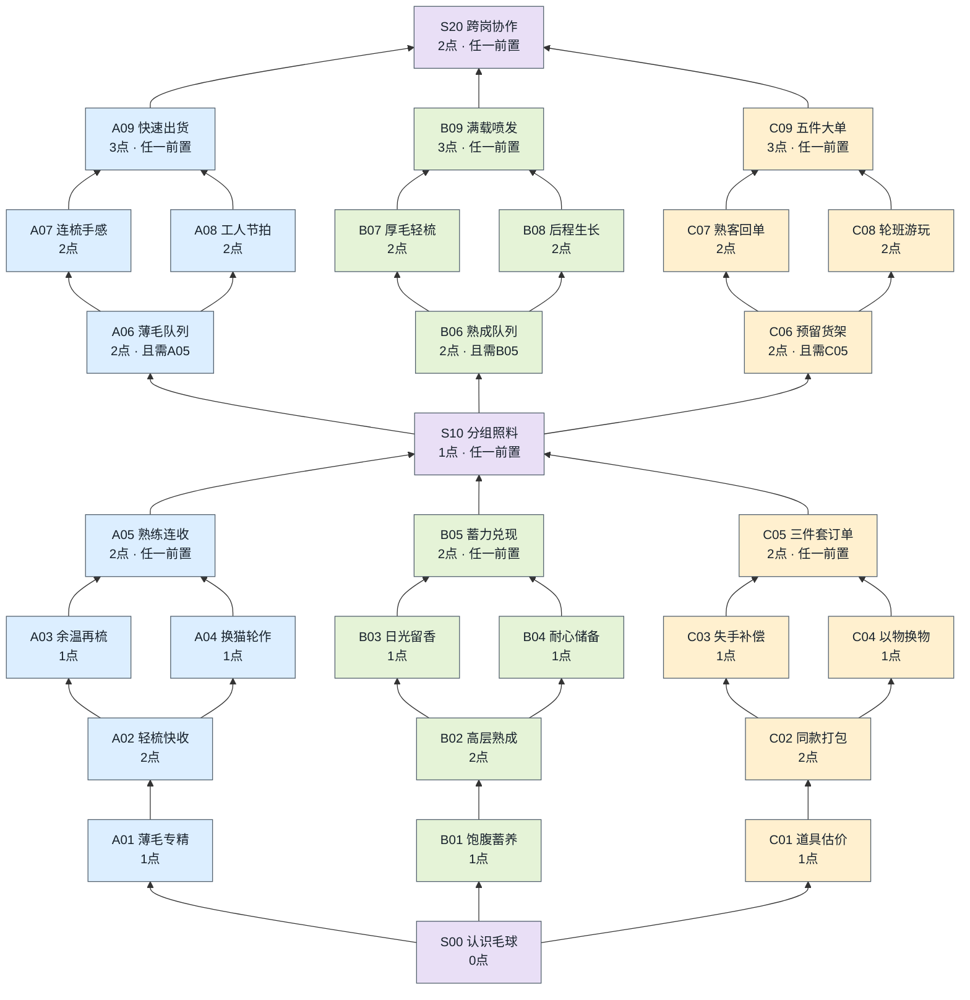
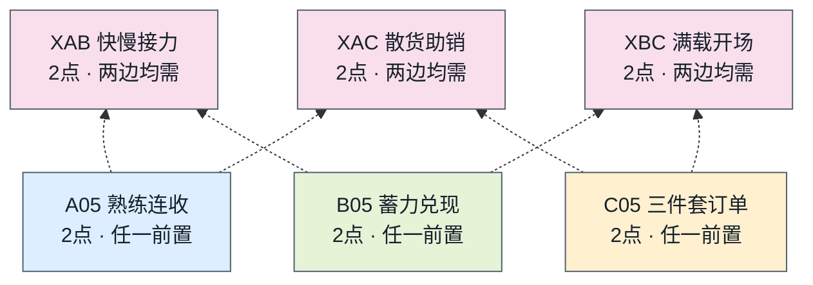
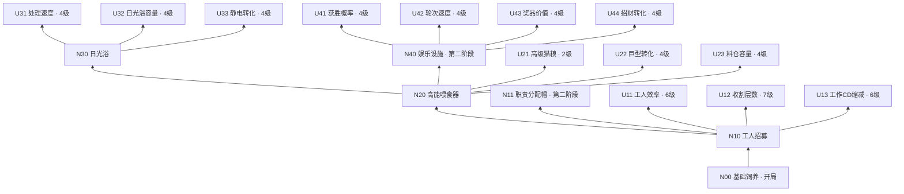
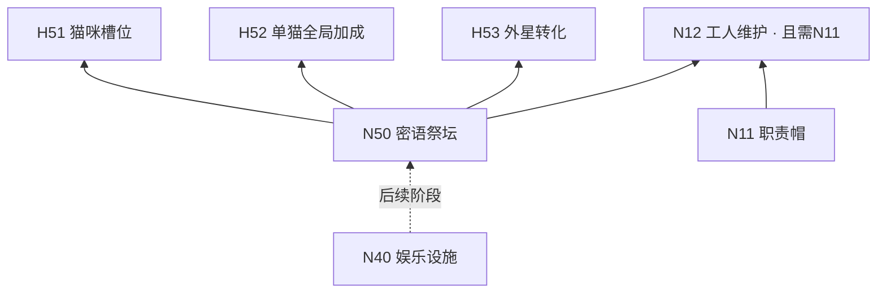

# 07｜升级树与解锁规划

《Purr Orbit》／《毛球计划》｜2026-09-22重构。入口：[00](00_索引.md)，数值唯一维护入口：[17第14.2节](17_Demo数值总表与调参清单.md)，实施记录：[18](18_实装变更日志.md)。

**已确认方向：**有限资源下的单层快收、攒层爆发、道具换金三大build；路线相对独立，有分叉、有合并、有共用节点。**本页为完整节点设计稿，新增节点、参数与连线尚未实装、未经平衡验证。**具体研究点制度、分组目标、重配政策属于本次设计建议，不冒充用户此前已确认的规则。

本版替换此前12节点／30点的小草案及旧合并说明，旧稿可通过Git查看。现在共33个机制节点（含免费起点），全开57研究点；另列现有基础设施和13个性能分支，它们消耗毛球，不重复计入57点。Demo仍连续两阶段、12件后补货新24件，不新增重开、祭坛或第三阶段。

## 1. 如何读图

- 图从下向上生长。蓝色A单层快收，绿色B攒层爆发，黄色C道具换金，紫色S共用，粉色X跨流派。
- **“或／任一前置”是OR：**任一所列节点购买成功，即满足该层连接。不需要把汇入的所有路线买齐。
- **“且／双前置”是AND：**必须同时拥有所列节点；只用于深入本流派和可选跨流派combo。
- 机制节点都是一次购买，没有先升满5级才能继续的问题；同一分叉两旁支可都买，但合流只要求其中一支。普通性能等级不成为后续机制节点的满级门槛。
- 阶段、基础设施资格仍独立检查。C路线第二阶段才开放；S10还需要职责分配帽，但不需要三路均完成。收齐首批12件可直接进入第二阶段，不检查S10或树完成度。

## 2. 核心升级树总图：分路、合流、再分路

[打开总图预览](图示/07_升级树总览.png)（由下方Mermaid生成；修改节点后需同步重生成）

三路各自经过“入口→核心→二选一旁支→本路合并”，随后进入共用S10；S10之后三路再次分开并各自合并，最后可购买共用S20。为保持图清楚，跨过S10的本路前置直接写在A06/B06/C06卡片上；三处可选交叉单独画在第7节，不挡主路。

**关键读法：**A03或A04→A05；B03或B04→B05；C03或C04→C05。A05／B05／C05任一＋第二阶段＋N11→S10。S10不赠送其他路的前置，想进入B06仍需B05；顶端S20任一路到顶即可买。购买XAB则必须同时有A05和B05。

## 3. 共用节点：同一套经营底座

| ID／节点 | 阶段／研究点 | 直接前置 | 完整效果（试算） | 定位与边界 |
| --- | --- | --- | --- | --- |
| S00 认识毛球 | 1阶段／0点 | 开局首次有效收割 | 第一次真实收割后开放流派界面；不直接发额外产物。 | 共同起点 |
| S10 分组照料 | 2阶段／1点 | （A05 或 B05 或 C05）；另需N11 | 开放至多3个猫群工作标签、工人负责标签及收割目标设置；可在已付费解锁的目标层范围内选值。 | 跨三路共用合流；不是要求三路全买 |
| S20 跨岗协作 | 2阶段／2点 | （A09 或 B09 或 C09）；另需N11 | 允许给每名工人设置一个后备岗位；主岗连续2秒无有效任务才执行后备岗，当前动作完成后重新检查主岗。 | 顶端再次共用；可选，不是收藏完成门槛 |

S10是明确的**新规则提案**：现版本“积攒层数收割”每级＋1的投入继续保留，但改为解锁可选目标层上限；只有购买S10后才可按工人组在1至该上限内配置。未买S10仍沿用当前全体统一门槛。不会凭空开放未付费层数，也不要求玩家重新支付已购买等级。这样才能同时安排一组快收、一组攒层；分组设置与路线队列不是新的拾取岗位。

S20只扩展工人的任务选择，基础职责帽仍可分工，无须买S20才能经营。主岗无目标包括目标反应CD未结束等情况；不抢断已开始的工作，防止频繁改岗抖动。

## 4. A树：单层多次快速收割

核心感觉是“收得快、回款密”，人工和工人都能完成；不是要求玩家一直连点。收割判定以开始锁定并最终实际结算的毛层数为准，只有恰好1层进入A的奖励与计数。自然长毛中途新增且留在猫身上的层不重复奖励。

| ID／节点 | 阶段／研究点 | 直接前置 | 完整效果（试算） | 定位与边界 |
| --- | --- | --- | --- | --- |
| A01 薄毛专精 | 1阶段／1点 | S00 | 恰好1层的真实收割，额外增加25%基础毛球。 | 确立单层专属收益 |
| A02 轻梳快收 | 1阶段／2点 | A01 | 1层人工行程与工人互动时长减少20%；不改变毛层CD或反应CD。 | 减少一次快收所需劳动 |
| A03 余温再梳 | 1阶段／1点 | A02 | 该猫反应结束后4秒内完成的1层收割，另加15%基础毛球；无上一次真实收割的猫不触发。 | 原地重复收割旁支 |
| A04 换猫轮作 | 1阶段／1点 | A02 | 同一操作者连续收不同猫，且两次结算间隔不超过5秒时，后一次1层收割另加15%基础毛球。 | 轮换猫咪旁支；人工与每名工人独立记前次目标 |
| A05 熟练连收 | 1阶段／2点 | （A03 或 A04） | 全场累计10次真实1层收割，完成第10次时额外发放该次基础毛球的100%，计数清零。 | 路线第一次合并；两旁支任选其一即可 |
| A06 薄毛队列 | 2阶段／2点 | S10 且 A05 | 开启快收策略：工人优先选就绪1层猫；连续5秒没有这类目标时，才按原付费门槛选最低层的可收猫。 | 再次分路；不降低已设目标；目标非1时清楚提示不生效 |
| A07 连梳手感 | 2阶段／2点 | A06 | 操作者完成一次1层收割后，下一次1层互动再减少15%；增益一次有效且不叠层，反应CD仍需等完。 | 进一步减少实际操作；各工人与人工分别持有 |
| A08 工人节拍 | 2阶段／2点 | A06 | 工人完成1层收割后，本次产出后工作CD减少20%；仍遵守全局冷却正下限与猫反应CD。 | 强化自动化旁支；不减少人工反应CD |
| A09 快速出货 | 2阶段／3点 | （A07 或 A08） | 将A05的10次门槛改为6次，完成奖励由100%改为150%基础毛球；替换而非叠加旧奖励。 | 路线第二次合并；不是所有旁支必点 |

**两次分叉：**先选A03原猫再梳或A04换猫轮作，两者任一通向A05；再选A07减少互动或A08缩短工人工作CD，任一通向A09。A03的4秒从反应结束算到收割完成，互动太慢时不保证触发；UI显示窗口，绝不能用鼠标悬停清反应CD。

**典型操作：**快速收首层→猫进入反应动画→去收另一只→计数奖励→工人接管单层队列。若更偏纯人工，可选A07而跳过A08；不会被强迫买一个没有用的工人性能旁支。

## 5. B树：积攒层数爆发性收割

核心感觉是“先养起来，再一口气兑现”。4层建立基础联动、6层进入大额收益、8层形成满载爆发；这些是本次试算门槛，不提高当前试玩8层上限。

| ID／节点 | 阶段／研究点 | 直接前置 | 完整效果（试算） | 定位与边界 |
| --- | --- | --- | --- | --- |
| B01 饱腹蓄养 | 1阶段／1点 | S00；另需N20 | 本批收割的新增毛层中，每层在有食物buff时自然长成，就为本次收割增加10%基础毛球，最多30%。 | 积累有效喂食长层记录；日光浴长层不重复算自然生长 |
| B02 高层熟成 | 1阶段／2点 | B01 | 真实收割达到4层时，额外增加25%基础毛球。 | 建立等待4层的第一档回报 |
| B03 日光留香 | 1阶段／1点 | B02；另需N30 | 一次日光浴完成后附加60秒熟成标记；下一次4层及以上真实收割额外增加15%基础毛球并消耗标记。 | 设施联动旁支；重复日光浴刷新不叠加 |
| B04 耐心储备 | 1阶段／1点 | B02 | 真实收割达到6层时，额外增加20%基础毛球。 | 纯攒层旁支；不必购买日光留香 |
| B05 蓄力兑现 | 1阶段／2点 | （B03 或 B04） | 每次达到6层的真实收割，额外增加25%基础毛球；一次完成只结算一次。 | 路线第一次合并；更高层数的大额回报 |
| B06 熟成队列 | 2阶段／2点 | S10 且 B05 | 对本组满足已设收割门槛的猫，优先收熟成标记剩余时间最短者，其次选择层数最多者。 | 再次分路；不提前收未达到目标层的猫 |
| B07 厚毛轻梳 | 2阶段／2点 | B06 | 4层及以上人工行程与工人互动时长减少20%，反应CD保持。 | 减轻大批收割劳动的旁支 |
| B08 后程生长 | 2阶段／2点 | B06 | 猫已有4层及以上时，自然长毛速度增加15%；不加速日光浴处理，不作用于首层反复收割。 | 缩短后半段等待的旁支 |
| B09 满载喷发 | 2阶段／3点 | （B07 或 B08） | 达到当前试玩8层时，额外增加100%基础毛球；不提高8层上限。若以后改层数上限，单独重定本节点门槛。 | 路线第二次合并；大额单次反馈 |

**两次分叉：**B03借助日光浴，B04直接等到6层，任一通向B05；后半段B07减轻收割操作、B08加快后期自然生长，任一通向B09。B03依赖N30，B04不需要随机转出静电猫。

**典型操作：**先喂食→成长记录→日光浴熟成／自然攒层→工人等到目标→爆发结算。空档缺钱时可手动收未分配给攒层组的猫，不能强迫全场同时等8层。B01记录绑定真实毛层批次，收割消耗对应记录；从日光浴或首层常驻产生的毛层不伪装成有粮自然长成。

## 6. C树：换金道具交换

核心感觉是“选留什么、换什么、何时卖”。全部使用普通换金道具，与永久扭蛋收藏、神秘代币分开。C节点可用普通猫完成，不要求先转成招财猫。当前五种普通道具为：不存在的鱼骨、猫形黑洞门票、反重力纸箱、宇宙的逗猫棒、第九条尾巴。

| ID／节点 | 阶段／研究点 | 直接前置 | 完整效果（试算） | 定位与边界 |
| --- | --- | --- | --- | --- |
| C01 道具估价 | 2阶段／1点 | S00；另需N40 | 普通换金道具的基础出售价格提高15%；不作用于永久扭蛋收藏。 | 确立道具路线；影响已有及新入库的普通道具 |
| C02 同款打包 | 2阶段／2点 | C01 | 一次消耗两件同名普通道具，以两件正常出售价值之和的1.20倍换毛球。 | 最容易形成的交换组合；不等待稀有物品 |
| C03 失手补偿 | 2阶段／1点 | C02 | 每台娱乐设备累计连续5轮未中奖，第5轮给一件价值为本机正常基础奖品40%的普通道具，计数清零；正常中奖也清零。 | 稳定供给旁支；保底与正常中奖不在同轮双发 |
| C04 以物换物 | 2阶段／1点 | C02 | 消耗两件同名普通道具，换一件玩家指定的另一种已开放普通道具；新道具基础价值取两件投入中较低者。 | 整理库存旁支；净损失件数，不能刷价；不新增生产贡献 |
| C05 三件套订单 | 2阶段／2点 | （C03 或 C04） | 消耗三件不同名普通道具，以三件正常出售价值之和的1.35倍换毛球。 | 路线第一次合并；选择更快供货或主动换货 |
| C06 预留货架 | 2阶段／2点 | S10 且 C05 | 玩家选同款包／三件套／已解锁的大单；库存自动标出所需件，普通一键出售默认跳过这些件，玩家可手动释放。 | 再次分路；仅管理库存，不自动出售或收取场景产物 |
| C07 熟客回单 | 2阶段／2点 | C06 | 完成订单后60秒内的下一份三件套订单，交易系数从1.35提高到1.45；不累计叠高，不作用于散卖和大单。 | 交易时机旁支；显示时限 |
| C08 轮班游玩 | 2阶段／2点 | C06 | 玩家可给娱乐岗位设每猫6轮的轮换任务；工人实际把猫带出、再搬入候选猫。无人可用则保留排队，不瞬移。 | 工人调度旁支；配合混搭蓄毛，单独购买前显示用途 |
| C09 五件大单 | 2阶段／3点 | （C07 或 C08） | 消耗五件不同名、均已开放的普通道具，以正常出售总价的1.80倍换毛球；交付后45秒内不能重复交大单。 | 路线第二次合并；五种均来自当前普通道具池，不要求稀有转化 |

**两次分叉：**C03补足产物供给，C04主动整理库存，任一通向C05；后半段C07争取连续订单收益，C08安排猫轮班，任一通向C09。没有C04也可从当前普通奖池凑齐5种，不能设置一个只有特定转化才掉的必交道具。

**典型操作：**娱乐产物入库→急用钱时散卖或同款打包→不急时预留不同款→三件套／五件大单。C06仅预留库存，未自动出售。C08可被其他build借用作工人轮班，单独走交易路线也可以选C07，不必为无收益轮换买单。

普通一键出售默认跳过预留物，但玩家可以主动解除。订单预览必须列出将消耗哪些实际道具和可得毛球；一次确认只成交一次。同一件不能既散卖又用于订单，C04换出的物件保留“已核算生产贡献”标记。

## 7. 跨流派的三处交叉

这些节点没有“走到共用点就免费获得另一树效果”的捷径。两路各自到第一次合并节点后，才能再花点数买联动；购买它们不是通向S10或S20的条件。

| ID／节点 | 阶段／研究点 | 直接前置 | 完整效果（试算） | 定位与边界 |
| --- | --- | --- | --- | --- |
| XAB 快慢接力 | 2阶段／2点 | A05 且 B05 | 累计5次真实单层收割生成1枚接力标记（最多1枚）；下一次4层以上真实收割消耗它，额外增加15%基础毛球。 | A+B交叉；两种收割必须真正发生，不能一次自产自触发 |
| XAC 散货助销 | 2阶段／2点 | A05 且 C05 | 累计20次真实单层收割获得1张助销券（最多1张）；下次卖出一件普通道具时额外支付该件正常售价的15%。 | A+C交叉；券只作用一件，可散卖或订单使用；不增加贡献 |
| XBC 满载开场 | 2阶段／2点 | B05 且 C05 | 4层以上猫进入娱乐时可选择消耗超过首层的毛层，换最多5轮奖品基础价值+20%（轮数=min(n−1,5)）；结束或离开即清。 | B+C交叉；消耗的毛层不结算毛球、蓄养或熟成奖励，不重复带入 |

XBC进入娱乐时必须显示“这批毛改作娱乐增值，不再收毛结算”；已有熟成与蓄养记录一并消耗，毛层回到常驻首层，原自然生长进度按既有进入娱乐规则处理。手动或工人按玩家预设转换开关执行，不能每次自动偷换玩家本想收的毛。

## 8. 基础设施与性能旁支：仍在同一树界面，花毛球

这层保留现有玩法的可达性，不消耗有限研究点。界面可置于机制树下方或侧边，以货币图标区分；以下子图和上面的机制图共同构成完整树。虚线只代表使用资格／后续扩展，不是重复付费。

| ID／节点 | 阶段／前置 | 具体内容、子级与边界 |
| --- | --- | --- |
| N00 基础饲养 | 开局 | 买普通短毛猫、手动收毛；只买普通猫，特殊猫通过设施转化 |
| N10 工人招募 | 1／N00 | 解锁招募，不等于免费给工人；工人接手重复操作 |
| N20 高能喂食器 | 1／N10 | 解锁喂食器和标准猫条供应；猫自主吃粮获得限时buff，补粮需人工／工人 |
| N30 太空日光浴 | 1／N20 | 解锁搬猫进日光浴加速就绪；不要求U21或U22满级 |
| N11 职责分配帽 | 2／N10 | 固定工人岗位；基础分工不消耗研究点，是S10/S20使用资格 |
| N40 娱乐设施 | 2／N20 | 猫占用设施时停止长毛，按轮次得道具；资格不要求N30或任何U节点满级 |
| U11 工人效率 | N10／6级 | 现有每级＋15%行动效率，影响移动和互动，不重复减独立工作CD |
| U12 收割层数 | N10／7级 | 每级增加1层，从1至8；未买S10沿用全体门槛；买S10后改为可配置目标上限（新提案） |
| U13 工作CD缩减 | N10／6级 | 现有3×0.85^L秒并受0.6秒下限；不缩短猫produce反应 |
| U21 高级猫粮 | N20／2级 | 0级标准猫条；第1级解锁高能冻干；第2级解锁星尘鱼罐头，仍需商店付费购买 |
| U22 巨型猫转化 | N20／4级 | 提高实际进食后的转化概率，不直接给巨型猫，非B树必备 |
| U23 料仓容量 | N20／4级 | 增加装粮上限，不自动补粮；缓解所有流派的补粮负担 |
| U31 日光浴速度 | N30／4级 | 缩短处理时间；不直接减少猫收割反应CD |
| U32 日光浴容量 | N30／4级 | 增加并行容纳量，仍需实际搬猫 |
| U33 静电猫转化 | N30／4级 | 增加日光浴转化概率，不成为B03／B09前置 |
| U41 获胜概率 | N40／4级 | 提高普通轮次中奖率；C03保底补偿需计入整体期望 |
| U42 轮次速度 | N40／4级 | 缩短娱乐轮次；不自动缩短C09交易冷却 |
| U43 奖品价值 | N40／4级 | 提高产出道具的基础价值；同一件入库后的价值处理沿用现版本 |
| U44 招财猫转化 | N40／4级 | 提高娱乐转化概率；抛币正面额外给普通道具，不产出神秘代币 |

U节点ID用于本版文档定位，代码键仍为worker:efficiency／harvest_layers／cooldown等，不要求为改名迁移存档。U价格与精确数值沿用17已实装表，直到单独调参；不拿机制研究点价格替代毛球价格。猫／工人／设施实体数量购买仍在商店，不把每一次买猫画成研究节点，也不凭空引入房间总猫数硬上限。

### Demo之外的保留节点（本次不纳入57点）

| ID | 前置 | 内容与范围 |
| --- | --- | --- |
| N50 | N40＋未来阶段资格 | 购买祭坛，指派猫带来全局加速并引入干扰；不要求招财转化成功 |
| H51 | N50 | 升级指派猫槽位，级数、费用后续定 |
| H52 | N50 | 升级单猫全局加速，级数、叠加上限后续定 |
| H53 | N50 | 提高外星猫转化率，级数、费用后续定 |
| N12 | N11且N50＋未来阶段资格 | 解锁工人维修黑屏娱乐设施；仍需工人实际执行，不永久免疫干扰 |

原文祭坛A01—A03改为H51—H53，避免与单层机制树A01—A09撞号；旧F/S/E等分支在本版对应U21—U44。蟑螂和黑屏是设施联动事件，不是玩家花研究点购买的惩罚节点。扭蛋机仍由首枚代币接触解锁，不放到本树末端。

## 9. 有限点数：保证能构筑，不能全拿

本次扩成33个机制节点后，原14／30预算不足以描述新树，替换为**Demo建议24点／全树57点**。每路9节点全买16点；S10＋S20共3点；三处跨路各2点，共6点；S00免费。24点约占全树费用42%，不足两路全买的32点。

只走一条完整通路并在两次分叉各选一个旁支：本路花13点，加S10／S20为16点，余8点可选另一条路的首段6点及交叉2点。也可本路全收16＋共用3＝19点，剩5点做浅层混搭。S20可不买，收藏通关不要求任一路封顶。

| 可行方案示例 | 购买节点 | 总研究点 |
| --- | --- | ---: |
| 单层主修＋攒层副修 | A01/A02/A04/A05/A06/A08/A09；S10/S20；B01/B02/B04/B05；XAB | 24 |
| 攒层主修＋交易副修 | B01/B02/B03/B05/B06/B07/B09；S10/S20；C01/C02/C04/C05；XBC | 24 |
| 交易主修＋单层副修 | C01/C02/C04/C05/C06/C07/C09；S10/S20；A01/A02/A04/A05；XAC | 24 |

第一阶段最多8点，第二阶段再发16点，具体里程碑见17。C到第二阶段才可选，不能要求C玩家为了跨过S10先买满A/B；建议补货时给一次重配机会，把早期暂借路线换成C，不退历史毛球收益、不重复发放研究点。重配要清除节点临时标记并检查依赖闭包，不能只退掉前置却留下后续能力。

## 10. 结算顺序与实现约束

1. 定义基础毛球Y0＝本次锁定毛层按当前产量公式、猫种、食物、虫害、收藏等基础规则算出的金额；不含本页新增机制奖金。所有“增加x%基础毛球”均以Y0为基数，相互相加，不把A05奖励再次送入A09计数或静电连锁。
2. 真实收割事件才推进A计数、X标记或B兑现；静电附加收益、交易奖励、以物换物都不是一次新收割。一次开始／版本只允许结算一次。新增奖金是否计神秘代币有效贡献：建议不计，原主产物按既有规则计；C03新生成的保底物可按其基础价值计一次，C04交换物与出售溢价不再计。该口径需三流派币速模拟验证，不保证只加毛球就能加快收藏。
3. 新互动缩减相乘，但人工行程和工人互动统一不得低于各自未获机制减免时的50%；不改165像素基准或渐近3倍曲线。工作CD缩减在普通U13之后乘A08的0.8，仍受0.6秒下限；猫反应动画绝不因此缩短。
4. 道具正常出售值Q＝物件基础价值×既有出售buff×C01（若已购则1.15）。每件只选择一种出口：散卖Q、同款包1.20×ΣQ、三件套1.35或1.45×ΣQ、大单1.80×ΣQ。不能先乘同款包再乘三件套／大单。XAC另加单件0.15Q，仅消费一张券。
5. 标记、计数、冷却与预留库存需保存；取消节点、重配、加载不得重发奖励。基础猫／工人／设施不随重配删除；旧档新增研究点按既有里程碑一次性补记，既有付费层数保留。迁移与重配的具体补偿需实装前验证。
6. 下游旁支优先显示可选关系，合流写明“任选一路”，交叉写明“两边都要”。S10是重组工作的机会，不是强制把前半树补满的收费口。每路都有分叉和合并，但不把纯性能等级伪装成新的互动玩法。

## 11. 验证范围与后续维护

本版仅完成节点／依赖／费用的设计核算，不代表三路线已平衡。验证至少覆盖：三路均能完成36件；相同研究预算下的净收益、有效贡献与操作负荷；单层反应CD不绕过；高层与娱乐不会双花同批毛；C普通物可达；研究点重复领取／重配漏洞；分组不绕过已购买目标层；合流不要求全部前置。

17第14.2节维护完整节点参数快照和24／57预算；18的IMP-20260922-001记录此次结构修订。之后新增节点须同时改图、节点表、依赖、总成本与示例配置，不只往图上补线。当前Godot代码和Windows构建尚未采用本设计。
