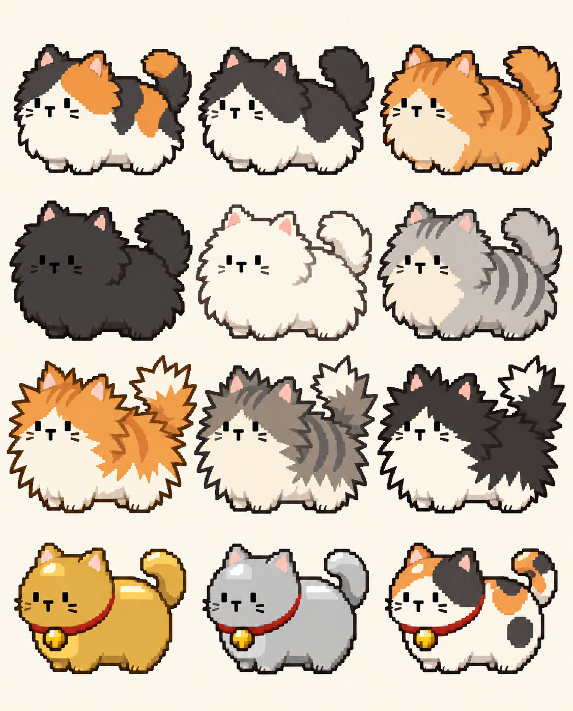

# 03｜猫咪素材制作日志

建立：2026-10-08｜入口：[00_索引](00_索引.md)。本页将仓库中实际接入的动画与本机尚未接入的概念／绿幕实验分开记录。

## 当前结论

| 素材 | 当前状态 | 核对入口 |
| --- | --- | --- |
| 短毛三花猫 `cat1new2` | 游戏运行引用 | [02 索引](02_素材与场景索引.md)、[合并验证](../毛球满屋/reports/merge_art_929/README.md) |
| 静电猫 `Cat2new` | 游戏运行引用 | 同上 |
| `cat1new3`、`Cat1new4` | 已入库的候选图集，未切换运行引用 | 同上 |
| 本机 `output/imagegen/` 下的概念、毛量、绿幕单图 | 本机美术实验，未发现其作为当前运行图集的证据 | 见下方文件清单；不能仅凭文件存在宣称已接入 |

## A. 已入库猫动画的演进

1. **2026-09-21，建立五种猫中的前四种动画基线。**将 Cat1／5／8／10 的 idle、walk、produce 逐帧 PNG 与 SpriteFrames 配置放入 `毛球满屋/Art/`，分别服务短毛、巨型、静电和招财猫。程序根据猫状态切动作，并处理脚底锚点、毛层徽标与收获反馈。提交与具体整合过程见[01 日志](01_制作与整合日志.md)。
2. **2026-09-28，把平面猫放进 3D 空间站。**新增 Cat14 外星猫的行走、产毛帧；五种猫继续使用平面逐帧图，通过 Sprite3D 接受场景光照和投影。调整脚底定位、朝向与屏幕鼠标到游戏坐标的映射。此步骤是显示管线升级，不表示猫被建成 3D 模型。
3. **2026-09-28，三花短毛改为四向动作图集。**`cat1new` → `cat1new1` → `cat1new2` 依次处理朝上尺寸、待机／行走方向、抚摸、舔爪、产毛速度及不透明像素脚底位置；向左用侧面镜像。替换时同时检查游戏反应时钟，避免画面播放完毕就提前解除模型禁收状态。当前运行停在 `cat1new2`。
4. **2026-09-29，继续试做并整合。**`cat1new3`、`Cat1new4` 是保留的三花候选；`Cat2new` 为九张静电猫方向／动作图集并已在运行中。猫的细轮廓、静电亮边和专用补光解决浅色地面上的辨识与发光问题。运行引用与验证见[02 索引](02_素材与场景索引.md)。

## B. 本机概念与毛量状态实验

### 游戏外视觉参考

*正常状态：用来核对角色站位、花纹和基础轮廓。来源：本机 `output/imagegen/cat-growth-states/01-normal.png`；未接入游戏。*

*长毛状态修正版：主要比较外轮廓扩张后是否仍能辨认同一只猫。来源：本机 `output/imagegen/cat-growth-states/02-grown-v2.png`；未接入游戏。*

### 制作记录

这些文件在 `C:\Users\jominchen\Documents\ChatGPT\Purr Orbit\output\imagegen\`，不属于本仓库已提交的 `毛球满屋/Art/`。`cat-concepts/` 有四张概念／角色名单图及名单提示词；`cat-growth-states/` 有 `01-normal.png`、`02-grown.png`／`02-grown-v2.png`、`03-maximum.png`／`03-maximum-v2.png` 和两版提示词。

制作流程可由同目录提示词复核：先建立 4 行 × 3 列的 12 猫基线；第二、第三毛量状态要求保留每只猫的站位、花纹、T 形小嘴与粗像素边。毛量主要通过**外轮廓扩张**表达，减少内部碎毛纹；软毛猫用较大圆润外形，刺毛猫用放射状外缘，金属猫保持体形并增加块状反光。`-v2` 文件是对过多内部毛纹、轮廓和像素边的修正候选，不等同于自动验收或当前游戏状态。

## C. 绿幕单图导出与局部修正

`cat-exports-green/` 从毛量状态表中选出三花、白猫、灰刺毛、金猫各三个状态，合计 12 张独立绿底图。`prompts-and-sources.txt` 逐张写明源表、行列位置及约束：完整身体、四边留白、纯 `#00FF00` 不透明背景、清晰像素边、无地面阴影。该清单可用于追溯“单图来自哪张状态表”，不能用来证明模型输出逐像素符合要求。

`cat-exports-green-v2/` 保存同名 12 张修正图及 `correction-prompt.txt`。修正针对左脸颊两条小短线：让线条留在脸部轮廓**内部**，不伸到绿背景，同时保留右脸颊、花纹、毛量外形和金属反光。再次强调背景必须是不透明纯绿，以便后续抠像。导出前应逐张检查像素色值、alpha、轮廓和三状态一致性；本日志未记录这批图已通过这种逐像素验收。

## 如何从这些素材继续制作

1. 先在 [02](02_素材与场景索引.md) 和实际场景引用中确认要替换的猫种、动作、运行图集；不要用新文件名推断已替换。
2. 对概念或绿底候选先选定源图与状态，记录提示词、图像尺寸、肉眼缺陷及修正版。画布中的视频、透明帧、SpriteFrames 导出另见 [04](04_资产画布制作日志.md)／[05](05_猫咪工作室制作日志.md)。
3. 只有导出结果进入 `毛球满屋/Art/`、动画配置被场景／脚本引用，并完成方向、脚底、收割时钟、透明边与实机显示检查后，才把状态改成“游戏运行引用”。同步更新 [02](02_素材与场景索引.md) 与本页。

## 证据与限制

入库历史见[01](01_制作与整合日志.md)、[三花动画报告](../毛球满屋/reports/cat1new/README.md)及[最终合并报告](../毛球满屋/reports/merge_art_929/README.md)。本机概念、提示词与绿幕图仅在上述本机路径可读；若新机器没有该目录，需要从原工作区另行迁移。图像生成不自动保证十二只角色跨状态一致，也不自动修复抠像、骨骼或动作问题。
