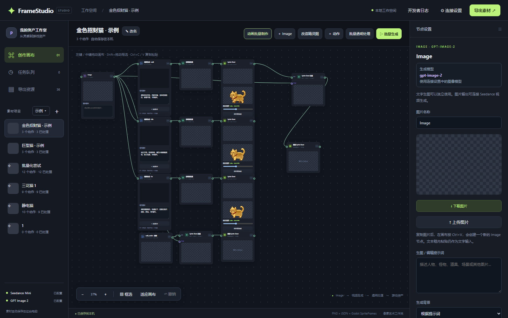

# 04｜第一代资产画布 FrameStudio 制作日志

建立：2026-10-08｜入口：[00_索引](00_索引.md)。本页依据本机 `Gaming/tools/asset-canvas/README.md`、`DEPLOY.md`、源码及测试记录重建迭代脉络。代码快照见[工作流代码](工作流代码.md)；原项目数据与媒体仍在 `Gaming` 工作区。

## 位置与用途

*FrameStudio 本机界面截图，2026-10-08。节点之间的连线说明素材从参考图流向视频、处理和导出；画布里的结果属于工具工作区，不能据此判断已进入游戏。*

- 源码快照：[`工作流代码/tools/asset-canvas/`](工作流代码/tools/asset-canvas/)；原工作副本在 `C:\Users\jominchen\Documents\ChatGPT\Gaming\tools\asset-canvas\`。本地启动 `启动画布.cmd`，默认 `http://127.0.0.1:8765`。
- 数据：`C:\Users\jominchen\Documents\ChatGPT\Gaming\output\asset-canvas\`，包含项目、节点图、任务、上传视频、处理中间帧和导出。可用 `ASSET_CANVAS_DATA` 指定别处。
- 用途：将角色参考图、视频生成、绿幕处理、逐帧筛选和 Godot 动画导出放在可连接的画布上。导出是候选资产，不自动进入 Purr Orbit 游戏。

## 迭代 1｜从单次媒体处理到可保存的节点画布

**问题：**参考图、视频、透明帧和最终 Sprite Sheet 容易散落，重复运行时难追溯哪段视频生成了哪个结果。

**处理：**每个角色建立项目；Image、视频、透明处理、导出分别为节点，端口按类型连接。节点位置、连线、任务与处理版本保存到项目数据。视频节点可选 Seedance 型号；未单独设置的旧节点沿用连接设置中的默认型号，提交任务时固定所选型号。项目画布可拖动、缩放、平移，支持负坐标和“适应画布”；右键添加节点，选中后 Delete／Backspace 删除，输入文字时不误删。删除标记可恢复，已有媒体和导出文件保留。

**实际流向：**Image 输出可以接视频的参考输入；视频接透明处理；透明帧接导出。Sprite Sheet 改造节点同时接旧动作表和新外观图；图中禁止形成循环，处理任务读取的是**实际连入**的视频／图片，而非“项目里最近一张”。一个输出可分叉给多个处理节点。生成视频与“一键生成 Sprite Sheet”是不同操作；后者才把视频、透明处理和导出串联。

## 迭代 2｜绿幕、抽帧与可逆的序列编辑（2026-09-22 记录）

**问题：**视频的背景、跳跃和帧节奏不适合直接放进 SpriteFrames；逐帧重新居中会抹掉动作本身的上下起伏。

**处理流程：**上传或生成视频 → 指定片段 → 以最多 20 FPS 提取完整 `source_frames` → 颜色键去绿／去绿边 → 对整段采用统一裁框与固定缩放 → 手动排除、恢复或隔帧选取 → 预览透明 APNG → 导出透明 PNG 序列、JSON、Godot `.tres` 和 ZIP。`source_frames` 与筛选后的 `frames` 分开保存，删帧不改变裁框；APNG 使用完整替换，避免透明区域留下上一帧残影。时间轴提供原视频对照、暂停、前后帧与播放；可保持原片段时长或固定播放 FPS。

去绿幕加入温和／标准／强力预设及阈值调节，像素风默认不柔化；去绿染兼顾不透明与半透明像素。绿色角色部位可能误抠，复杂半透明边缘必须逐帧看。多提取帧不会修复原视频重复帧、角色形变或不连贯的首尾姿势。

## 迭代 3｜参考图、付费生成与恢复能力

**参考图：**画布可有多个独立 Image 节点，可上传、粘贴本机图像文件或单独调用 GPT 图像生成／参考图编辑。带 alpha 的图可在本地合成纯绿背景；无透明区域的图若要改变背景，需要明确提交图像编辑并检查主体。Sprite Sheet 改造把原动作表、项目主图和提示词交给图像编辑，再按显式列／行／有效帧数切图；模型不能保证各格动作被精确保留。

**任务：**Seedance 通过本机桥接或服务器 API 提交；收费调用前显示任务数量，立即保存 task ID，失败不自动重复提交。刷新、重启后可继续查询已有 task ID；恢复查询不是再次付费生成。未配置 API Key 时仍可上传和本地处理。README 里的并发与模型可用性是当时记录，继续部署前以当前源码和账号实测为准。

**后期扩展（当前源码／测试可见，确切上线日未单独登记）：**画布已含多动作批量队列、失败项重试、节点撤销与跨画布复制、目标总帧数和播放速度分离、颜色异常／闪帧与像素稳定候选修复，以及开发日志的版本冲突保护。候选修复应先预览、对照再应用；更新后不可拿旧候选覆盖新导出。测试文件 `test_studio.py` 含相应案例，具体可用状态仍须在当前工作区复测。

## 验证与边界

- `README.md` 记录过本地测试、浏览器节点连线／删帧、透明预览，以及导出 `.tres` 在 Godot 4.7.1 隔离项目加载的验证。那是记录时的证据，不能替代当前版本复测。
- 当前测试入口：在工具目录执行 `python -m unittest test_studio.py -v`；另有 `test_pixel_stability.py`、`test_multi_batch_ui.js`。付费 API、权限、余额与生成质量不由 mock 测试证明。
- 2026-10-08 本机复测：使用 Codex 随附 Python 执行 `python -m unittest test_studio.py -q`，**49 项通过**。测试不包含付费生成或游戏场景验收。
- 本机和内网／服务器部署方式见同目录 `DEPLOY.md`。联网部署涉及权限、密钥和共享数据；仅凭部署文件存在不能声称服务已经上线。
- 游戏接入要另行将选定版本导入 `PURR_ORBIT/毛球满屋/Art/`、配置动画并跑方向／脚底／透明边／实际场景检查。画布数据中的“导出完成”只说明资产包已生成。

## 与第二代的关系

第一代保留灵活节点图，适合任意素材和复杂分叉。猫咪动作增多后，每个猫的方向参考、动作历史和统一质量检查需要更直接的界面，于是从它**复制初始数据**做出[第二代猫咪工作室](05_猫咪工作室制作日志.md)。两边此后各自保存，互不自动同步。继续工作前先确认要编辑的是哪边的数据。
