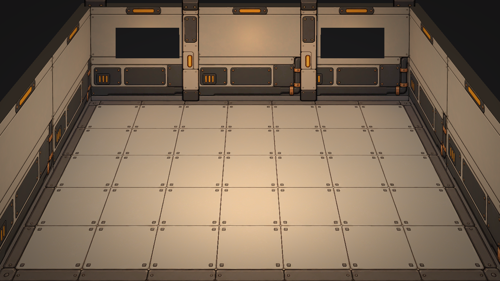

# 07｜2026-10-09 场景美术与面片搭建日志

本序列汇总本次对话截至10月9日的场景制作与整合工作；历史构思及素材迭代一并归档，不将此前工作全部认定为当天首次制作。最新效果以本次入库的场景和运行截图为准。

## 1. 风格与结构确定
以《饥荒：哈姆雷特》的室内围合和《咩咩启示录》的勾线、贴片层次为视觉参考，确定柔和温馨的科幻猫咪空间站。减少宇宙背景占比，采用米灰、暖褐、琥珀灯光，减少蓝绿色与暖色的强烈对撞。
保留清楚的轮廓、铆钉、检修板、管道等科幻细节，降低脏污、噪声、手绘纹理与过深接缝；避免纯色块化。前景机械框架作为点缀，不做厚重遮挡。

## 2. 资产清单与提示词
从完整清单缩减为整组模块，保留01地面、02基础墙、03窗墙、04轨道回收接口、06宇宙、10装饰、11前景。05暂缓，07—09不制作。
中文提示词及v1—v3均存于[07附件](07_附件_20261009/)，其中[v3确认范围](07_附件_20261009/PurrOrbit_场景资产清单与中文提示词_v3_确认范围.md)保留当时确认口径。其后墙柱独立拆分、暂去门旁控制台等以本日志后续记录为准。
轨道回收接口仅为美术方向，本场景未接入回收玩法；玩法内容仍以正式策划为准。

## 3. 制图迭代与选用
全部现存原稿和对应提示词归档在[素材原稿](07_附件_20261009/素材原稿/)。
- 地面v01→v04：逐步降低对比度与接缝深度，保留铆钉与模块分割，去除脏污纹理；当前采用v04。
- 墙面：由概念式墙段调整为适合贴片的正面素材，去掉两侧柱子，独立生成柱子。当前采用无柱墙v03与柱子v01。
- 窗墙v01、门墙v01属于候选，不是本次新场景的正式运行素材。顶部绘制透视、烘焙光影、透明门、移除右侧操作板等反馈仍需在后续制图完成。不能将其写作全部验收通过。
- 素材仍有部分绘制明暗；“去光影”是制图目标，不声称现有资源已经是完全无光照底色。

## 4. Godot纯面片新场景
入口：[Concept Whitebox.tscn](../毛球满屋/scenes/Concept%20Whitebox.tscn)，编辑器F6运行。独立用于美术验证，不移植猫、UI、设施或玩法。
由地面、左右墙、后墙窗洞、独立柱子及墙顶QuadMesh构成。初期实体感过强的拼合结构已简化；墙顶厚度使用独立水平面片展示。用户后续手调的高度、结构、柱位、相机与灯光全部保留当前保存版本。
建立Asset文件夹，命名：
| 运行素材 | 来源 |
|---|---|
| [Floor_01.png](../毛球满屋/Asset/Floor_01.png) | PO_01_floor_v04 |
| [Wall_Base_01.png](../毛球满屋/Asset/Wall_Base_01.png) | PO_02_wall_base_nocolumn_v03 |
| [Wall_Column_01.png](../毛球满屋/Asset/Wall_Column_01.png) | PO_02_wall_column_v01 |

墙面UV按模块映射，窗洞周边保持连续；柱子通过材质UV排除透明留白，保留原始PNG。窗后尚未接入宇宙，门与装饰占位已经由用户移除。

## 5. 相机与纵深迭代
先比较远距窄视场与近距透视，用户指出完整盒体展示感过重。后续保留用户结构，对比三轮七组相机，兼顾前端墙体、前柱、完整地面与墙地占比。
为消除柱子向上收拢，改用水平相机配合Frustum偏移，保留前后近大远小。曾验证同一竖线的两端屏幕X一致。
注意这不是对《饥荒》实际引擎实现的确认，只是本项目实现相似视觉的方法。
此前保存基准位置(0,14,24)、旋转零；本次上传前用户进一步微调，当前实际位置约(0,13.195523,20.795734)，俯角约1.847度。保留该最新状态，不再强制回零，因此当前不声称严格零竖向汇聚。
当前projection=Frustum、size=0.84、offset=(0,-0.54)、near=1、far=100。调整近大远小时应配合相机距离与取景宽度，不单独拉歪墙。

## 6. 墙高、厚度、光影与暗角
墙体在用户合理结构上加高约8%，墙顶同步上移至约4.131858。厚度展示宽度从0.3增至0.5，向外延伸，后墙顶长度同步加宽。
保留暖色主光、补光及墙灯；用户最新主光能量3.158、范围11.596，具体参数以场景为准。
GameCamera/CameraEffects/Vignette添加柔和暗角，中心清晰、四周渐暗；CanvasLayer全屏适配且鼠标穿透。材质强度可在编辑器调节。

## 7. 同批入库的既有Godot改动
正式whitebox_room使用C_Floor.png与C_Window.png；窗户shader依据新贴图黑区开孔，移除旧勾边，保留宇宙显示逻辑。它与Concept Whitebox是不同场景。
cat1new_animations.tres、cat2new_animations.tres保留编辑器当前保存版本一并入库，不据资源文件重排推断新的动作或玩法改动。
这些是本地已有未提交内容，本次按“Godot改动全部上传”整合，不都认定为本轮新制作。

## 8. 验证与交付
Godot4.7.1 headless编辑器导入成功；新场景真实图形运行与截图通过。相机曾检查16:9和16:10，本次入库前再次生成最新两种尺寸截图。
本次没有重新验证完整玩法流程或生成新的Windows包。builds中的10月8日EXE/ZIP保留本地，不是这次新场景构建产物。
本次提交范围为Godot工程改动、07美术日志与索引、概念参考和素材提示词归档；没有修改玩法蓝图。

