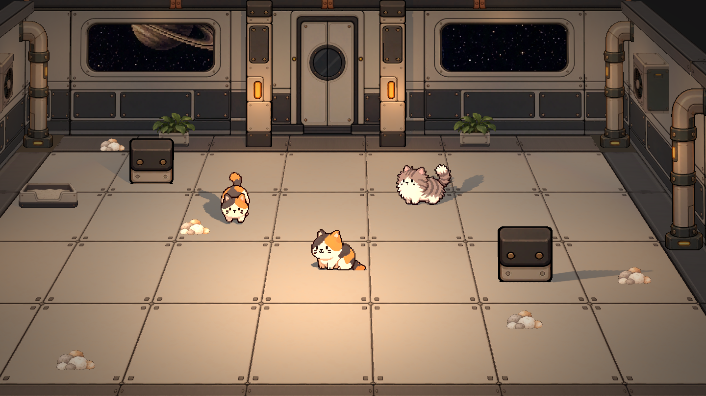
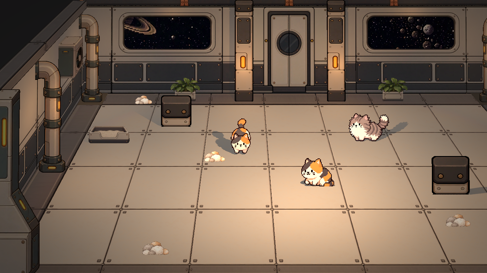
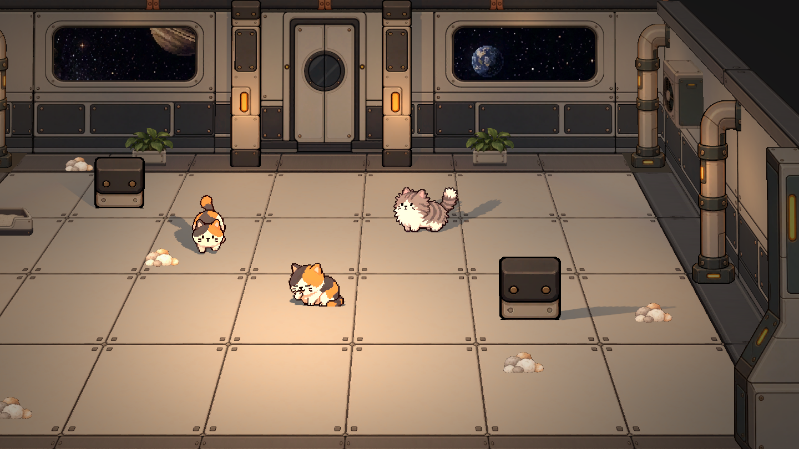

# 08｜2026-10-10 模块化场景与装饰整合

记录今日独立美术场景的制作、试装和调整。承接[07号日志](07_2026-10-09_场景美术与面片搭建.md)，以本机最新保存的 `毛球满屋/scenes/Concept Whitebox.tscn` 为准。以下为本地已实现状态；本次上传日志及截图，不代表今日工程和素材已随之提交。正式玩法、启动入口及策划蓝图不在本次修改范围内。

## 1. 房间布局与模块比例

- 地面从原5×6调整为前后4排、左右8列，之后按用户修改缩为4×6，最终确定为 **4×7、共28块**。修正拉伸和空隙，保持每块2.5×2.5的正方形世界尺寸；画面中的梯形由相机投影产生。
- 拆出浅色地板与深色边框，降低地板接缝对比度、保留铆钉。保留用户加厚的侧边框，后方深色边框同步加宽并衔接墙脚。
- 基础墙去除多余顶部灯与下部管道，调整柱子的宽度、高度和墙柱接缝。保留用户手调的相机、道具和光源位置，按保存后的左侧布置向右侧复制。
- 新增中央门墙模块：米灰色双开门、圆形观察窗和少量暖色提示，没有门旁独立操作板。门保持房间正中，左右窗户分别位于各自墙段中央，剩余区域用基础墙填齐。
- 窗后使用原有宇宙素材，保留连续、旋转的窗外背景。

## 2. 框架、风机与管道：从白模参考到独立面片

此前直接生成的透视与墙面不一致，改用场景内白模确定可见顶面、侧面和轮廓，再据此制图。框架为下宽上窄，去掉顶部横向突出，小幅加高并加厚顶部；风机保留认可的朝向，管道按用户调整的尺寸制作。

试装中曾将图片分贴白模表面，随后按反馈移除白模，改成 **每件道具一张带透明区域的独立图片面片**。图片自带可见厚度，场景负责摆放、遮挡和受光；不把已经画入图片的透视再次沿侧墙压缩。对侧使用镜像版本，保留用户后续摆位。

风格统一为干净勾线、米灰与暖褐金属，保留少量铆钉、接缝与琥珀灯，不添加大量脏污纹理。

## 3. 墙顶覆盖结构

- 两侧顶部先试长管白模，后改为方形管道。最终由顶面和朝室内侧面两张面片构成，前端不可见，因此不制作封口。
- 两侧使用现有深色地面边框贴图重复铺设；管道高度从0.5减至0.375，减轻压迫感。
- 后方墙顶采用用户提供的深色直管、铜色接头平面图，分成4段拼接。与两侧方管分别处理，避免把整张管图强行折到转角。

## 4. 猫与装饰物试装

- 接入两只普通猫和一只静电猫作为静止位置的动画预览：普通猫分别循环向下walk和舔毛，静电猫循环idle。沿用cat1new2及Cat2new资源，没有新增猫行为或生产逻辑。
- 两只普通猫在初次试装尺寸上放大20%，调整脚底与地面关系。
- 生成正面、略能看到顶面的花盆绿植、猫砂盆和毛球堆，避免专门画出右侧面；各放入一件后由用户继续调整和复制。
- 当前场景保留2盆植物、1个猫砂盆、5堆毛球。所有毛球关闭投影；它们是视觉装饰，不参与资源结算。

## 5. 受光问题与补光

修正右侧镜像资产的法线及UV处理：墙和窗采用纹理镜像而非负缩放来维持正确受光；独立道具面片调整法线。保留宇宙背景的显示方式。

前方补光经历点光、仅照道具和猫的平行光，最终按用户要求限定为 **仅照3只猫与5堆毛球的平行光**。暖白色、能量0.65、关闭投影与镜面高光，没有距离衰减；花盆、猫砂盆、墙地继续使用原场景灯光。毛球材质保持受光，修正其法线，使补光实际生效。

曾出现实例子节点重复覆盖及退出警告，清除重复覆盖后重新验证。灯光开关的图像对比用于确认右侧墙窗和毛球确实响应光照，不等同于最终美术验收。

## 6. 镜头与查看方式

- 游戏视角保留用户设置的高度、角度和Frustum投影，仅允许左右移动。左右移动范围限制为X=-2.2至2.2。
- 鼠标进入画面左、右各三分之一区域时开始平移，越靠边越快，中间三分之一停止。鼠标静止时不把编辑器设置的相机位置强制重置。
- 新增 **P键自由视角**：按一次进入，再按一次恢复进入前的镜头位置、角度与投影，并恢复边缘平移。
- 自由视角：按住右键转向，WASD移动，Q/E升降，Shift加速；Esc或失焦释放鼠标。该模式用于场景检查，没有增加碰撞约束。

## 7. 本地工程入口

以下路径相对本机工程 `C:/Users/jominchen/Desktop/Project/PURR_ORBIT-main/毛球满屋/`；今日新增文件尚未随本次日志上传，因此这里不提供可能失效的远端文件链接。

| 内容 | 本地路径 |
|---|---|
| 独立美术场景 | `scenes/Concept Whitebox.tscn` |
| 模块化地面、墙窗、门及边框 | `Asset/Modular/`，中央门为`Wall_Door_01.png` |
| 白模衍生道具与中文提示词 | `Asset/Modular/WhiteboxDerived/` |
| 后墙顶部直管 | `Asset/Modular/WallTop_BackPipe_01.png` |
| 植物、猫砂盆、毛球及中文提示词 | `Asset/Decor/` |
| 框架、风机、管道面片 | `scenes/props_2d/Frame.tscn`、`Vent.tscn`、`Pipe.tscn` |
| 三只猫的动画预览 | `scenes/props_2d/CatPreview.tscn` |
| 边缘平移与P键切换 | `scripts/concept_edge_pan.gd` |
| 相机检查 | `tests/test_concept_edge_pan.gd`、`tests/test_concept_free_view.gd` |

## 8. 验证与待办

实际运行并截取中央、左侧、右侧画面；P键切换检查通过，覆盖重复按键、切换与原镜头恢复。选择性补光核对到8个目标，毛球开关灯对比可见亮度变化。

地面、面片、镜头检查在迭代过程中运行；最后一次完整边缘平移测试仍有1项“左右道具位置镜像”断言未通过，原因是用户后续手动摆位已不完全对称，保留该布置，没有为通过测试强行复位。因此不标记全部测试通过。后续需按认可的最终布局修订这项断言。

本轮没有导出新的可玩包，没有重跑完整玩法或长期节奏。本次仅归档日志与截图；本地工程、贴图和提示词的版本提交另行处理。

## 9. 实机截图

截图为2026-10-10 17:18的本地运行记录，位于加入P键之前；包含当时的布局及仅照猫、毛球的补光，不用于证明自由视角效果。

